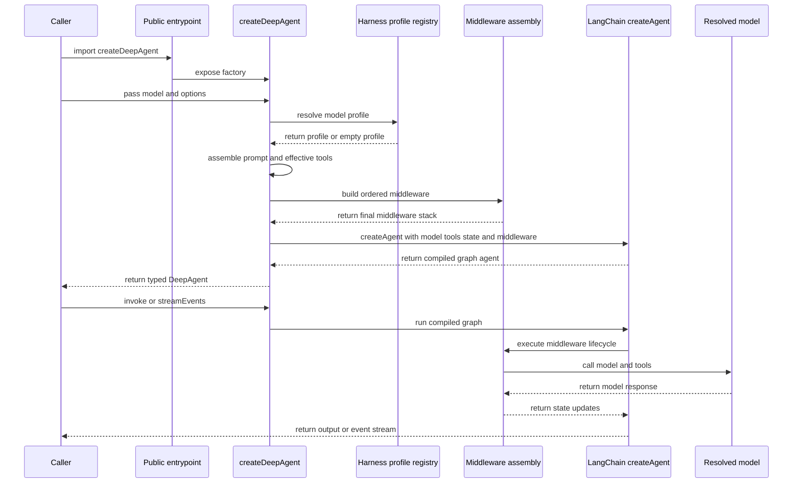

# Deep Agent Runtime and Public Surface

`deepagents` is the package boundary for building controllable AI agents on top of LangChain and LangGraph. The package owns the opinionated assembly layer: it supplies filesystem access, delegation, summarization, tool-call repair, optional skills, memory, human-in-the-loop interrupts, profile overlays, and the type surface that describes the resulting agent. The actual graph engine is LangChain's `createAgent`; `createDeepAgent` configures it and returns it as a `DeepAgent`.

## Package ownership and entrypoints

The package metadata exposes three meaningful import choices:

- The package root resolves to `./dist/index.js` for normal ESM imports and `./dist/index.cjs` for CommonJS. Its `browser` export condition selects `./dist/browser.js` when a bundler is targeting a browser.
- `deepagents/browser` is an explicit browser-safe subpath. It exports the agent, profiles, middleware, protocol types, and browser-compatible backends, but intentionally omits project configuration helpers, filesystem-backed skill loading, agent-memory middleware, `FilesystemBackend`, and `LocalShellBackend`.
- `deepagents/node` is an explicit Node entrypoint that re-exports `index`, so it includes the complete surface, including Node-only APIs.

This distinction is a runtime boundary rather than merely an organizational preference: an application should use the browser condition or `deepagents/browser` when its bundle must not import Node APIs, and use `deepagents/node` when it needs the full filesystem and configuration surface. The root `index` additionally re-exports backend implementations and protocol adapters, public profile registration and serialization helpers, middleware factories, `createDeepAgent`, the stream types, and state/type utilities.

## Construction path

*Caption: Construction resolves profile and prompt inputs before assembling middleware and compiling the LangGraph agent; invocation then runs that compiled graph through the middleware stack.*

### Inputs and early validation

`createDeepAgent` defaults to the model string `anthropic:claude-sonnet-4-6`, an empty user-tool list, the `StateBackend`, no custom middleware, no subagents, no permissions, and no stream transformers. A supplied `backend` can be an instance or a factory receiving state and store; `checkpointer`, `store`, `stateSchema`, `contextSchema`, `responseFormat`, `memory`, `skills`, `permissions`, `interruptOn`, and `name` are forwarded into the assembly path as appropriate.

Before building the graph, the factory rejects custom tools whose names collide with built-in filesystem tools, async-task tools, or `task`. It throws `ConfigurationError` with code `TOOL_NAME_COLLISION` and lists the colliding names. User tools are additive otherwise: passing `tools` does not remove the built-in filesystem tools. Profile tool-description overrides are applied by cloning the affected tool while preserving its prototype and replacing only its description.

The default `StateBackend` keeps files in LangGraph state. Its state is durable within a checkpointed conversation thread, not across threads, and updates are applied through LangGraph's state mechanisms. Use a different backend when filesystem state must be externalized or connected to a sandbox or store.

### Model and harness-profile resolution

The model input drives two independent decisions: the model passed to LangChain and the harness behavior layered around it.

1. For a model string, the string is used directly for profile lookup. The registry first considers an exact model key, then its provider prefix, and merges provider defaults beneath an exact-model override. Built-in profiles are loaded lazily. The current built-ins include model-specific Anthropic profiles and profiles for selected OpenAI Codex model specs.
2. For a model object, the factory extracts a provider and identifier. Configurable models use `_defaultConfig.modelProvider` and `_defaultConfig.model`; known model class names map to providers, and `model_name` or `modelName` supplies an identifier. Resolution tries the provider and identifier combination, then an identifier that already contains a provider, then the provider alone, and finally the immutable empty profile.
3. A profile is orthogonal to model selection. It can alter prompt text, tool descriptions, visible tools, middleware, and general-purpose-subagent settings, but it does not replace the model object or model string.

Profile merging is field-specific: prompt scalars use the more-specific value, tool-description maps use key-wise override, excluded tool and middleware names are unioned, extra middleware is merged by middleware name, and general-purpose-subagent settings merge field by field. Profile middleware factories are resolved afresh when assembling an agent, which prevents a mutable factory-created middleware instance from being shared accidentally.

### Prompt assembly

The prompt input accepts a string, a `SystemMessage`, or the compatibility `SystemPromptConfig`. A string or message becomes the prompt prefix; the structured form supplies prefix, base, and suffix fields. The active base is the caller's `base` when present, otherwise the resolved profile's `baseSystemPrompt`. The final prompt joins, in order:

1. caller prefix
2. active base
3. caller suffix
4. profile `systemPromptSuffix`

Non-empty string parts are separated by blank lines. If any part is a `SystemMessage`, the factory creates a new message from content blocks and preserves the existing blocks. An empty final prompt is omitted from the `createAgent` call, so a default agent does not acquire an authored system message merely by being created. The profile prompt overlay is also applied to declarative subagents and the automatically added general-purpose subagent.

### Deterministic middleware ordering

The root stack is assembled as two ordered regions. `mergeMiddlewareStack` makes same-name custom middleware replace an existing entry in place, while novel custom middleware stays between the default region and the tail; custom ordering is therefore meaningful without allowing a replacement to drift to the end.

The default region is:

1. optional root `SkillsMiddleware`
2. `FilesystemMiddleware`
3. `SubAgentMiddleware`
4. deepagents `SummarizationMiddleware`
5. `PatchToolCallsMiddleware`
6. optional async-subagent bridge

The tail region is:

1. profile-provided extra middleware
2. provider-specific prompt caching middleware and, for Anthropic, the cache-breakpoint middleware
3. optional memory middleware
4. optional human-in-the-loop middleware

Profile middleware is deliberately before cache middleware so its prompt changes participate in caching. After custom replacement, profile middleware exclusions filter the assembled stack. Profile tool exclusions are then appended as a final filtering middleware, after all tool-injecting middleware, so they affect both user and injected tools. Required scaffolding cannot be excluded: profile construction rejects attempts to remove `FilesystemMiddleware` or `SubAgentMiddleware`. Tool exclusions are model-facing calibration and should not be treated as a security boundary.

Declarative subagents receive their own default stack of filesystem, summarization, tool-call repair, and optional subagent skills, followed by their custom middleware and their resolved model profile's extra, cache, and fork-specific memory middleware. A subagent with a different model resolves a different profile. Custom subagents do not inherit the root skills by default; fork-mode subagents mirror the parent's skills and can inherit the parent's memory configuration. The general-purpose subagent is inserted when enabled and not already declared, uses the main model and effective tools, and receives the main agent's skills. Compiled subagents are used as supplied rather than rebuilt.

Finally, the factory calls LangChain `createAgent` with the resolved model, final prompt when non-empty, effective tools, state and context schemas, middleware, response format, checkpointer, store, name, and stream transformers. It applies a recursion limit of `10_000` and deepagents metadata to the resulting agent. The returned graph is therefore a compiled LangGraph agent, not a second execution engine maintained by deepagents.

## State, lifecycle, and extension points

### Persisted state versus invocation context

`stateSchema` extends the graph state with application fields alongside built-in `messages` and filesystem state. Middleware state schemas are included in the inferred result, and subagent middleware state is flattened into the deep-agent type configuration. With a checkpointer, state persists between invocations on the same thread; `contextSchema` instead describes per-invocation context and is not persisted. `store` is the separate long-term-memory boundary used by memory-aware middleware and backends.

The type-level contract reflects the runtime assembly. `DeepAgent` extends LangChain's `ReactAgent` and adds a `~deepAgentTypes` brand containing response, state, context, tools, subagents, and stream-transformer types. `createDeepAgent` returns this type after combining optional skills state, built-in middleware, user middleware, and flattened subagent middleware. A response strategy unwraps its schema type for `structuredResponse`; without `responseFormat`, that field is not added as a structured response type.

This makes custom middleware and subagents first-class extension points rather than untyped escape hatches. A middleware state schema becomes available on `invoke` output and graph state, while a literal subagent tuple can be queried by name with `InferSubagentByName`. Compiled subagents retain their runnable types; declarative subagents expose the state contributed by their middleware.

### Invocation and streaming

Normal `invoke`, `stream`, and LangGraph configuration behavior comes from the underlying `ReactAgent`, including `configurable.thread_id`, checkpointers, stores, abort signals, recursion limits, and interrupts. The deepagents-specific user-facing stream is opt-in through `agent.streamEvents(state, { version: "v3" })`.

The v3 return value is a typed projection over LangChain's `AgentRunStream`; it is a type overlay, not a custom runtime stream class. The underlying `createAgent` registers the native subagent transformer, and deepagents narrows that projection using the declared subagent tuple. A caller can consume:

- `run.messages` for message lifecycles and streamed text or reasoning
- `run.toolCalls` for typed tool name, input, output, status, and errors
- `run.subagents` for named delegation streams and each subagent's own messages and tool calls
- `run.middleware` for before and after agent or model lifecycle events
- `run.values` for state snapshots and `run.output` for final state
- `run.subgraphs` for child graph streams
- `run.extensions` for projections emitted by user-supplied stream transformers

The v3 API also exposes the raw async iterable, `path`, `signal`, and interruption information. The legacy LangGraph event-stream behavior remains available through the inherited overload for compatibility, but it does not provide the narrowed projection-oriented contract.

A practical lifecycle is therefore: construct once, invoke with initial messages and optional state, let middleware produce tool calls, summaries, file updates, delegation, cache controls, and interrupts, then consume either the final state or the v3 projections. Subagent streams are live async iterables; consumers should iterate them while the parent run is active rather than assuming they are replayable after completion.

## Focused tests and safe change points

The tests that define the runtime boundary are intentionally split by concern:

- `agent.test.ts` checks prompt normalization and omission of a default authored prompt, Anthropic cache-control placement, profile tool exclusion at both visibility and call time, tool-collision failures, opt-in todo state, and propagation of a custom `StateSchema` into the compiled graph.
- `agent.test-d.ts` checks that middleware and subagent state appear on `invoke` results with precise types, that `stateSchema` fields remain typed, and that the `DeepAgent` type brand preserves literal subagent information.
- `stream.test.ts` checks v3 output, message streaming, typed custom-tool calls, empty and populated subagent projections, per-invocation isolation for parallel same-type subagents, raw protocol events, values, interruption status, and abort signals.
- The harness profile tests cover profile creation, lazy registry behavior, exact-versus-provider resolution, merge semantics, serialization, and built-in registration. They are the right place to change profile precedence or validation rules.

When changing assembly, preserve the middleware names used for replacement and exclusion, keep tool exclusion after tool injection, and update both runtime tests and type tests. When changing an entrypoint, validate the package export map and browser build separately: the root browser condition and explicit `deepagents/browser` are intended to remain free of Node-only APIs, while `deepagents/node` must continue to expose the complete index.

## Related architecture

- [Backend storage](../architecture/backend-storage.md) explains the backend protocols and persistence choices used by filesystem middleware.
- [Context management](../concepts/context-management.md) covers summarization and history handling in more depth.
- [Delegation](../concepts/delegation.md) describes task subagents, isolated execution, and fork mode.
- [Model profiles](../concepts/model-profiles.md) documents profile registration and model-specific overlays.
- [Agent run workflow](../workflows/agent-run.md) follows an invocation from user input through tools and final output.
