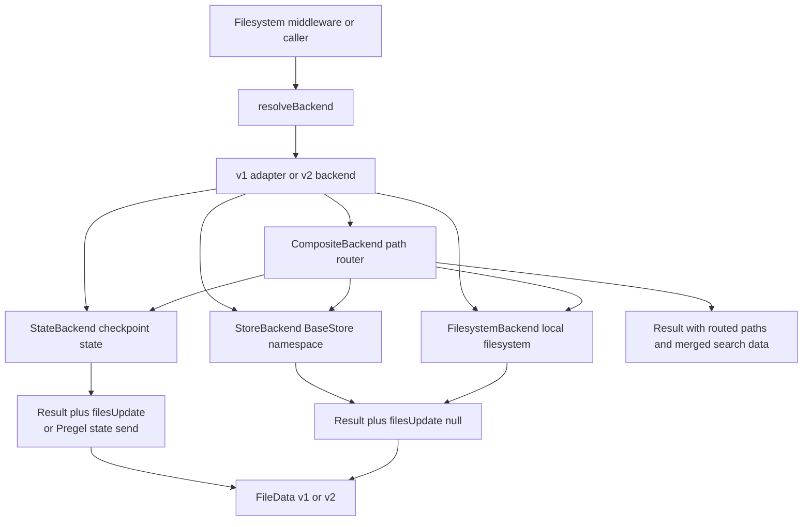

# Backend Protocol and File Storage Architecture

The backend layer gives filesystem tools one contract while allowing file data to live in LangGraph state, a LangGraph `BaseStore`, the host filesystem, or a routed combination of those locations. The important boundary is not just *where* a file is stored: it is whether a write is a checkpoint/state update that the graph must apply, or an externally persisted write that is already durable.

## The common model

`BackendProtocolV2` is the current implementation contract. It covers listing, paginated reads, raw reads, writes, edits, literal grep, glob, optional recursive delete, and optional upload/download operations. A sandbox backend is the same contract plus `execute(command)` and a non-empty `id`; this is how middleware decides whether to expose command execution.

The contract uses structured results rather than requiring callers to parse display strings or rely on exceptions:

- `LsResult`, `ReadResult`, `ReadRawResult`, `GlobResult`, and `GrepResult` carry an optional `error` alongside successful data. `GrepResult` and `GlobResult` can also carry partial data with `truncated: true`.
- `ReadResult.content` is a string for text or a `Uint8Array` for binary. Text reads may include `totalLines`, `startLine`, `endLine`, and `nextOffset`; binary reads return the complete payload and ignore line pagination.
- `WriteResult` and `EditResult` carry the affected path, edit occurrence count, optional operation metadata, and the storage-specific `filesUpdate` signal. `DeleteResult` uses null-valued update entries for legacy checkpoint deletion.
- Bulk upload/download results are per-path. A download returns `content: null` plus a standardized error such as `file_not_found`, `permission_denied`, `is_directory`, or `invalid_path`; an upload returns the path and either `error: null` or one of those codes.
- A successful command execution returns combined output, an exit code (possibly `null`), and a `truncated` flag.

An `error` field is therefore a normal result path, not evidence that an exception must have been thrown. Implementations can still throw for configuration failures such as an unavailable required store, invalid namespace construction, or an adapter/provider bug; callers should handle both structured failures and exceptional setup failures.



*The backend relationship: callers resolve one V2-shaped backend, which may route to checkpointed or externally persisted storage and returns structured data/results.*

## File data: v1 compatibility and v2 storage

The legacy `FileDataV1` shape stores text as an array of lines (`content: string[]`) with `created_at` and `modified_at`. It cannot represent binary content. `FileDataV2` stores text as one string or binary content as a `Uint8Array`, adds `mimeType`, and retains the timestamps. New backend writes default to v2; `BackendOptions.fileFormat: "v1"` is available for a rolling deployment or an older reader that still expects line arrays.

Readers accept the union of both formats. Runtime discrimination is based on whether `content` is an array. `migrateToFileDataV2` joins legacy lines with `\n` and derives a MIME type from the path, while preserving timestamps; v2 data without a MIME type is also repaired from the path. MIME classification treats common images, audio, video, PDF, and presentation formats as binary, while text formats, JSON, JavaScript, SVG, and unknown extensions are text. Consequently, literal grep skips binary files, and text pagination never attempts to slice binary bytes.

A text write preserves an existing file's creation timestamp and updates its modification timestamp. A binary write uses base64 text input for the `write` operation, decodes it to bytes for v2, and uses the path-derived MIME type. Bulk upload accepts bytes directly. This distinction matters when adding a backend: preserve the FileData shape and timestamps rather than returning an ad hoc string or silently turning binary data into text.

## Runtime resolution and the state-update boundary

A backend option can be a preconstructed backend or the deprecated `BackendFactory` form. `resolveBackend` awaits a factory when necessary, detects sandbox capability by the presence of a non-empty `id` and an `execute` function, and adapts either a sandbox or ordinary backend to `BackendProtocolV2`. The filesystem middleware resolves at request/tool time, so a factory can see the current runtime state and configuration. It uses the resolved backend again when deciding whether `execute` or `delete` should be visible to the model.

The default filesystem middleware backend remains a runtime factory around `StateBackend`; `createDeepAgent` likewise defaults its `backend` parameter to a `StateBackend` factory. New code should prefer a zero-argument backend instance (`new StateBackend()`, `new StoreBackend(options)`, or another preconstructed V2 backend) when the backend can read the LangGraph execution context itself. The runtime-injected constructors remain for compatibility.

### StateBackend: ephemeral, checkpoint-owned files

`StateBackend` stores a `files` map in the current graph state. Its intended lifetime is the conversation thread/checkpoint: it is available across steps in that thread, but is not cross-thread persistence. In the modern zero-argument mode it reads through LangGraph's fresh `__pregel_read` channel, so pending task writes are included, and sends writes/deletions through `__pregel_send`. The graph reducer/checkpoint mechanism owns the resulting state update.

In the deprecated runtime-injected mode, the backend reads `runtime.state.files` and returns update maps to its caller instead. The filesystem middleware turns a non-null `filesUpdate` into a LangGraph `Command` update; a modern zero-argument `StateBackend` normally returns only `{ path }` after sending the update, so there is no update map for middleware to apply. The old mode is still useful to understand tests and custom callers that explicitly merge `filesUpdate` into state.

State operations are map operations, not a host filesystem walk:

- `ls` derives immediate files and directories from file-key prefixes and returns `FileInfo` metadata.
- `read` paginates text by normalized line offset/limit, while binary data is returned in full.
- `delete` removes an exact key and every nested key by sending null markers. A missing target is a `DeleteResult.error`, not a successful empty deletion.
- `edit` performs validated literal replacement and reports `occurrences`; it does not use regular expressions. Grep is likewise literal and can be capped with `maxCount`.

The checkpoint-versus-external distinction is observable in the result contract: legacy state writes/edits contain a `Record<string, FileData>` in `filesUpdate`, whereas external backends return `filesUpdate: null`. Do not apply a null update to state, and do not assume that the absence of `filesUpdate` from a modern state backend means the write was lost.

### StoreBackend: persistent, namespaced files

`StoreBackend` maps file paths to LangGraph `BaseStore` items. Unlike state, the store is intended for persistent data shared across conversation threads. It obtains the store from an explicitly supplied `store`, the deprecated injected runtime, or the current LangGraph execution context. If no store is available, operations fail at configuration access rather than pretending that a store write succeeded.

The namespace is part of the storage identity. Resolution order is:

1. An explicit static namespace in `StoreBackendOptions`.
2. A namespace factory evaluated against `{ state, config, assistantId }`.
3. `assistant_id` or `assistantId` from runtime/config metadata.
4. The deprecated injected `assistantId`.
5. `["filesystem"]`.

The legacy assistant-id path becomes `[assistantId, "filesystem"]`. Static namespaces are validated and dynamic namespaces are validated when resolved: they must be non-empty and each component may contain only alphanumeric characters, `-`, `_`, `.`, `@`, `+`, `:`, or `~`. This prevents wildcard/glob-like components from changing the meaning of store lookups. Store search paginates internally until all matching items have been retrieved, then applies local path-prefix filtering for `ls`, `grep`, and `glob`.

Store writes, edits, and deletes are performed directly against the store and return `filesUpdate: null`, because the external persistence has already occurred. A store delete batches null-valued `PutOperation`s for the matching key and descendants; a store-level failure is reported in the `DeleteResult.error` field. The store adapter converts items to and from the same v1/v2 FileData model, so old line-array items remain readable.

### FilesystemBackend: local files and optional virtual roots

`FilesystemBackend` reads and writes the Node filesystem. `rootDir` sets the working root and defaults to `process.cwd()`. In normal mode, absolute paths are accepted as-is and relative paths resolve below `cwd`; listings and search results use concrete filesystem paths. In `virtualMode`, inputs are virtual absolute paths under `rootDir`, results use `/...` virtual paths, traversal (`..` and `~`) is rejected, and the resolved path must remain within the root.

File reads, writes, and edits avoid following symlinks: the implementation uses `O_NOFOLLOW` where available and explicit symlink checks otherwise. Virtual deletion additionally validates real parents so a symlinked parent cannot redirect an unlink outside the root. Writes create parent directories and return `filesUpdate: null`; directory deletes are recursive, while symlinks are removed as links rather than traversed.

The local backend derives MIME type and timestamps from filesystem metadata. Text reads use the same structured pagination fields as state/store reads. Grep uses ripgrep fixed-string mode when available and a literal substring fallback otherwise; the fallback skips binary files, does not follow symlinks, and observes `maxFileSizeMb`. `glob` returns structured `FileInfo` entries and deliberately does not descend into symlinked directories.

## CompositeBackend: one namespace over multiple backends

`CompositeBackend` is a transparent path router. Its constructor takes a default backend and a map such as:

```ts
const backend = new CompositeBackend(new StateBackend(), {
  "/memories/": new StoreBackend({ store, namespace: ["memories"] }),
});
```

Route keys are sorted longest-first, so a specific mount such as `/workspace/memories/` wins over a broader mount such as `/workspace/`. A path equal to the route root or beginning with the route prefix is routed. For a routed operation, the full prefix is stripped before delegation while a leading slash is retained: `/memories/notes.txt` becomes `/notes.txt`, and `/memories/` becomes `/` for the child backend. Listing, grep, glob, and routed delete results add the prefix back so callers see the composite namespace. A direct `write` or `edit` delegates the child result without rewriting its child `path`; callers should use the original request path when reporting a routed write.

The operations have deliberately different fan-out rules:

- `read`, `readRaw`, `write`, and `edit` select one backend.
- `ls("/")` lists the default root and exposes each route as a directory. A listing inside one route queries only that child.
- `grep` and `glob` query the default backend plus only routes mounted under the requested search path, then re-prefix and merge results. `grep` carries the total `maxCount` across backends and marks the result truncated when the cap prevents a complete search.
- `uploadFiles` and `downloadFiles` group requests by child backend for efficiency, but restore the original path and input order in the returned per-file responses.
- `execute` is not path-specific: it always delegates to the default backend, and fails if that backend is not a sandbox backend.
- A delete of a file selects one backend. A delete of a parent path or `/` fans out sequentially to the default and mounted descendants. It stops at the first non-not-found failure, reports that deletion may be partial, and does not roll back earlier successful deletes. Routed checkpoint deletion maps are re-prefixed before being returned.

The router adapts v1 children as it constructs the route table. It also preserves `routePrefixes` through protocol adaptation, allowing middleware's composite detection and execution-permission checks to keep working across module boundaries.

## v1 to v2 migration and extension guidance

V1 is deprecated but remains a compatibility boundary. `BackendProtocolV1` used `lsInfo`, a plain-string `read`, raw `FileData` from `readRaw`, `grepRaw` returning `GrepMatch[] | string`, and `globInfo`; writes and edits already used result objects, and delete/upload/download were optional. V2 replaces the read/search/listing methods with structured `Result` objects and makes binary/pagination metadata explicit.

`adaptBackendProtocol` normalizes either version: arrays become `{ files: ... }`, a v1 string read becomes `{ content: ... }`, a v1 raw file is migrated to v2 FileData, a v1 grep error string becomes `{ error: ... }`, and a v1 match array is capped and wrapped as `{ matches: ... }`. `adaptSandboxProtocol` adds through `execute` and `id`. New providers should implement V2 directly, return errors in the appropriate result field, preserve `filesUpdate` semantics, and make optional capabilities genuinely optional so middleware can hide unsupported tools.

When choosing a backend, decide the persistence boundary first:

- Use `StateBackend` for thread-scoped working files that belong in checkpoints.
- Use `StoreBackend` for durable cross-thread files and choose a namespace that expresses the required tenant/user/assistant isolation.
- Use `FilesystemBackend` for local or sandbox-mounted files, enabling `virtualMode` when the backend must expose only a controlled root.
- Use `CompositeBackend` when the agent needs one path vocabulary spanning ephemeral defaults and persistent or local mounts.

For an execution-capable backend, path permissions alone cannot constrain shell access. Filesystem middleware therefore rejects permissions combined with unrestricted `execute`, unless execution is disabled or every permission path is scoped to a `CompositeBackend` route. This is an operational safety boundary, not a storage feature: use a non-executing backend or an appropriately scoped composite when path-based permission rules are required.

## Focused tests that define the contract

- `state.test.ts` covers CRUD/search behavior, recursive deletion, v1/v2 file formats, zero-argument Pregel sends, and the legacy `filesUpdate` mode.
- `store.test.ts` covers store persistence, assistant/config namespace precedence, custom and dynamic namespaces, namespace validation, binary round trips, and per-file download errors.
- `composite.test.ts` covers route stripping and restoration, mixed state/store routing, selective search fan-out, batching, recursive mounted-route deletion, partial failure reporting, and global grep caps.
- `filesystem.test.ts` covers normal versus virtual paths, non-recursive listings, traversal rejection, and local structured operations.
- `utils.test.ts` covers MIME classification, v1-to-v2 migration, and wrapping v1 results into V2 result objects.
- `middleware/fs.ts` is the integration boundary: it resolves a backend at request time, turns checkpoint update maps into `Command` updates, leaves external writes alone, and filters tools based on resolved capabilities.
