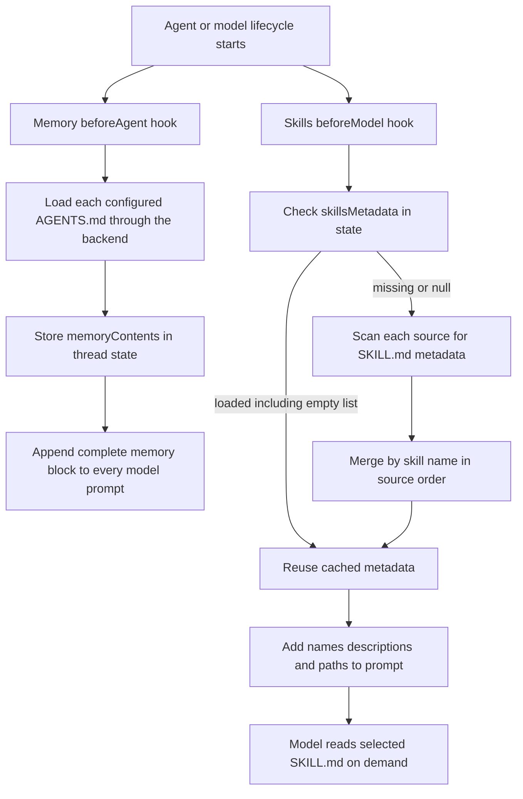
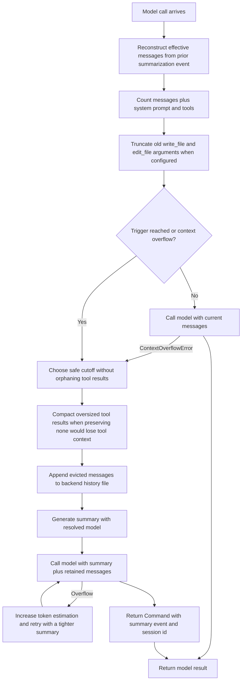

# Skills, Memory, Summarization, and Prompt Context

Deepagents manages prompt context through three different mechanisms with deliberately different lifecycles:

- **Memory** loads configured `AGENTS.md` files before the agent begins and injects their complete contents into every model request. It is always available to the model after loading.
- **Skills** load only metadata into the prompt. The model sees names, descriptions, paths, and optional annotations, then reads a selected `SKILL.md` through the normal filesystem tools when the task requires it. This is progressive disclosure.
- **Summarization** protects the model context window by retaining a recent slice, replacing older messages with a generated summary, and optionally appending the evicted history to backend storage.

These are middleware concerns, not three competing persistence systems. The backend determines where files live, while LangGraph state carries the loaded metadata or summarization event across a checkpointed thread.

## One loading model, two disclosure policies



*Caption: Memory loads full files once for the thread, whereas skills load a compact catalog and defer full instruction reads until the model selects a skill.*

### Memory: always-loaded context

`createDeepAgent({ memory: [...] })` creates `MemoryMiddleware` when the array is non-empty. The array is an explicit ordered list of backend paths; the middleware does not silently discover a project hierarchy. For each source, `beforeAgent` resolves the supplied backend, loads the file, and records successful text in a private `memoryContents` map keyed by the original path. Sources are formatted in the same order, with later sources appearing after earlier sources. There is no last-wins merge for memory: if two files contain contradictory instructions, both are present and the prompt or project convention must establish how to interpret them.

The middleware caches the load in state. If `memoryContents` already exists, a later invocation does not reread the files. The `wrapModelCall` hook appends an `<agent_memory>` block containing the source paths and their contents, followed by memory guidance, to the existing system message. If no source is available, it still supplies `(No memory loaded)` rather than failing the model call. A checkpointer therefore makes the loaded context reusable on that thread; changing the backing file does not change an already-loaded checkpoint unless the state is reset or a new run/thread loads it again.

The backend boundary is important. `createMemoryMiddleware` uses `resolveBackend` and the backend protocol, so the same behavior can read from `StateBackend`, `StoreBackend`, `FilesystemBackend`, a composite backend, or a backend factory. With a backend that supports `downloadFiles`, a missing file is an expected optional condition: `file_not_found` is skipped. A read result with an error is likewise treated as unavailable, while other per-source download failures are logged and that source is omitted. Backend resolution or configuration failures occur before per-source loading and can surface to the caller; memory being optional does not make a broken required backend configuration safe to ignore.

The default memory prompt also tells the model it may update memory with `edit_file`, and explicitly warns against storing credentials. That is prompt guidance rather than an authorization system: file permissions, a sandbox, and human approval still belong to backend and tool configuration. A memory source can be a state file, so `/AGENTS.md` in a `StateBackend` is thread-scoped rather than automatically a host-level user file.

### Skills: catalog first, instructions later

`createSkillsMiddleware({ backend, sources })` uses only backend APIs and is portable across storage implementations. Each source may be either a parent directory or a direct skill directory:

- A parent source is listed and each immediate subdirectory is considered only when it contains `SKILL.md`.
- A direct source is detected when its listing contains `SKILL.md` and is parsed as one skill.
- A source that cannot be listed, a missing `SKILL.md`, an unreadable skill file, malformed YAML, missing `name` or `description`, or a file larger than `10 MB` contributes no skill. The middleware logs source-level failures and continues with other sources.

A `SKILL.md` must begin with YAML frontmatter. The loader parses `name`, `description`, optional `license`, `compatibility`, `metadata`, `allowed-tools`, and a module entrypoint. It validates the Agent Skills name rules and directory-name match as warnings for compatibility, truncates descriptions above 1,024 characters and compatibility above 500 characters, and rejects malformed or oversized files. A `module` is retained only when it is a relative path with a supported JavaScript or TypeScript extension and no traversal or declaration-file path; invalid module metadata degrades the skill to prose-only.

Source order is the precedence rule for skills. A `Map` keyed by skill name is populated source by source, so a later source replaces an earlier skill with the same name. The final catalog preserves the resulting insertion order, and the last configured source is marked higher priority in the generated prompt. This makes layering explicit, for example base, user, then project skills. It does not grant a skill extra tool permissions: `allowed-tools` is displayed as metadata, while actual tool visibility and authorization remain middleware and backend concerns.

The middleware stores the catalog as `skillsMetadata`. Missing, `undefined`, or `null` means load; an empty array means a successful load that found no skills and is still cached. To refresh after adding, editing, or deleting a skill, set `skillsMetadata: null` in input or state. Reloading happens in the next `beforeModel` hook, so a middleware can invalidate the catalog mid-run and the following model call sees fresh metadata. The model then uses `read_file` on the displayed path when it needs the full instructions. `createDeepAgent` also adds this middleware for the root `skills` option; ordinary custom subagents do not inherit root skills, while the general-purpose subagent does and fork-mode subagents mirror them.

## Prompt ordering, caching, and provider boundaries

At the root agent, the relevant assembly order is: optional skills, filesystem and delegation middleware, summarization, tool-call repair, profile middleware, provider cache middleware, memory, and human-in-the-loop middleware. Profile middleware precedes caching so profile-authored prompt changes can participate in a cache. The memory block follows the static cache breakpoint, because memory can change while the static harness prompt remains stable.

For Anthropic models, `createDeepAgent` installs provider prompt caching plus `CacheBreakpointMiddleware`. The breakpoint copies the current system message and marks its last content block with `cache_control: { type: "ephemeral" }`, capturing static content injected before it. Memory can opt into a second breakpoint via `addCacheControl`, so the resulting prompt has one stable breakpoint and one dynamic memory breakpoint. Both middleware and breakpoint logic check the model on each call: if fallback middleware changes an Anthropic request to OpenAI or another provider, no Anthropic-only marker is emitted. This avoids provider errors such as rejection of the unknown `cache_control` parameter. The cache middleware also leaves the original system-message blocks unmutated.

`createDeepAgent` enables `addCacheControl` for memory when the primary model is Anthropic. Direct callers of `createMemoryMiddleware` must opt in themselves. Cache controls are optimization hints, not memory consistency: a cached prompt does not reload files or override checkpoint state.

## Conversation history offloading and summarization

The deepagents `createSummarizationMiddleware` extends LangChain summarization with backend history storage and tool-payload protection. It accepts message, token, or fraction triggers and a message, token, or fraction retention policy. Explicit `trigger`, `keep`, and argument-truncation settings take precedence. If no trigger is supplied, the first resolved model determines defaults: models exposing `profile.maxInputTokens` use an 85% trigger and retain 10%; models without that profile use a 170,000-token trigger and retain six messages. The default truncation policy follows the same profile distinction. A request-time model takes precedence over the middleware's optional model used to generate summaries.



*Caption: Summarization first protects tool payloads, then offloads and condenses old context; the event lets later calls reconstruct the effective history without rewriting the whole message state.*

### What is persisted and what the model sees

The history path defaults to `/conversation_history/{session}.md`, where the session comes from `_summarizationSessionId` in state or a generated middleware-instance fallback. Each event appends a `## Summarized at ...` section containing the evicted messages. The implementation prefers raw byte download and `uploadFiles` concatenation, falls back to `write` for a new file, and uses `edit` when upload is unavailable. A custom `historyPathPrefix` changes the path namespace.

Summarization does not delete all messages from graph state. It returns a `Command` carrying a private `_summarizationEvent` with the cutoff index, summary `HumanMessage`, and offload path, plus the session id. On later calls, `getEffectiveMessages` presents the summary followed by messages at and after the cutoff. This avoids a full state rewrite while preserving the relationship between checkpoint history and the model-facing context. The summary message is tagged with `lc_source: "summarization"`, so previous summaries are excluded from the next offload rather than recursively copied into the history file.

The cutoff logic is safety-sensitive. It adjusts a boundary that lands on a `ToolMessage` so the corresponding AI tool call and all its results remain together. If moving backward would preserve an excessively large tool-call group, it advances past the consecutive results instead. When no messages could otherwise be retained, large `ToolMessage` payloads are compacted to fit a budget with headroom before summarization is attempted; this prevents the model from losing tool-call context and repeatedly invoking the same tools. Old `write_file` and `edit_file` tool-call arguments can also be shortened according to `truncateArgsSettings`.

If the backend cannot offload history, the middleware warns and continues summarization with a summary that has no file reference. This is intentional: avoiding context overflow is more important than archival success. If the model raises `ContextOverflowError` despite the initial attempt, the middleware catches wrapped overflow errors, calibrates its token-estimation multiplier from the observed ratio, and retries with a tighter summary. Other model errors are rethrown.

## Deprecated direct agent memory

`createAgentMemoryMiddleware` is retained for compatibility but is not the recommended path. It uses Node's `fs` directly, so it cannot follow the backend abstraction and is unsuitable for non-filesystem backends or browser-oriented runtimes. It reads a user `agent.md` below `~/.deepagents/{assistantId}/` and a project `agent.md` below `{projectRoot}/.deepagents/`, where `createSettings` discovers the project by walking upward for `.git`. Its older state fields are `userMemory` and `projectMemory`, and it injects those sections plus a long-term-memory instruction document into the system prompt.

Use `createMemoryMiddleware` instead with explicit `AGENTS.md` source paths and a backend, for example:

```ts
const middleware = createMemoryMiddleware({
  backend: new FilesystemBackend({ rootDir: "/" }),
  sources: ["~/.deepagents/AGENTS.md", "./.deepagents/AGENTS.md"],
});
```

The deprecated middleware treats absent files and `fs` read errors as empty optional memory and loads once into state. That graceful behavior should not be confused with portability or authorization; its direct filesystem access bypasses backend routing and its paths are governed by Node process access.

## Configuration and operational guidance

- Choose the backend before choosing a path convention. `StateBackend` makes memory and history thread-scoped, `StoreBackend` provides namespaced cross-thread persistence, and `FilesystemBackend` exposes host or sandbox files. A backend factory is useful when paths depend on current graph state.
- Treat `AGENTS.md` as prompt input. Do not put API keys, access tokens, passwords, or untrusted instructions into a source without appropriate isolation and review; the memory prompt explicitly says not to store credentials, but the backend remains the enforcement boundary.
- Keep skill sources ordered from lowest to highest priority. Use `skillsMetadata: null` when an operator or tool has changed a skill during a live thread.
- Set explicit summarization thresholds for predictable operations when the model profile is unavailable or when tool outputs are unusually large. Use `historyPathPrefix` to place archives in an intentional backend namespace.
- Remember that offloading is best-effort archival. Monitor warnings if conversation history is required for audit, because a failed write does not stop the run or preserve the evicted messages outside the in-memory/checkpoint state.
- For Anthropic caching, keep stable prompt material before the memory block and do not rely on cache markers with a fallback provider. The per-call provider gate is part of correctness, not merely a performance detail.

## Focused tests that define the contracts

- `middleware/memory.test.ts` covers ordered multi-file loading, missing and empty sources, state caching, backend factories, prompt injection, StateBackend integration, and Anthropic versus non-Anthropic cache-control behavior.
- `middleware/skills.test.ts` covers parent and direct sources, later-source override, missing or invalid files, the 10 MB limit, fallback to `read`, state caching, `null` reloads, per-invocation backend factories, frontmatter validation, safe module paths, and prompt formatting.
- `middleware/cache.test.ts` checks last-block placement, immutability, empty prompts, and per-call provider gating for model fallback.
- `middleware/summarization.test.ts` checks message, token, fraction, and multiple triggers; backend append and failure; event and session tracking; chained summaries; safe AI/tool cutoffs; argument and result compaction; overflow retry and token calibration.
- `middleware/agent-memory.test.ts` records the legacy `agent.md` paths, state fields, missing-file behavior, and prompt template so compatibility changes do not get mistaken for changes to the current AGENTS.md implementation.

The safe change points are the middleware contracts and their tests: preserve the distinction between full memory and metadata-only skills, preserve source ordering and the `null` reload sentinel, keep summarization events consistent with message indices, and route all current file access through the backend protocol rather than adding new direct `fs` reads.

## Related architecture

- [Deep Agent Runtime and Public Surface](../architecture/agent-runtime.md) explains middleware assembly order and model/profile resolution.
- [Backend Protocol and File Storage Architecture](../architecture/backend-storage.md) explains state, store, filesystem, and composite backend lifetimes.
- The agent run workflow follows invocation, middleware, tool, and output lifecycles.
