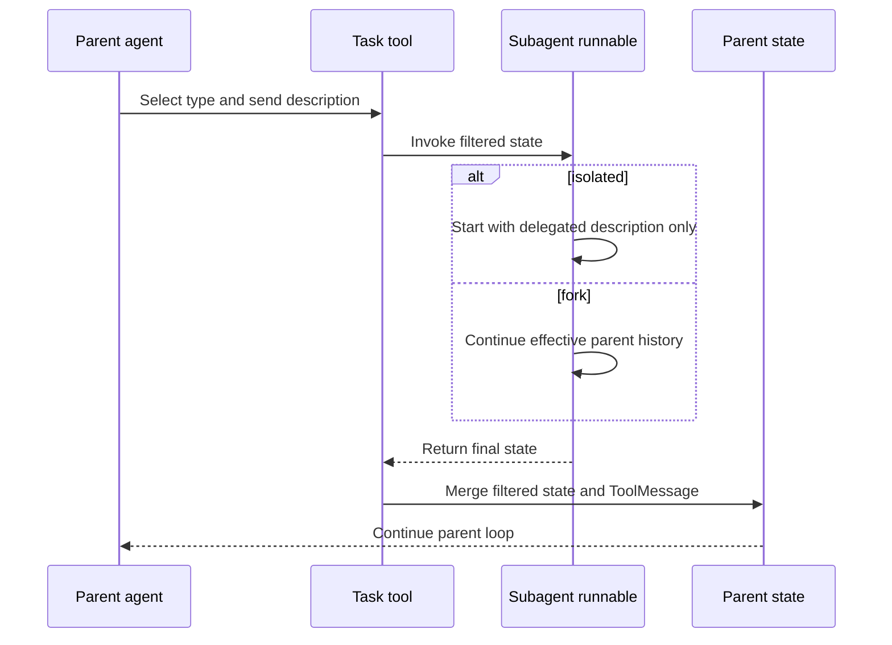
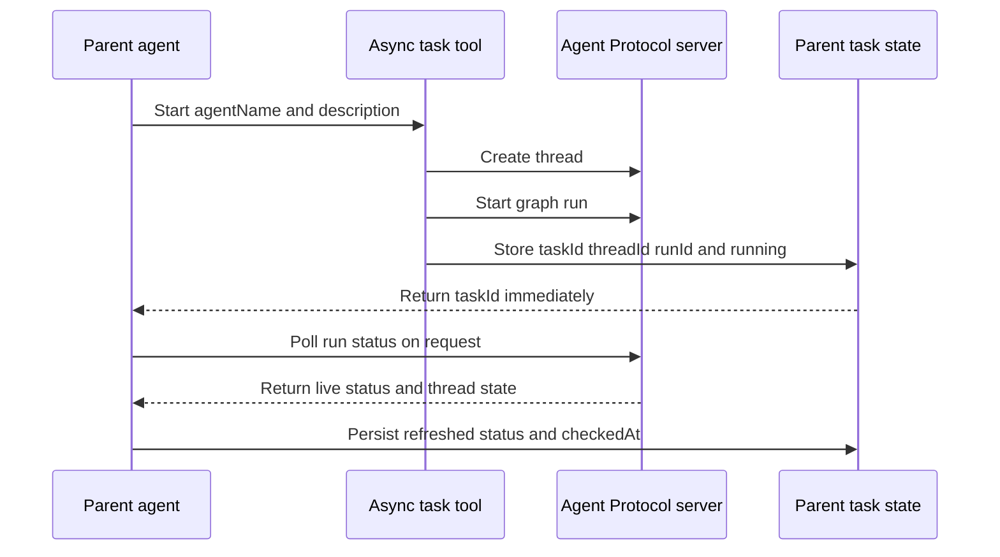
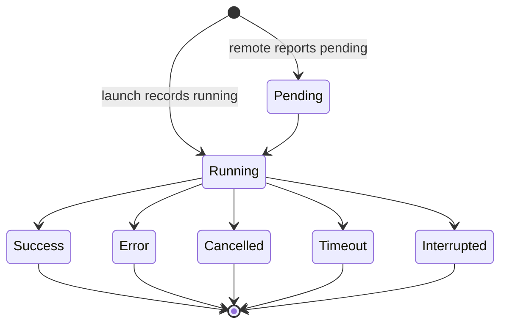

# Subagent Delegation and Async Tasks

Deep Agents expose two different delegation planes:

- **Synchronous delegation** uses the `task` tool to invoke a local runnable and wait for its final report. The runnable may be a declarative `SubAgent`, a pre-compiled `CompiledSubAgent`, or another `createDeepAgent`, so a hierarchy can contain multiple levels.
- **Asynchronous delegation** uses five task-management tools to launch a graph on an Agent Protocol-compatible remote server. The parent returns to its own loop immediately and later polls, updates, or cancels the remote run.

`createDeepAgent` is the main assembly point. It always builds the synchronous subagent middleware and adds `createAsyncSubAgentMiddleware` when the unified `subagents` option contains at least one `AsyncSubAgent` identified by its `graphId`. The two forms therefore share configuration at the public entrypoint but have different context and lifecycle semantics.

## Synchronous task routing

`createSubAgentMiddleware` installs a single `task` tool. Its schema selects an agent with `subagent_type` and supplies a detailed `description`. At construction time it validates names, compiles declarative specifications, and retains pre-compiled runnables as-is. An unknown type is an error rather than an implicit fallback.

A declarative subagent is compiled by `createSubAgent` after the parent has supplied defaults for model and tools. It can add its own system prompt, tools, middleware, `interruptOn` configuration, skills, permissions, and response format. A `CompiledSubAgent` bypasses that compilation path; its `runnable` owns its model and middleware. This is what allows a complete `createDeepAgent` to be mounted below another agent. Each name must be unique, including the automatically available `general-purpose` agent.

The generated task-tool description tells the model to issue multiple task calls in one assistant turn when work is independent. LangGraph then executes those calls concurrently. The child reports are not directly shown to the user: the parent receives a `ToolMessage` and is responsible for synthesizing the answer.



*This sequence shows the local task-tool boundary and the filtered state returned to the parent.*

### Defaults and extension points

`createDeepAgent` gives declarative subagents a deep-agent-oriented default stack: filesystem access, summarization, tool-call patching, and any model-profile middleware. A custom subagent does **not** inherit the root agent's skills automatically; it must specify its own `skills` paths. The built-in general-purpose subagent is the exception: it uses the parent model and tools and inherits the root skills. A declarative subagent that omits `tools` uses the parent tools, which is true for both isolated and fork modes.

Other important options are:

- `model` selects a child model independently of the parent. Model profiles and their excluded tools or middleware are resolved for that child.
- `middleware` appends child-specific behavior. `interruptOn` adds human-in-the-loop handling and requires a checkpointer when the child is run that way.
- `responseFormat` requests a schema-backed result. A dynamic response format can also be supplied through `SUBAGENT_RESPONSE_FORMAT_CONFIG_KEY`, but only for declarative specs; compiled runnables cannot be recompiled with a dynamic schema.
- `generalPurposeAgent: false` disables the general-purpose entry when using `createSubAgentMiddleware` directly. `createDeepAgent` manages its own default general-purpose configuration.

## Isolated versus forked context

The default mode is **`isolated`**. The child receives a new message containing only the delegated description. Its system prompt and configured tools are its own, and it does not see the parent's conversation. This is the safe default for independent research or execution tasks.

**`mode: "fork"`** is an experimental continuation boundary. A declarative fork receives the parent's effective conversation, including the post-summarization view when history has already been compacted, and then receives a preamble plus the new task description. The parent's system prompt is retained and the fork's `systemPrompt`, if present, is appended as an addendum rather than replacing it. Forks also mirror the parent's prompt-producing skills and memory middleware so their reconstructed system message matches the parent. A fork may not declare its own `skills`; construction fails because the parent's skills are inherited.

A compiled fork differs in one important respect: the parent supplies the conversation history, but the compiled runnable's system prompt remains fixed inside that runnable. The task-tool description calls this out so the model does not assume compiled and declarative forks have identical prompt ownership. Context inheritance is independent of whether the child uses the same model as the parent.

A fork also gets a separate copy of the task tool positioned after filesystem middleware. The copy is marked in state during `beforeAgent`. If that fork tries to call `task` again, the tool returns a refusal telling it to complete the current task itself. This explicit boundary prevents a fork from recursively spawning forks while still allowing ordinary hierarchical composition through separately compiled agents.

### State filtering at the boundary

The child invocation and the state returned by a child are intentionally different from a raw graph-to-graph state copy. For the isolated and compiled path, `filterStateForSubagent` excludes these keys:

- `messages`, because the task description becomes the child's new conversation
- `todos`
- `structuredResponse`
- `skillsMetadata` and `memoryContents`, which are private prompt state
- `threadModelCallCount`, `runModelCallCount`, `threadToolCallCount`, and `runToolCallCount`
- `_summarizationEvent` and `_summarizationSessionId`
- `_deepagentsForkedContext`, the internal recursion marker

The child result is filtered with the same list. Its final answer is then sent back as the `task` `ToolMessage`; a non-null `structuredResponse` is serialized as JSON, otherwise the last non-empty `AIMessage` text is selected. This prevents a child's messages and private bookkeeping from replacing the parent's channels.

A declarative fork uses the deliberately narrower `filterStateForFork`. It excludes `structuredResponse`, all four call-count keys, and the two summarization keys, but preserves the parent's `messages`, `todos`, `skillsMetadata`, `memoryContents`, and other user state before `runTask` replaces `messages` with the effective history plus the fork task. The in-flight parent `AIMessage` with unresolved tool calls is removed first, including sibling calls from a parallel delegation turn. The fork gets a fresh summarization session ID.

```text
Isolated or compiled subagent
  parent state -> remove messages, todos, private prompt state, summaries, call counts
  child result -> remove the same keys, then return ToolMessage plus safe state

Declarative fork
  parent state -> keep conversation and prompt-producing private state
  remove structured response, summaries, and call counts
  rebuild effective history -> append fork preamble and task description
```

The call-count exclusion is an operational invariant, not merely a privacy choice. Model and tool limit middleware uses plain single-writer channels. Forwarding those values would make parallel children write into the parent's channels, allow a child's reset to overwrite the parent, or produce `INVALID_CONCURRENT_GRAPH_UPDATE`. Each graph therefore owns its own model-call and tool-call budget. Configure limits on the parent and child independently when a workload needs bounded execution.

Filesystem state is different: reducer-backed file updates are safe to merge, which is why parallel children can write different files without one child's result erasing another's. Arbitrary custom middleware state is not automatically safe merely because it is present. A middleware author adding plain state should provide a compatible reducer or avoid returning a colliding value across parallel child boundaries.

## Permission inheritance

`SubAgent.permissions` controls the filesystem middleware's permission rules. The effective value is resolved with nullish semantics:

```ts
const effectivePermissions = input.permissions ?? permissions;
```

Therefore:

- omitting `permissions` inherits the parent rules
- `permissions: []` is an explicit unrestricted replacement, not inheritance
- a non-empty child array replaces the parent's rules with child-specific rules

This is a **full replacement**, not a merge. A child can consequently remove a parent deny rule with `[]`, or impose a deny rule on a path the parent allowed. Treat that as a deliberate capability boundary when defining a reader or writer subagent.

## Structured responses and result semantics

A declarative subagent may set `responseFormat` to a Zod schema, JSON schema, `toolStrategy`, `providerStrategy`, or another format accepted by `createAgent`. When the child returns `structuredResponse`, the task tool JSON-serializes it into the parent's `ToolMessage` instead of extracting prose. This gives a supervisor predictable data to parse and aggregate.

Without structured output, the return path walks backward through child messages to find the last `AIMessage` with non-empty text. That avoids forwarding an empty trailing `AIMessage` emitted after a final tool call. If no usable text is available, the fallback is `Task completed`.

## Remote asynchronous subagents

An `AsyncSubAgent` describes a remote graph or assistant:

```ts
import { createDeepAgent, type AsyncSubAgent } from "deepagents";

const asyncSubAgents: AsyncSubAgent[] = [
  {
    name: "researcher",
    description: "A general-purpose research agent that can investigate any topic.",
    graphId: "researcher",
    url: "https://my-agent-protocol-server.example.com",
    headers: { "x-team": "research" },
  },
];

const supervisor = createDeepAgent({
  systemPrompt: "Coordinate background research and report live task status.",
  subagents: asyncSubAgents,
});
```

`graphId` is the runtime discriminant. `url` is optional for the SDK's default endpoint, and `headers` supports custom authentication or routing. LangGraph Platform authentication is supplied through the SDK's supported environment variables; self-hosted servers can use explicit headers. `ClientCache` reuses a LangGraph SDK `Client` for agents with the same URL and resolved headers, and adds `x-auth-scheme: langsmith` unless the configuration explicitly provides that header.

Adding at least one async spec mounts `asyncSubAgentMiddleware`, which contributes exactly these tools:

- `start_async_task`
- `check_async_task`
- `update_async_task`
- `cancel_async_task`
- `list_async_tasks`

The launch tool validates `agentName`, creates a remote thread, and starts a run with the description as a user message. It returns immediately with a task ID. The task ID is the remote `thread_id`; the task record also stores the current `runId`, agent name, description, creation time, and cached `running` status. If the parent has a configured `thread_id`, the launch input also carries it as `callbackThreadId` so the remote child can notify the parent later. Launch failures are returned as tool errors and do not create a task record.



*This sequence shows that remote work outlives the launch tool call while its bookkeeping remains in parent state.*

### Task lifecycle and controls

The supported status vocabulary includes `pending`, `running`, `success`, `error`, `cancelled`, `timeout`, and `interrupted`. The middleware records `running` on launch; `pending` and the other statuses may be returned by the remote server. `success`, `error`, `cancelled`, `timeout`, and `interrupted` are terminal for listing purposes.



*This state machine distinguishes live statuses from terminal task statuses.*

- `check_async_task` requires the exact tracked task ID, fetches the current run, and, on success, reads the remote thread state. It returns the last message content as `result`, or `Completed with no output messages.` when no messages are available. An error run returns a generic error description. It persists the refreshed status, `checkedAt`, and `updatedAt` when the status changed. A missing task or failed status request is reported without inventing a result.
- `list_async_tasks` first filters the **cached** records when `statusFilter` is supplied. It then fetches non-terminal live statuses concurrently with `Promise.all`, updates each returned record, and formats task ID, agent, and status. Terminal records avoid an unnecessary network request. If a live request fails, the cached status is retained. Filtering happens before live fetching, so a filter that matches nothing makes no remote calls.
- `update_async_task` starts a new run on the same remote thread with `multitaskStrategy: "interrupt"`. The child sees its prior remote conversation plus the new message. The task ID and thread ID remain stable while `runId`, status, description, and `updatedAt` change.
- `cancel_async_task` cancels the current remote run and persists `cancelled` while retaining the existing run ID and timestamps that still describe the task.

The `asyncTasks` channel uses a reducer that shallow-merges task records by task ID. A launch or status operation therefore updates one or more entries without replacing unrelated tasks, and the records survive context compaction and graph checkpoints. The implementation does not provide a delete operation; cancellation is the terminal bookkeeping action exposed to the model.

### Optional completion callbacks

`createCompletionCallbackMiddleware` is experimental and is intended for the remote child graph. The parent launch tool stores `callbackThreadId` in the child's input state. When the child finishes, the middleware reads its final `AIMessage`, truncates the notification to 500 characters when necessary, prefixes the task ID when available, and calls `runs.create` on the callback thread using the configured `callbackGraphId`. The truncation message tells the supervisor to use `check_async_task` for the full result.

A model-call exception produces a generic callback notification and is then rethrown in the child, so internal exception details are not sent to the callback agent. Network failures while delivering the callback are best effort: they are warned about and swallowed. The successful completion hook requires `callbackThreadId` in child state, so deploy the notifier consistently with parent launches that provide a callback thread; a missing key currently causes the completion hook to fail rather than silently fabricating a destination.

## Configuration and failure boundaries

- Keep subagent names unique. Duplicate synchronous names fail during task-tool construction; duplicate async names fail when async middleware is created. User tools also cannot collide with built-in names such as `task` or the five async task tools.
- Give isolated children complete descriptions because they cannot infer the parent's conversation. For forks, avoid repeating context that is already inherited, but state the desired output and completion criteria.
- Do not report an async status from a previous conversation turn. Call `list_async_tasks` for a live overview and `check_async_task` for the exact result of a completed task.
- Use a checkpointer for workflows that need resumable task state or human-in-the-loop interruption. Remote task records are only as durable as the parent's configured LangGraph state and checkpointer.
- For parallel delegation, keep independent child writes reducer-backed and give each child a separate call budget. Never assume arbitrary middleware state can be copied safely merely because it is serializable.

## Focused verification

The most relevant regression coverage is split by responsibility:

- `subagent.test.ts` covers isolated and fork context, effective summarized history, the recursion refusal, prompt and middleware mirroring, in-flight message removal, state filtering, per-graph call counts, compiled and hierarchical agents, tool inheritance, permissions wiring, and structured-response serialization.
- `subagents.int.test.ts` exercises actual task routing, child tool calls, compiled deep agents, nested hierarchies, parallel task calls, and concurrent filesystem updates.
- `async_subagents.test.ts` covers remote SDK calls, task-record persistence, live versus cached status, parallel status polling, update and cancellation semantics, terminal-state handling, and configuration validation.
- `completion_callback.test.ts` verifies callback addressing, truncation, generic error notifications, explicit authentication headers, and best-effort delivery failures.
- `subagents.permissions.test.ts` verifies the critical distinction between inherited permissions, `[]` as an unrestricted replacement, and child-specific deny rules.

Together these tests describe the safe change surface: alter context filtering, reducers, or middleware state schemas only with the parallel and fork cases in mind, and preserve the distinction between synchronous result return and asynchronous task persistence.
