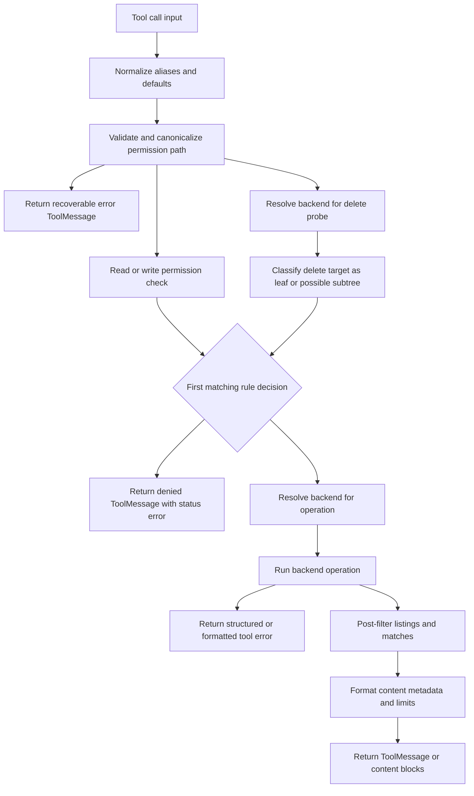

# Filesystem Tools, Limits, and Permissions

The filesystem middleware is the agent-facing boundary for `ls`, `read_file`, `write_file`, `edit_file`, `delete`, `glob`, `grep`, and, when the backend supports it, `execute`. It does not itself own file storage. Instead, it normalizes tool input, enforces optional path rules, resolves a backend at call time, converts structured backend results into model-facing content, and applies context-size protections.

The default backend is a runtime factory around `StateBackend`, so files normally belong to the current LangGraph thread and checkpoint. A caller can instead provide a `StoreBackend`, `FilesystemBackend`, `CompositeBackend`, another V2 backend, or a factory. The backend contract and persistence choices are described in [Backend Protocol and File Storage Architecture](/openwiki/architecture/backend-storage.md).

## Tool-call path

For ordinary file operations, the middleware validates and checks the relevant path before invoking the backend. `delete` is the deliberate exception: because deletion is recursive, it resolves the backend and probes the target before deciding whether the target may contain descendants. That lets it protect denied descendants rather than checking only the requested directory name.

*This flow shows the shared middleware boundary from normalized input through validation, permission decision, backend work, and the formatted result; the delete branch performs its subtree probe before the decision.*

`resolveBackend` accepts either an instance or the deprecated factory form. It awaits factories, detects sandbox capability, and adapts V1 or V2 backends to the current `BackendProtocolV2` shape. Resolving at tool-request time allows a factory to observe the current runtime state. For checkpoint-style backends, a non-null `filesUpdate` becomes a LangGraph `Command`; external backends return `filesUpdate: null` because they have already persisted the operation.

## Built-in tool surface

The middleware registers every built-in tool by default, subject to the resolved backend's capabilities. `tools: "all"` has the same meaning. An explicit allowlist restricts only these built-ins and must include `read_file`; this is required both for normal inspection and for reading large results saved by the middleware. User-provided tools are not restricted by this allowlist. At model-call time, `execute` is removed when the backend is not a sandbox backend, and the built-in `delete` is removed when the backend has no delete method.

| Tool | Behavior and important limits |
| --- | --- |
| `ls` | Lists one directory non-recursively, formats files and directories, and reports `No files found in ...` after permission filtering leaves no entries. The backend listing is sorted; inaccessible entries are filtered from the result. |
| `read_file` | Reads text by line window, defaulting to `offset: 0` and `limit: 100`. It accepts `path` as an alias for `file_path`. Text results carry a status header such as `@@ lines 1-2 of 2 @@` above an unmodified source body. Empty text returns a system-reminder warning. Binary data ignores line pagination and becomes an image, audio, video, or file content block. |
| `write_file` | Creates or completely overwrites the requested path. The backend decides how text or base64 binary content is stored. Success is a `ToolMessage`; state-backed updates are returned through a graph command. |
| `edit_file` | Performs exact string replacement. It reports an error when the old string is absent, when it is empty in a non-empty file, or when it occurs more than once without `replace_all: true`. It reports the occurrence count on success. |
| `delete` | Permanently deletes a file or recursively deletes a directory. Symlink handling belongs to the backend, but the local backend removes links as links rather than traversing them. The middleware performs the conservative recursive permission check described below. |
| `glob` | Finds files using glob syntax such as `*`, `**`, `?`, and character or brace patterns, then returns paths. No matches are reported as `No files found matching pattern ...`. |
| `grep` | Searches literal text, not regular expressions. It supports an optional file glob, `files_with_matches`, `content`, or `count` output, and a total `max_count`. The default maximum is 1,000 matches; a per-call `max_count` overrides it. |
| `execute` | Runs a shell command only through a sandbox-capable backend and returns combined output, exit code, and an output-truncated indication. It is not a path-scoped operation, so filesystem path permissions cannot safely constrain it. |

The tool schemas also coerce numeric `offset`, `limit`, and `max_count` inputs where applicable. `read_file` uses `normalizeReadPagination`: non-finite values become zero, and finite negative or fractional values are clamped or floored. A negative requested offset is disclosed in a notice even though the effective read starts at line 1.

### Text, binary, and backend behavior

`BackendProtocolV2` uses structured results rather than requiring the middleware to parse display strings. Reads identify errors separately from content and may provide `totalLines`, `startLine`, `endLine`, and a 0-indexed `nextOffset`. Text pagination is line-based. Binary reads return the complete payload and ignore line offsets and limits.

`read_file` additionally refuses binary payloads over 10 MiB. Smaller payloads are base64-encoded into the appropriate multimodal block. MIME type comes from the backend when available or from the path extension otherwise; unknown extensions are treated as text by the shared utilities.

The concrete `FilesystemBackend` resolves paths relative to `rootDir` or `process.cwd()` in normal mode. With `virtualMode: true`, incoming paths are virtual absolute paths beneath the configured root, traversal is rejected, and the resolved path must remain inside that root. Local reads, writes, and edits use `O_NOFOLLOW` where available and explicit symlink checks otherwise. Local grep uses ripgrep fixed-string mode when available and a literal substring fallback; the fallback skips binary files, does not follow symlinks, and skips files larger than `maxFileSizeMb` (10 MiB by default). `glob` does not descend into symlinked directories.

A `CompositeBackend` strips the longest matching route prefix before delegating and restores prefixes on listings and search results. It can therefore expose state, persistent store, and local filesystem mounts under one path vocabulary. `execute` always delegates to its default backend because command execution is not path-specific. A parent delete may fan out sequentially to mounted routes; a later failure can leave earlier deletions completed, and the error reports that the deletion may be partial.

## Path normalization and permission safety

Permission rules are optional. When rules are present, setup validation requires every rule path to be an absolute glob pattern beginning with `/`; its path components must not contain `..` or `~`. Supported matching includes `**` for any directory depth, `*` within one segment, and `{a,b}` brace expansion. At invocation time, a checked path must also be absolute and must not contain `..` or `~`. The validator canonicalizes repeated or trailing slashes before matching.

These are safety invariants:

- **Absolute, traversal-free permission paths:** permission rules and checked paths cannot use relative paths, parent traversal, or tilde components to bypass a rule. Invalid checked paths are rejected, not normalized into a potentially permitted path.
- **First match wins:** rules are examined in declaration order. The first rule whose operation list includes the operation and whose glob matches determines `allow` or `deny`.
- **Permissive no-match behavior:** if no rule matches, access is allowed. An empty permission array skips middleware path checking entirely and lets the selected backend handle the raw path. This preserves unrestricted behavior but does not make an unsafe backend path safe.
- **Read and write classes:** `ls`, `read_file`, `glob`, and `grep` check `read`; `write_file`, `edit_file`, and `delete` check `write`.
- **No backend call on a denied ordinary operation:** invalid or denied `read_file`, `write_file`, and `edit_file` calls return before the backend method is invoked. `ls`, `glob`, and `grep` also filter individual returned entries or matches after the base path check, so a broad search cannot disclose denied descendants.

`delete` needs stronger handling than a normal write. For a backend-confirmed plain file, the target is evaluated with normal first-match-wins semantics. For a possible directory or ambiguous target, a recursive deletion is blocked by every overlapping deny-write pattern, regardless of whether an earlier allow could cover the target itself. An empty directory and a backend that cannot distinguish a file from a directory use this conservative subtree path. This prevents deleting an allowed-looking parent from removing a denied descendant; the error names the overlapping deny patterns.

Permissions and unrestricted command execution are incompatible. If a concrete backend supports `execute` and `execute` is enabled, middleware construction fails unless the backend is a `CompositeBackend` and every permission path is scoped within one of its route prefixes. For a backend factory, the same guard runs when the factory resolves at invocation time. Disable `execute`, use a non-executing backend, or scope the rules to mounted routes when path permissions are required. This guard is intentionally a configuration failure, unlike malformed tool input, which is recoverable.

## Pagination, truncation, and large-result eviction

There are several independent limits. They should not be conflated:

1. **Backend read pagination** selects a line window. The middleware default is 100 lines, and `next offset N` is reported only when more source lines remain.
2. **`read_file` output fitting** applies a character budget estimated at four characters per token. It truncates after complete source lines and rebuilds the status header so the advertised `next offset` never skips unseen lines. If one source line is itself too large to fit, the result may be clipped mid-line and says how many characters were shown rather than advertising a misleading resume offset.
3. **Search/list formatting limits** use the same four-character approximation and append `... [results truncated, try being more specific with your parameters]` when `ls` or `glob` output is too large. `grep` can independently stop at its match-count cap and appends a note that the matches are valid but incomplete.
4. **Tool-result eviction** defaults to 20,000 tokens, approximately 80,000 characters. It is disabled with `toolTokenLimitBeforeEvict: null`. The filesystem tools `ls`, `read_file`, `write_file`, `edit_file`, `delete`, `glob`, and `grep` are excluded from this eviction path because they have bounded or specialized result handling; `execute` is not excluded.

When an eligible `ToolMessage` exceeds the eviction threshold, the middleware writes its full text to `/large_tool_results/{sanitized-tool-call-id}.txt`, keeps a head-and-tail preview, and returns a replacement message telling the model to use `read_file` with pagination. Dots and path separators in the call ID are replaced with underscores. If the write fails, the replacement explicitly says that the result could not be saved rather than pretending recovery is available. A successful state-backed save is carried through the same state-update boundary as any other write.

Human messages have a separate optional limit, defaulting to 50,000 tokens. When the latest human message exceeds it, `beforeAgent` saves the text under `/conversation_history/{random-id}`, tags the message with `lc_evicted_to`, and `wrapModelCall` later replaces the model-visible text with a preview while preserving non-text media blocks. A failed conversation-history write leaves the message unchanged.

## Failures and extension guidance

Operational failures are designed to be recoverable tool results. Backend methods return structured `error` fields for missing files, invalid operations, unavailable capabilities, and provider failures; the middleware turns them into error strings, text blocks, or `ToolMessage` objects as appropriate. Permission and path failures use `ToolMessage` with `status: "error"`, so the model can distinguish them from successful content that happens to begin with `Error:`. The permission checker itself does not throw for malformed call paths. Construction-time failures remain exceptional: invalid permission rule configuration, an allowlist without `read_file`, and unsafe permission-plus-execution combinations fail fast.

When adding a backend, implement `BackendProtocolV2` directly where possible. Preserve the structured result shapes, line-pagination metadata, literal search semantics, optional capability behavior, and `filesUpdate` distinction between graph-owned state and already-persisted storage. Return a real error result rather than an empty success for a missing target. If the backend is execution-capable, provide a non-empty sandbox `id` and implement `execute`; middleware will then expose or filter the tool according to capability and configuration.

## Focused tests

The tests that define this page's contract are concentrated in:

- `libs/deepagents/src/middleware/fs.permissions.test.ts`: absolute and traversal-free rule validation, first-match permission behavior, post-filtering of `ls`, `glob`, and `grep`, recursive delete overlap analysis, recoverable error `ToolMessage` behavior, and the execution-permission guard.
- `libs/deepagents/src/middleware/fs.test.ts`: default and allowlisted tool sets, capability filtering, read status headers, missing-file results, and state update behavior.
- `libs/deepagents/src/middleware/fs.eviction.test.ts`: four-character budgeting, long-line read truncation, binary multimodal results and the 10 MiB limit, disabled eviction, and readback of evicted results.
- `libs/deepagents/src/backends/filesystem.ts` and its tests: local versus virtual roots, symlink protections, recursive deletion, literal ripgrep/fallback behavior, and local glob/search limits.
- `libs/deepagents/src/backends/utils.test.ts`: normalization of negative and fractional read bounds and shared formatting helpers.
