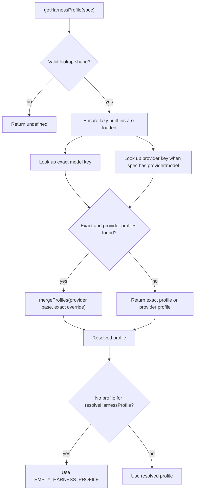

# Harness Model Profiles

A **harness profile** is an optional layer of runtime behavior associated with a model key. It is orthogonal to model selection: the `model` still chooses the language model, while the profile tunes the prompt, visible tools, middleware stack, and automatically added general-purpose subagent.

Profiles are available from the package entrypoints through `createHarnessProfile`, `registerHarnessProfile`, `getHarnessProfile`, `serializeProfile`, and `parseHarnessProfileConfig`. The normal construction path is:

```ts
import {
  createHarnessProfile,
  registerHarnessProfile,
} from "@langchain/deepagents";

registerHarnessProfile("openai", {
  systemPromptSuffix: "Respond concisely.",
});

registerHarnessProfile("openai:gpt-5.4", {
  excludedTools: ["execute"],
});
```

## Resolution and fallback

A registry key is either a bare provider (`provider`) or a provider/model pair (`provider:model`). Registration trims surrounding whitespace and rejects an empty key, more than one colon, or an empty half of a pair. Lookup rejects malformed `provider:model` specs without consulting the registry.



*Caption: Profile lookup checks the exact model first, combines it with a provider profile when both exist, and lets `resolveHarnessProfile` fall back to the frozen empty profile.*

`getHarnessProfile` itself returns `undefined` on a miss. `resolveHarnessProfile` is the agent-facing total resolver: when an explicit `spec` is supplied, it uses that spec directly and returns `EMPTY_HARNESS_PROFILE` on a miss. For a pre-built model instance, it tries, in order, a valid `providerHint:identifierHint` pair, an `identifierHint` that already contains a colon, and the bare `providerHint`, then returns the same empty profile if none matches. Thus an explicit, unmatched spec does not silently fall back to separately supplied hints.

The default `createDeepAgent` model is `anthropic:claude-sonnet-4-6`, so that exact built-in profile is selected unless the caller supplies another model or a user registration changes the key. A subagent with a different model is resolved independently; a subagent without a model, or with the same model as the parent, reuses the parent profile.

## Registry lifecycle and registration

The registry is process-global. It is stored under `Symbol.for("deepagents.harness-profiles.v1")`, allowing duplicate package installs that share the same versioned registry shape to see the same profiles. The state contains the profile map, a built-in-key baseline, and a `builtinsLoaded` flag.

Built-ins are lazy. The first registration or lookup marks the registry as loading and calls `loadBuiltinProfiles`; the loader registers the built-in entries through the internal non-bootstrapping function and then snapshots the resulting keys. Current built-ins are:

- `anthropic:claude-opus-4-7`, with guidance for parallel tool calls, investigation before answering, tool-result reflection, tool usage, and subagent usage.
- `anthropic:claude-sonnet-4-6` and `anthropic:claude-haiku-4-5`, with the shared Claude parallel-call, investigation, and reflection guidance.
- `openai:gpt-5.1-codex`, `openai:gpt-5.2-codex`, and `openai:gpt-5.3-codex`, sharing an autonomous-engineering and plan-hygiene prompt suffix plus a `todoListMiddleware` factory.

User registrations are **additive**, not replacements. `registerHarnessProfile` accepts either raw `HarnessProfileOptions` or an already constructed `HarnessProfile`; raw options are validated and normalized first. If the key already exists, the new profile is merged over the existing one. This means registering a user suffix on a built-in key replaces that scalar suffix, while registering a novel key creates a profile that makes `hasUserRegisteredProfiles()` true. The latter distinction is used for logging calibration; overriding a built-in key remains a user customization but does not create a new key outside the built-in baseline.

## Profile shape and construction invariants

`createHarnessProfile` turns plain options into a frozen profile:

| Option | Runtime behavior |
| --- | --- |
| `baseSystemPrompt` | Replaces the active base prompt when set. |
| `systemPromptSuffix` | Adds model-specific prompt text after the active prompt. |
| `toolDescriptionOverrides` | Replaces descriptions by tool name; unknown names are ignored by the tool-mapping step. |
| `excludedTools` | A set of names hidden from the model and rejected if called. |
| `excludedMiddleware` | A set of middleware `.name` values removed from the assembled stack. |
| `extraMiddleware` | Static middleware or a zero-argument factory for runtime instances. |
| `generalPurposeSubagent` | Selective settings for the automatic general-purpose subagent. |

The factory copies the tool-description map into a null-prototype object, converts exclusion arrays to `Set` instances, freezes the profile and the general-purpose configuration, and leaves the middleware array or factory as a runtime value. `EMPTY_HARNESS_PROFILE` is one shared frozen no-op profile, avoiding a new allocation for every miss.

`excludedMiddleware` is validated at construction time. Entries must be non-empty, non-whitespace plain names: colon-based `module:Class` paths and underscore-prefixed private names are rejected. `FilesystemMiddleware` and `SubAgentMiddleware` are required scaffolding and cannot be excluded. Tool exclusions are deliberately a model-facing calibration mechanism, not a security boundary; filesystem permissions and other runtime controls remain responsible for authorization.

## Merge semantics

`mergeProfiles(base, override)` creates another frozen profile. The higher-priority override wins for `baseSystemPrompt` and `systemPromptSuffix` only when its value is not `undefined`; an unset field inherits the base value. Tool-description maps are shallow-merged by key, with the override winning on conflicts. `excludedTools` and `excludedMiddleware` are set unions, so neither layer can remove an exclusion from the other.

Middleware has ordered, name-based semantics. If both layers contain a middleware with the same `.name`, the override instance replaces the first base occurrence in place; later duplicate base occurrences are dropped. New override names are appended. If either side is a factory, the merged result is a factory that resolves both sequences afresh, preserving the ability to create fresh stateful middleware per agent construction.

`generalPurposeSubagent` is merged field by field. `enabled`, `description`, and `systemPrompt` each inherit independently when the override leaves the field `undefined`; an explicit override wins. This lets a provider profile disable the automatic subagent while a model profile changes only its description, for example.

## Applying a profile during agent construction

`createDeepAgent` resolves the parent profile before assembling tools and middleware. Its overlays are applied at distinct boundaries:

1. **Prompt.** The caller's prompt configuration supplies the prefix, base, and suffix. A profile `baseSystemPrompt` supplies the base only when the caller did not provide one, and `systemPromptSuffix` is appended as another prompt part. The result is passed to `createAgent` when non-empty.
2. **Tool descriptions.** The caller's structured tools are shallow-cloned with replaced `description` values for matching names. The effective set is also supplied to the automatic general-purpose subagent.
3. **Filesystem tools.** Excluded filesystem names are removed from the filesystem middleware configuration. If exclusions would remove `read_file`, it is retained as the minimum filesystem read capability needed by that configuration.
4. **Middleware.** Profile `extraMiddleware` is resolved into the tail stack after core and custom middleware ordering has been established. `excludedMiddleware` is applied after custom replacement, so the profile exclusion wins. Profile `excludedTools` adds a final filtering middleware after all tool-injecting middleware.
5. **Subagent defaults.** Declarative subagents resolve their own model profile for filesystem-tool computation, extra middleware, and middleware exclusions. A subagent with no distinct model reuses the parent profile. A custom subagent's own system prompt and explicit tools are not rewritten by the parent's tool-description overlay; the auto-added general-purpose subagent is the special case that receives the parent's effective tools and profile prompt behavior.

The tool-exclusion middleware removes matching tools from model requests and returns an error `ToolMessage` for a matching tool call, so exclusion covers both visibility and the call boundary. It is still not an authorization mechanism.

## General-purpose subagent settings

Unless disabled by the resolved parent profile, `createDeepAgent` prepends an automatic `general-purpose` subagent when the caller has not already supplied one. It uses the parent `model`, effective tools, and skills. The profile section supports:

- `enabled: false` to disable it; `true` explicitly enables it while inheriting other defaults.
- `description` to change the selector-facing description.
- `systemPrompt` to replace the default general-purpose prompt directly.

When `systemPrompt` is not explicitly set in this section, the profile's `baseSystemPrompt` and `systemPromptSuffix` are applied to the default general-purpose prompt. The general-purpose-specific `systemPrompt` is more specific than the profile prompt overlay.

## Safe JSON/YAML configuration

External configuration must be treated as untrusted data. `parseHarnessProfileConfig(data)` is the safe boundary for an object produced by `JSON.parse()` or `YAML.parse()`; it does not parse text itself. It performs three checks in order:

1. Recursively reject the prototype-pollution keys `__proto__`, `constructor`, and `prototype` in object values before schema parsing. This rejection is a safety invariant, including for nested profile maps such as `toolDescriptionOverrides` and `generalPurposeSubagent`.
2. Validate the supported external shape with strict Zod schemas. Unknown top-level and nested general-purpose fields, wrong types, and unsupported fields are errors rather than silently ignored. The external shape includes prompt strings, tool-description records, exclusion string arrays, and the three general-purpose settings.
3. Pass the parsed data through `createHarnessProfile`, retaining middleware-name validation, normalized runtime collections, and the required-scaffolding invariant.

The schema intentionally does not expose `extraMiddleware`: middleware instances and their closures have no portable JSON/YAML representation. `extraMiddleware` is runtime-only. `serializeProfile(profile)` therefore throws when resolving it produces any middleware, including a non-empty factory result. For a serializable profile it emits only populated fields, turns sets back into arrays, omits `undefined` and empty sections, and produces a plain JSON-compatible object. A normal round trip is:

```ts
const raw = YAML.parse(readFileSync("profile.yaml", "utf-8"));
const profile = parseHarnessProfileConfig(raw);
const portable = serializeProfile(profile);
```

Applications should keep the returned profile immutable and register it explicitly; parsing external data does not implicitly alter the process-global registry.

## Focused tests and safe extension points

The most useful regression coverage is concentrated in the harness profile tests:

- `registry.test.ts` covers exact lookup, provider fallback, provider-plus-model merging, malformed specs, additive re-registration, hint-based resolution, and the built-in/user baseline distinction.
- `merge.test.ts` exercises scalar precedence, map merging, set unions, ordered middleware replacement, fresh factory resolution, general-purpose field inheritance, and frozen results.
- `serialization.test.ts` covers strict unknown-key and type rejection, nested dangerous-key rejection, required-middleware validation, omission of empty fields, runtime-only middleware failures, and create/serialize/parse round trips.
- `builtins.test.ts` verifies lazy built-in content and deliberately confirms that unknown Anthropic and non-Codex OpenAI models do not receive a provider-wide built-in profile.

For an extension, prefer `registerHarnessProfile("provider", options)` for provider defaults and `registerHarnessProfile("provider:model", options)` for a model-specific overlay. Use `systemPromptSuffix` for additive tuning, reserve `baseSystemPrompt` for a true replacement, use middleware factories for stateful runtime behavior, and route all file or network configuration through `parseHarnessProfileConfig` before registration.
