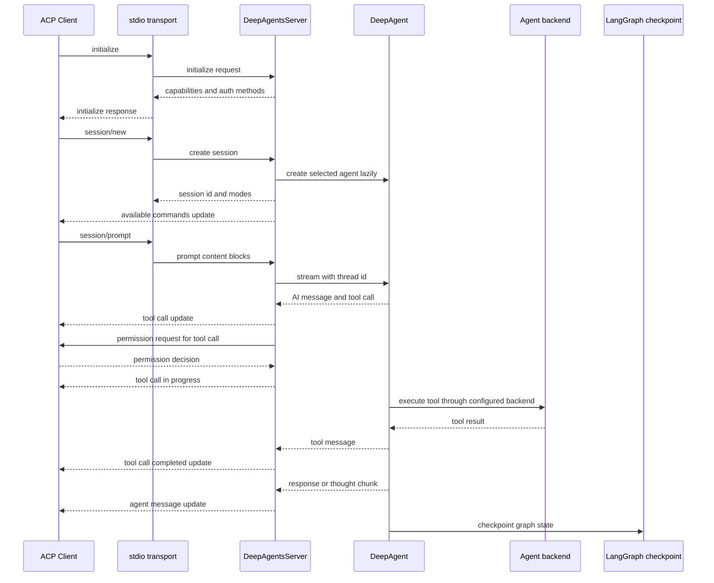
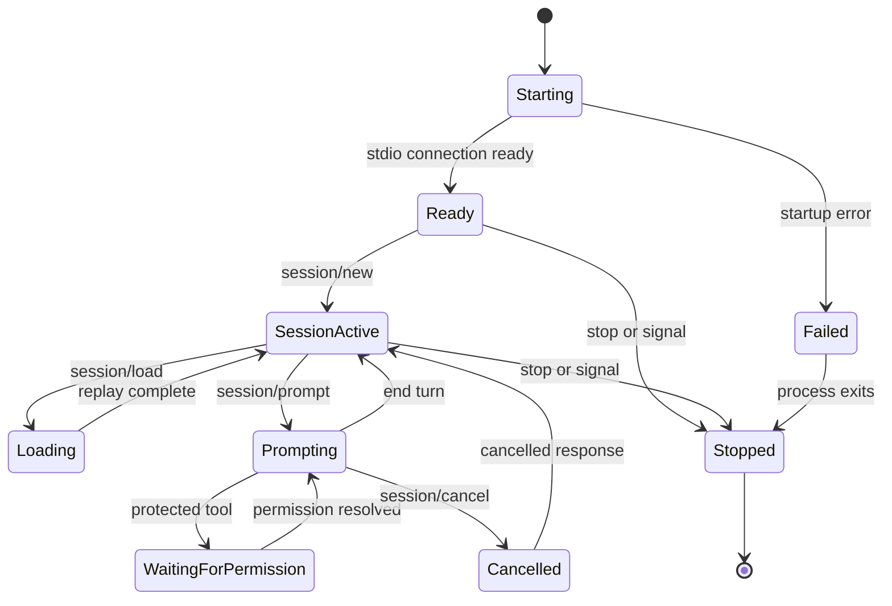

# ACP IDE Server Integration

`deepagents-acp` is an Agent Client Protocol server that adapts a configured DeepAgent to an ACP-compatible IDE such as Zed. The package uses JSON-RPC 2.0 newline-delimited messages over stdin and stdout, while `DeepAgentsServer` owns ACP request handling, agent selection, session state, stream translation, and client-side operations. The package exports `DeepAgentsServer`, `startServer`, `ACPFilesystemBackend`, adapter helpers, and logger utilities from `libs/acp/src/index.ts`.

The important boundary is that ACP is the transport and presentation layer; the DeepAgents graph remains responsible for model calls, tools, middleware, skills, memory, and LangGraph checkpoint writes. The server chooses which graph to run and translates graph events into ACP notifications rather than implementing a second agent runtime.

## Start the server

Install the package and run the CLI:

```bash
npm install deepagents-acp
npx deepagents-acp --name coding-assistant --workspace /path/to/project --debug
```

The published package exposes `deepagents-acp` as its binary. The CLI supports `--name`, `--description`, `--model`, `--workspace`, comma-separated `--skills` and `--memory`, `--debug`, and `--log-file`; `DEBUG=true` enables debug logging and `DEEPAGENTS_LOG_FILE` supplies a log-file default. The CLI builds default skill paths under `.deepagents/skills` and `skills`, and default memory paths under `.deepagents/AGENTS.md` and `AGENTS.md`. Use `--workspace` for the CLI's workspace setting. Although the CLI help describes `WORKSPACE_ROOT` as a fallback, its parsed workspace defaults to `process.cwd()`, so that fallback is effectively bypassed in the CLI; the example script does explicitly honor `WORKSPACE_ROOT`.

A programmatic server can expose one or several agents:

```typescript
import { DeepAgentsServer } from "deepagents-acp";
import { FilesystemBackend } from "deepagents";

const server = new DeepAgentsServer({
  agents: [
    {
      name: "coding-assistant",
      description: "Coding assistant for the current workspace",
      model: "claude-sonnet-4-5-20250929",
      backend: new FilesystemBackend({ rootDir: process.cwd() }),
      skills: ["./skills"],
      memory: ["./AGENTS.md"],
    },
  ],
  serverName: "deepagents-acp-server",
  serverVersion: "0.0.1",
  workspaceRoot: process.cwd(),
  debug: true,
});

await server.start();
```

The runnable repository example is `examples/acp-server/server.ts`; it selects a workspace from `WORKSPACE_ROOT` or `process.cwd()`, supplies a `FilesystemBackend`, and starts the server with `server.start()`.

## Transport and request flow

`start()` creates an `ndJsonStream` around a readable stdin stream and writable stdout stream, then constructs an `AgentSideConnection`. The server waits on `connection.closed`. `initialize` records the client's file-system and terminal capabilities and returns the requested protocol version, server identity, load-session support, image and embedded-context prompt support, mode and command support, MCP capability flags, and advertised authentication methods.

The normal request path is:



*Caption: ACP initialization, session creation, prompt streaming, tool execution, and translated updates.*

### `session/new` and agent routing

Each `session/new` creates a `sess_`-prefixed session ID and a separate random LangGraph `threadId`. The client may select an agent with `configOptions.agent`; otherwise the first configured agent is used. An unknown name fails the request. The session stores its selected `agentName`, thread ID, timestamps, messages, optional mode, and per-session permission decisions. The agent instance itself is created lazily on the first session that selects it, then cached by agent name.

The response contains `sessionId` plus a `modes` object. The server also sends an `available_commands_update` containing the built-in commands and the selected agent's custom commands. Built-ins are `/plan`, `/agent`, `/ask`, `/clear`, and `/status`.

### `session/prompt` and stream translation

A prompt must reference a known session and its selected agent. ACP `ContentBlock` input is converted to a LangChain `HumanMessage`:

- A single text block becomes a string.
- Multiple text blocks remain structured content.
- Images become `image_url` values, using a data URL for base64 input or the supplied URL.
- Resources become text prefixed with their URI.

The server calls `agent.stream({ messages: [humanMessage] }, { configurable: { thread_id }, signal })`. It examines LangGraph updates for direct `messages`, `model_request.messages`, or `tools.messages`. AI text becomes `agent_message_chunk`; thinking blocks become `agent_thought_chunk`; tool messages complete tracked tool calls. ACP does not receive a separate graph event format: this translation is the server's presentation contract.

Outgoing non-text LangChain content is serialized as JSON text by the adapter. This is useful to know when extending support for new content types: add an explicit conversion rather than assuming arbitrary blocks will remain native ACP blocks.

## Tool calls, plans, and permissions

For each AI tool call, the server sends a `tool_call` update with:

- an ACP display `kind`: `read` for `read_file` and `ls`, `search` for `grep` and `glob`, `edit` for `write_file` and `edit_file`, `execute` for `execute`, `shell`, and `terminal`, and `think` for `write_todos`;
- a human-readable title such as `Reading path/to/file` or `Planning tasks`;
- the raw tool arguments as `input`;
- a follow-along `locations` entry when the tool has a `path`, with an optional `line` or `startLine` value resolved against `workspaceRoot` for relative paths.

The client receives `tool_call_update` transitions such as `pending`, `in_progress`, `completed`, `failed`, `error`, or `cancelled`. Completed results are included as text content and as `output`. The current server does not synthesize a separate diff payload in this path; an IDE can display the backend's file change through its own file integration, but callers should not rely on a server-generated ACP diff.

If the agent emits a todo list, `todosToPlanEntries` maps it to a `plan` update. Todo priorities default to `medium`, and a DeepAgents `cancelled` todo is exposed as ACP `skipped`.

For each observed AI tool call, `requestToolPermission` calls the client's `requestPermission` with four options: allow once, always allow, reject once, and always reject. Always decisions are cached in the session by tool name; once decisions are not. A cancelled dialog marks the tool cancelled. If the permission RPC itself fails, the implementation logs the error and allows the tool, so permission-request transport failures are fail-open rather than fail-closed. `interruptOn` is passed through to `createDeepAgent`, but this ACP handler does not itself filter permission requests by that configuration; add an explicit policy if only selected tools should prompt.

## File operations through the IDE

If the client advertises both `fs.readTextFile` and `fs.writeTextFile`, and the agent did not provide an explicit `backend`, `DeepAgentsServer` creates an `ACPFilesystemBackend`. It uses the ACP client's `readTextFile` and `writeTextFile` for reads and writes, passing the current session ID and an absolute path rooted at `workspaceRoot`. This lets the agent see unsaved editor buffers and lets the IDE track writes.

The backend has deliberate fallbacks:

- Without a current session, reads and writes use the inherited local `FilesystemBackend`.
- If an ACP read or write rejects, that individual operation falls back to the local filesystem.
- `ls`, `glob`, and `grep` always remain local because the backend has no ACP equivalents.
- A configured custom backend takes precedence over ACP capability detection.
- ACP reads preserve DeepAgents pagination fields such as `totalLines`, `startLine`, `endLine`, and `nextOffset` after slicing the client-returned text.

The ACP backend is cached once per agent and its mutable `currentSessionId` is changed by `session/new` and `session/load`. This is an implementation constraint: concurrent sessions using the same agent share that backend object, so extensions that need strict per-session routing should make the backend session-scoped rather than relying on the built-in cache.

Terminal capability is recorded during `initialize`, and `executeWithTerminal` can create `/bin/bash -c` in the client's terminal, wait for exit, collect output, and release the terminal. The current `streamAgentResponse` path does not automatically dispatch `execute` tool calls through that helper, and `createBackend` does not use terminal capability. Treat terminal execution as an explicit helper and extension point, not as an automatic replacement for local command execution.

## Sessions, checkpointing, and lifecycle

The server creates one shared in-memory `MemorySaver` and passes it as `checkpointer` to every lazily created DeepAgent. Each prompt uses the session's `threadId`, so the LangGraph checkpoint is the authoritative conversation state while the process and checkpointer remain alive. `session/load` looks up the session in the server's in-memory `sessions` map, reads the checkpoint's `channel_values.messages`, and replays user messages, string agent messages, and completed tool-call notifications to the client. It then advertises commands again.

This is process-local persistence, not durable storage. A new process cannot load an old session ID, and `stop()` clears the session map. To provide restart persistence, supply a durable checkpoint implementation through a server design that supports it or extend the server rather than assuming the default `MemorySaver` survives shutdown.

The server's `SessionState.messages` array is a local fallback and is appended with the incoming human message. Normal full-history replay comes from the checkpointer; the fallback does not itself accumulate the complete AI and tool transcript. `/clear` empties that array and replaces the session thread ID with a new UUID, which starts subsequent graph work on a fresh checkpoint thread.

The lifecycle can be viewed as two coupled lifecycles: one process-level stdio server and one session-level graph interaction.



*Caption: Logical server and session states implemented by `isRunning`, the session map, prompt abort handling, and connection shutdown.*

Cancellation uses one server-level `AbortController`. `session/cancel` aborts the current controller without checking that the notification's session ID matches the active prompt. The stream notices the abort, sends cancelled updates for active tool calls, and returns `stopReason: "cancelled"`. This means concurrent prompts or cross-session cancellation are not isolated; a multi-session extension should make the controller session-scoped.

Modes are exposed as ACP state, not as separate DeepAgents graphs. The available IDs are `agent`, `plan`, and `ask`; `session/set_mode` stores the requested ID, and slash commands update the same field and return a short message. The current source does not pass the mode into `agent.stream`, change the backend, or enforce read-only behavior. Do not treat `/plan` or `/ask` as a security boundary without adding mode-aware middleware or tool policy.

## Authentication, logging, and shutdown

Authentication is advertised, not performed by the server. By default `initialize` returns env-var methods for `ANTHROPIC_API_KEY` and `OPENAI_API_KEY`, plus a generic agent setup method. `authMethods` can replace that list with `agent`, `env_var`, or `terminal` descriptors. The `authenticate` handler is currently a no-op, so API-key validation and credential loading remain the model provider or process environment's responsibility.

Stdout is reserved for ACP protocol traffic. The logger writes debug and operational output to stderr and can append timestamped records to `logFile`; it never writes normal logs to stdout. The CLI and example also print startup and fatal diagnostics on stderr. This separation is essential: debug or file logs on stdout would corrupt the JSON-RPC stream and make the IDE unable to parse responses.

`start()` rejects a second start, installs SIGINT and SIGTERM handlers, converts stdin to the ACP input stream, and waits for the connection to close. `stop()` marks the server not running, drops the connection, clears in-memory sessions, and closes the logger so file writes can flush. Uncaught exceptions exit the process; unhandled promise rejections are logged while the process attempts to continue.

## Configuration and extension points

`DeepAgentConfig` extends DeepAgents creation parameters with the ACP-required `name`, an optional description, and custom command descriptors. This means the ACP layer can expose model, system prompt, tools, middleware, subagents, skills, memory, `interruptOn`, response format, context schema, store, and backend choices without duplicating those abstractions.

Useful extension boundaries are:

1. **Agent selection:** use a stable unique `name` per configured agent and pass it as `configOptions.agent` from clients that support it. Without that option the first configured agent wins.
2. **Backend policy:** provide a custom backend when editor proxying is inappropriate, or change `createBackend` when capability negotiation needs a different policy.
3. **Message support:** extend `adapter.ts` for new ACP content blocks, LangChain content blocks, tool kinds, locations, or plan states.
4. **Safety policy:** combine DeepAgents `interruptOn` with the ACP permission bridge, and replace the fail-open permission-error behavior if the deployment requires fail-closed operation.
5. **Persistence and concurrency:** replace the shared `MemorySaver` and server-global abort controller when sessions must survive process restarts or prompts may run concurrently.
6. **Protocol surface:** add ACP handlers in `createAgentHandler` and corresponding session updates only when the client's negotiated capabilities support them.

## Focused verification

The most useful tests are behavior-oriented rather than source-shape checks:

- `libs/acp/src/cli.int.test.ts` spawns the real CLI over stdin and stdout, verifies `initialize`, session creation and loading, mode changes, cancellation, stderr debug logs, and `--log-file` output.
- `libs/acp/src/server.int.test.ts` checks session tracking, unknown-session failures, the three mode IDs, multi-agent routing, and cancellation aborts.
- `libs/acp/src/server.test.ts` covers ACP response shapes, default and custom auth methods, command advertisement, slash commands, thought chunks, tool kinds and locations, permission caching and failure behavior, terminal helper behavior, and history replay.
- `libs/acp/src/acp-filesystem-backend.test.ts` verifies ACP reads and writes, pagination, session IDs, local fallbacks, and local-only `ls`, `grep`, and `glob`.
- `libs/acp/src/adapter.test.ts` verifies text, image, resource, tool-call, plan, ID, URI, tool-kind, title, and location conversions.

These tests also document current limits: they test the terminal helper directly rather than automatic execute-tool routing, and they test in-memory session replay rather than restart persistence.
