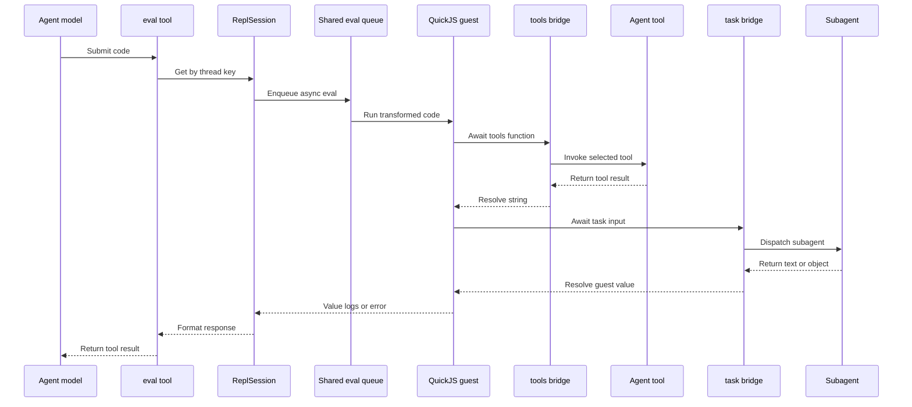
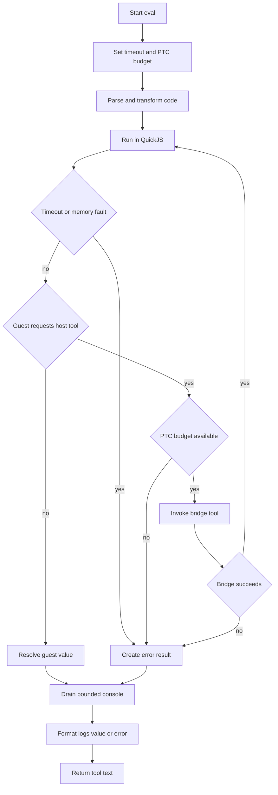

# QuickJS Code Interpreter Integration

The `@langchain/quickjs` integration adds one model-facing tool, `eval`, through `createCodeInterpreterMiddleware`. The tool is a computational scratch pad: the model submits TypeScript or JavaScript, the middleware evaluates it in a QuickJS-NG WASM context, and the tool returns the last expression, captured console output, or an error. The guest has no direct host filesystem, network, or Node.js runtime access. Any external effect must cross an explicitly configured bridge.

This integration is separate from the ordinary agent tool loop. The model first calls `eval`; only code running inside that call can use the optional `tools.*` or `task()` bridges. Without those bridges, the REPL is pure computation. For the broader middleware assembly and invocation lifecycle, see [Deep Agent Runtime and Public Surface](/openwiki/architecture/agent-runtime.md). For normal delegation semantics, see [Subagent Delegation and Async Tasks](/openwiki/concepts/delegation.md); for the filesystem tools that may be exposed through PTC, see [Filesystem Tools, Limits, and Permissions](/openwiki/concepts/filesystem-tools.md).

## Runtime boundary and isolation

Every `ReplSession` creates its own QuickJS runtime and context on a process-shared compiled WASM module. The module and Emscripten infrastructure are shared, but globals, heap, and stack belong to the individual runtime. The shared module is therefore an implementation optimization, not a shared guest namespace.

The isolation guarantee is precise:

- **No guest filesystem, network, or standard library:** guest code cannot use Node APIs such as `process`, `require`, or `fetch`; it cannot import modules, and it has no built-in host filesystem or network API. QuickJS language built-ins such as `JSON` and `Math` remain available. The sandbox itself does not install global `readFile` or `writeFile` functions.
- **Explicit host capabilities only:** when PTC is configured, selected agent tools are installed under `tools` as asynchronous functions. A filesystem operation is consequently available only if the caller deliberately exposes the corresponding ordinary tool, such as `read_file` or `write_file`; it is not a loophole in the WASM boundary.
- **Per-session state:** variables, functions, classes, and closures survive later evaluations in the same session. The middleware keys a session by `thread_id` plus its middleware instance ID and deletes it in `afterAgent`, so the useful lifetime is one agent turn or run rather than a process-global REPL.
- **Bounded execution:** the default memory limit is 64 MiB, the default stack limit is 320 KiB, and each evaluation has a five-second timeout. These are configurable; a negative timeout disables the timeout and should be treated as an unsafe operational choice.
- **Bounded bridge use:** the default PTC budget is 256 `tools.*` calls per evaluation. The counter resets at the start of every evaluation, and the call that exceeds the budget rejects with `PTCCallBudgetExceededError`. Setting `maxPtcCalls: null` removes this bound and increases denial-of-service risk.

The runtime also uses a process-global async evaluation queue. The asyncify WASM variant permits only one concurrent `evalCodeAsync` operation per module, so every session enqueues its evaluation. This does not make guest code single-threaded: independent host tool promises can still be composed with `Promise.all`; it serializes the asyncify evaluation entrypoint to preserve the WASM invariant.



*Caption: A model calls `eval`; guest code can cross the WASM boundary only through explicitly installed PTC tools or the optional subagent bridge, while the shared queue serializes asyncify evaluation entrypoints.*

## Middleware entrypoint and session lifecycle

Create the integration with `createCodeInterpreterMiddleware(options)`. It registers exactly one tool by default, named `eval` unless `toolName` changes it. The input schema is `{ code: string }`, and the tool metadata identifies JavaScript input for model integrations. The middleware's `wrapModelCall` hook adds the interpreter instructions to the system message and discovers the current agent tools and `task` tool. A custom `systemPrompt` replaces the built-in interpreter prompt; `null` uses the built-in prompt.

On an eval call, the middleware derives the thread ID from `config.configurable.thread_id` and uses `${threadId}:${middlewareId}` as the session key. `ReplSession.getOrCreate` deduplicates that key, starts QuickJS lazily on the first evaluation, and supplies the configured memory, stack, PTC, console, and subagent options. Before every evaluation with a task bridge, the active dispatch closure is refreshed with the current runnable config, so tracing and run-specific context do not become stale across eval calls.

`afterAgent` calls `ReplSession.deleteSession` for the finished thread. Disposal releases the QuickJS context and runtime and removes the cache entry. `ReplSession.toJSON()` stores only `{ id }`; `fromJSON` reuses the live in-process session when the ID is present or creates a new lazy session otherwise. This makes the session handle safe to carry through graph state and interrupts, but the guest heap is not serialized into JSON. A restored process without the original static session cache starts an empty runtime.

## Evaluation pipeline

### Transform before execution

`transformForEval` parses the input with Acorn plus the TypeScript plugin and then uses `MagicString` edits. The evaluation transform:

1. removes TypeScript-only declarations and type syntax, including interfaces, aliases, annotations, generics, `as` casts, non-null assertions, and `satisfies` expressions;
2. removes import and export declarations because an eval cell is not a module loader;
3. rewrites top-level variable declarations as `globalThis` assignments and publishes top-level function and class declarations to `globalThis`, which provides cross-eval persistence;
4. wraps the result in an async IIFE so top-level `await` works; and
5. returns the final expression automatically, while declarations and statements without a final expression produce no value.

If AST parsing fails, the transform deliberately falls back to wrapping the original source so QuickJS can report the syntax error. This keeps evaluation errors observable rather than silently discarding malformed input.

### Evaluate and settle promises

`ReplSession.eval(code, timeoutMs)` initializes the per-eval PTC counter and installs a QuickJS interrupt handler when the timeout is enabled. It submits the transformed code through `AsyncEvalQueue`, checks the returned promise state, and runs pending QuickJS jobs until the value fulfills, rejects, or the deadline expires. A guest exception, a rejected host promise, a QuickJS interruption, a memory or stack failure, or a pending promise that outlives the deadline becomes an unsuccessful `ReplResult`; session state remains available for a later evaluation after ordinary errors.

The result shape is deliberately small:

```ts
interface ReplResult {
  ok: boolean;
  value?: unknown;
  error?: { name?: string; message?: string; stack?: string };
  logs: string[];
  logsDroppedChars: number;
}
```

## Host tool and PTC bridge

Set `ptc` to a list of agent-tool names or `StructuredToolInterface` instances to expose selected tools inside the guest. Names are resolved from the tools visible at model-call time; instances are injected directly, even if they are not registered on the agent. Unknown names are silently omitted. The middleware excludes the eval tool itself and rejects `task` in `ptc`, reserving subagent dispatch for the separate `task()` global.

Each exposed tool is converted to camelCase, so `read_file` becomes `tools.readFile` and `web_search` becomes `tools.webSearch`. The injected host function dumps its input, invokes the LangChain tool, and resolves a guest promise. Results are coerced for guest use: strings pass through, text content blocks are joined with newlines, and other values are JSON-serialized. LangChain `Command`, `ToolMessage`, and message-list envelopes are unwrapped before text extraction. A tool failure rejects the guest promise with a message naming the underlying tool. The `read_file` bridge additionally strips the filesystem tool's known status header and line-number prefix so code receives parseable file content; it does not expose a global filesystem function.

The PTC API is intentionally an opt-in capability boundary. With no `ptc` entries, the system prompt describes the REPL as pure computation. With entries, the middleware generates typed API documentation from each tool schema and tells the model to use `await tools.name(input)`. Guest code can use normal Promise composition, including parallel calls, but every `tools.*` invocation consumes the current eval's PTC budget.

## Subagent dispatch with `task()`

When subagent specs provide a normal `task` tool and `subagents` is enabled, the session installs a frozen, non-writable, non-configurable `globalThis.task`. The default middleware cap is 32 concurrent subagent calls; excess calls wait in a per-session queue. This supports the RLM pattern shown in [`examples/repl/rlm-agent.ts`](repo://examples/repl/rlm-agent.ts): fan out work with `Promise.all`, process results in JavaScript, and return a compact aggregate.

A task input must be an object containing a non-empty `description` and `subagentType`. `subagent_type` and `response_schema` are accepted as aliases; other keys are rejected. `responseSchema`, when present, must be a plain object. The middleware validates the schema before dispatch and forwards it through `SUBAGENT_RESPONSE_FORMAT_CONFIG_KEY`. Schemas are limited to 4,096 serialized bytes, nesting depth five, and 32 properties counted across nested objects. Text results resolve as strings. Structured results are unwrapped from the task tool's `Command` envelope, parsed when necessary, and marshaled as native QuickJS objects.

The bridge invokes the parent task tool from inside the running eval, not through the parent `ToolNode` task-call path. Consequently, a `task()` launched from guest code does not independently trigger parent-level `interrupt_on` or HITL approval. Approval middleware configured inside a declarative child still applies to that child; if approval is needed before launch, gate the `eval` call or use the ordinary task tool outside guest code. When no subagent bridge is configured, `task` is not installed and guest code receives the normal undefined or not-a-function failure.

## Quotas, errors, and result formatting

The limits and failure paths are easier to reason about as one pipeline. Memory and stack limits are enforced by the QuickJS runtime; timeouts interrupt synchronous execution and also bound the host-promise settlement loop; the PTC budget protects the host bridge independently of the execution timeout. Console capture has its own character budget, defaulting to 4,000 characters. `console.log`, `info`, and `debug` produce plain lines; `warn` and `error` receive a prefix. Excess console text is counted rather than silently lost, and the formatted tool response appends `[truncated N chars]`.



*Caption: Quotas and bridge failures become a `ReplResult`; successful and failed evaluations both drain bounded console output before the middleware formats the final tool response.*

`formatReplResult` emits logs first, then prefixes a defined value with `→`. Strings are emitted directly and other values are JSON-formatted with indentation. Errors include the error name and message and append a stack when present. An undefined value with no logs becomes `(no output)`. The `maxResultChars` option bounds console capture; the result formatter separately serializes the returned value or error.

## Configuration and safe extension points

The public options that materially change the boundary are:

| Option | Default | Operational meaning |
| --- | --- | --- |
| `ptc` | omitted | Exposes selected agent tools under `tools`; omission keeps the REPL pure computation. |
| `memoryLimitBytes` | `67108864` | QuickJS heap limit, 64 MiB. |
| `maxStackSizeBytes` | `327680` | QuickJS stack limit, 320 KiB. |
| `executionTimeoutMs` | `5000` | Per-eval execution and promise-settlement deadline; negative disables it. |
| `maxPtcCalls` | `256` | Per-eval `tools.*` budget; `null` disables the budget. |
| `maxResultChars` | `4000` | Console capture capacity and truncation accounting. |
| `captureConsole` | `true` | Installs the buffered console; false discards console output. |
| `subagents` | `true` | Enables the `task()` bridge when a task tool is available; the bridge still caps concurrency at 32. |
| `toolName` | `"eval"` | Model-visible name for the interpreter tool. |
| `systemPrompt` | built-in | Replaces the generated interpreter guidance when set to a string; `null` selects the built-in prompt. |

Prefer changing the integration at its explicit boundaries: add a new host capability by injecting a `StructuredToolInterface`, extend guest syntax in `transformForEval`, change serialization or envelope handling in `coerce.ts`, and change subagent schema policy in `subagent-dispatch.ts`. Do not turn host tools into globals or bypass the shared queue; those changes would weaken the capability and asyncify invariants.

## Focused tests

The tests that define the integration contract are concentrated in:

- `libs/providers/quickjs/src/session.test.ts`: expression and TypeScript evaluation, declaration and closure persistence, console capture, timeout interruption, isolation from `process`, `require`, `fetch`, `readFile`, and `writeFile`, PTC result coercion and errors, per-eval budgets, session deduplication, serialization, cleanup, subagent validation, native structured results, frozen `task`, and concurrency limits.
- `libs/providers/quickjs/src/middleware.test.ts`: registration of exactly one `eval` tool, prompt composition, PTC tool resolution and typed signatures, task-tool exclusion, per-thread cleanup, Command-envelope unwrapping, structured task results, and fresh per-call dispatch configuration.
- `libs/providers/quickjs/src/transform.test.ts`: async-IIFE wrapping, auto-return, global declaration hoisting, TypeScript stripping, import/export removal, top-level await, and parse-error fallback.
- `libs/providers/quickjs/src/eval-queue.test.ts`: insertion order, serialization of concurrent operations, returned values, and recovery after a rejected operation.
- `libs/providers/quickjs/src/subagent-dispatch.test.ts`: response-schema byte, depth, and property-count limits.
- `libs/providers/quickjs/src/middleware.int.test.ts`: persistence of REPL variables across separate eval calls in one agent thread and reuse of earlier cell data rather than re-embedding it.
