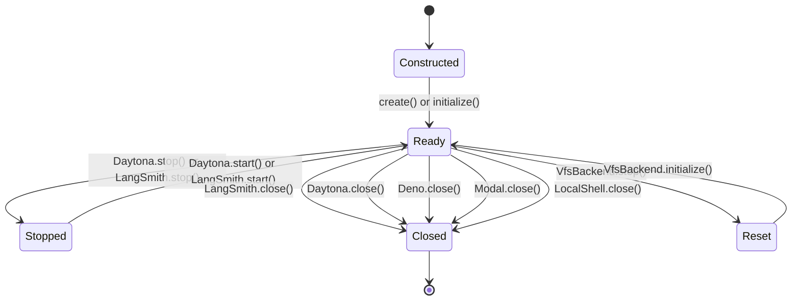

# Sandbox Backend Integrations

This page is the implementation guide for agent backends that expose a filesystem-like workspace and, for sandbox backends, shell execution. The current contract is `SandboxBackendProtocolV2`: it extends `BackendProtocolV2` with `execute(command)` and a non-empty `id`. `BackendProtocolV2` standardizes structured results for `read`, `readRaw`, `ls`, `grep`, `glob`, `write`, and optional `delete`; upload and download return one structured result per requested path. Methods may be synchronous or asynchronous, so provider wrappers can call a local VFS directly or an external SDK.

`VfsBackend` is deliberately the exception in the provider set: it implements `BackendProtocolV2`, not `SandboxBackendProtocolV2`. It supplies isolated in-memory file storage but no `execute()` or sandbox `id`; use it where the agent only needs file tools, not a remote runtime.

## Contract and control flow

`BaseSandbox` is the reusable implementation for the remote command-backed providers. A subclass supplies `execute`, `uploadFiles`, and `downloadFiles`; the base class supplies the higher-level file tools. Those defaults are intentionally runtime-light: text reads use POSIX `awk`, listings and globs use `find` and `stat`, searches use literal `grep`, and writes/edits/raw reads use the transfer methods directly. The sandbox host therefore needs POSIX shell utilities, not Python or Node.js, for the base implementation.

The default paths have important semantics:

- `read()` paginates text by line offset and limit and returns binary files as the full `Uint8Array` from `downloadFiles()`.
- `readRaw()` always downloads the complete file and wraps text or binary data in v2 `FileData` with MIME type and timestamps generated by the base class.
- `write()` encodes text as UTF-8, treats non-text input as base64, and calls `uploadFiles()`.
- `edit()` downloads, replaces text in the host process, then uploads the result. With `replaceAll=false`, multiple matches are an error.
- `grep()` is a literal search, skips files classified as binary, and applies the optional match cap after the provider command returns. `glob()` reports `truncated` when its recursive walk or command output is capped.
- `delete()` probes existence and then executes `rm -rf` in the sandbox. This is not a root-confinement mechanism: the path is shell-quoted, but the operation can remove anything reachable by the sandbox shell.

Consequently, provider-specific transfer and path behavior is part of the effective contract. A backend must preserve per-item results and may report partial success; callers must inspect each response rather than assuming a batch succeeded atomically.

### Provider lifecycle

The diagram shows the lifecycle methods shared by the implementations. `create()` is the async convenience factory; `initialize()` is the explicit two-step entrypoint. The `Stopped` path is resumable for Daytona and LangSmith. `VfsBackend.stop()` releases the in-memory filesystem and can be followed by a new initialization, but VFS is not a sandbox protocol implementation.

*Caption: Provider lifecycle transitions implemented by the wrappers and exercised by the lifecycle tests; `close()` is terminal from the caller's point of view for cloud sandboxes, while VFS reset discards its in-memory state.*

Daytona, Deno, and Modal reject use before initialization through their `instance` getter; LangSmith instead wraps an already-created SDK `Sandbox` and starts in its running state. The provider wrappers expose `isRunning` and clear or flip it during cleanup. The standard suite checks a non-empty `id`, `isRunning` after creation, successful close, and—when configured—construction followed by explicit `initialize()`.

## Comparison

| Implementation | Storage | Execution | Authentication | Cleanup and persistence |
|---|---|---|---|---|
| `LocalShellBackend` | Host filesystem through `FilesystemBackend`; optional virtual path mode | Node `spawn()` with `shell: true` and the user's permissions | None | `close()` only flips the local initialized flag; files remain on the host |
| `LangSmithSandbox` | LangSmith sandbox file API (`read`/`write`) | LangSmith `sandbox.run()`; default timeout 30 minutes | `apiKey` option or `LANGSMITH_API_KEY` | `stop()` preserves files and `start()` resumes; `close()` deletes the remote sandbox |
| `DaytonaSandbox` | Daytona `fs.uploadFile`/`fs.downloadFile`; parent directories are created first | Daytona `process.executeCommand()` in the provisioned environment | `auth.apiKey` then `DAYTONA_API_KEY`; URL and target also have documented option/environment fallbacks | `stop()` preserves a restartable sandbox; `close()` deletes it; auto-stop/archive/delete options can provide provider-side cleanup |
| `DenoSandbox` | Deno shell/filesystem bridge; current transfer implementation writes text and reads with `cat` | `/bin/bash -c` through `spawn()` | top-level `token`, deprecated `auth.token`, then `DENO_DEPLOY_TOKEN` | `close()`/`stop()` closes the microVM deployment and clears the client; duration `timeout` can terminate it automatically |
| `ModalSandbox` | Modal `filesystem.writeBytes`/`readBytes`; relative paths are normalized to `/` | `sh -c` through `sandbox.exec()`; works with minimal images such as Alpine | `auth.tokenId`/`auth.tokenSecret` then `MODAL_TOKEN_ID`/`MODAL_TOKEN_SECRET` | `close()`/`terminate()` terminates the container; Modal volumes can outlive the sandbox |
| `VfsBackend` (Node VFS) | In-memory `VirtualFileSystem` rooted at `/workspace`; path traversal is rejected | No command execution; implements file backend only | None | `stop()` drops the VFS reference and all files; each factory call creates an independent store |

The credential names in the table are configuration selectors, not values. Never put API keys, tokens, or token secrets in this page, source control, logs, or agent prompts.

## Implementations

### LocalShellBackend: local development only

`LocalShellBackend` extends `FilesystemBackend` and implements the sandbox protocol by adding `execute`; its upload/download behavior is inherited from the filesystem backend. `FilesystemBackend` creates parent directories, writes `Uint8Array` data as-is, reads each requested file independently, and maps common `ENOENT`, `EACCES`, and `EISDIR` cases to the standard file-operation codes.

**Security warning:** `LocalShellBackend` has unrestricted host shell access. It runs commands directly on the host with `shell: true`, the backend working directory, and the configured environment. It has no sandboxing, process isolation, or security restriction, and commands run with the user's full permissions. `rootDir` and `virtualMode` affect filesystem path handling only; `virtualMode` does **not** confine shell commands. Use it for trusted local development or suitably isolated CI, never for untrusted agent input or a multi-tenant production service.

`initialize()` creates `rootDir` and is one-shot until `close()` resets the flag. `LocalShellBackend.create()` initializes and then uploads `initialFiles`. Execution combines stdout and stderr, prefixes stderr lines, returns exit code `124` on timeout, and truncates output at the configured byte limit (100,000 by default). Its defaults are a 120-second command timeout and an empty environment unless `inheritEnv` is enabled; `env` can explicitly provide or override variables.

### LangSmithSandbox: API-native remote workspace

The wrapper can receive an existing LangSmith `Sandbox` or create one with `LangSmithSandbox.create()`. Creation requires exactly one of `snapshotId` or the deprecated `templateName`; the factory constructs a `SandboxClient`, creates the sandbox, and wraps it as already running. `execute()` delegates to `sandbox.run()` and combines stdout and stderr into the protocol output; the default command timeout is 1,800 seconds and can be overridden per call, with `0` disabling the timeout.

Transfers use the provider's native APIs rather than `BaseSandbox` shell commands. Each requested download calls `sandbox.read()` and preserves the input order. A missing resource maps to `file_not_found`, a directory read maps to `is_directory`, and other failures map to `invalid_path`. Each upload calls `sandbox.write()` and maps a failed write to `permission_denied`, so callers still receive one response per input file. `close()` calls the remote delete API and marks the wrapper not running; `stop()` preserves the sandbox and `start()` makes it usable again. `captureSnapshot()` produces a snapshot that can be passed back as `snapshotId` to a later creation.

### DaytonaSandbox: provisioned, restartable sandbox

`DaytonaSandbox.create()` constructs and initializes the wrapper. Initialization resolves credentials, creates a `Daytona` client, provisions from either an image or snapshot, changes the temporary ID to the provider sandbox ID, and uploads `initialFiles` if supplied. It defaults to a TypeScript environment and a 300-second command timeout. `fromId()` reconnects to an existing sandbox without creating a new one. Async factory helpers either create a fresh sandbox per invocation or return a factory that reuses an already-created sandbox; the owner remains responsible for `close()`.

`execute()` calls `process.executeCommand()` and returns the provider result and exit code. A timeout or other SDK failure is translated to `DaytonaSandboxError` with `COMMAND_TIMEOUT` or `COMMAND_FAILED`; ordinary non-zero command results remain protocol responses. Uploads create parent directories with a quoted `mkdir -p`, write bytes through Daytona's file API, and continue after individual failures. Downloads read each path individually, enabling partial success. Error classification recognizes not-found, permission, and directory messages and otherwise returns `invalid_path`.

`close()` deletes the remote sandbox and clears the SDK references. `stop()` leaves it available for `start()`, while `autoStopInterval`, `autoArchiveInterval`, and `autoDeleteInterval` are useful safety nets for interrupted processes. The integration test labels its resources by CI run, performs an `afterAll` label-based sweep, and uses short provider-side stop/delete intervals so an aborted test does not leave long-lived sandboxes.

### DenoSandbox: microVM with duration-based lifetime

Deno uses the same two-step/create pattern and supports reconnecting with `fromId()`. Initialization resolves the token, maps deprecated `memoryMb` to `memory` and `lifetime` to `timeout`, calls `Sandbox.create()`, updates the ID, and uploads initial files. `timeout: "session"` ends the sandbox when the primary client disconnects; a duration such as `"5m"` terminates it after that duration even if clients remain connected. The integration setup runs sequentially because provider concurrency is limited and skips only when credentials or sandbox-plan access are unavailable.

Commands run as `/bin/bash -c command`, with stdout and stderr buffered and concatenated. Timeouts and command failures throw `DenoSandboxError` with `COMMAND_TIMEOUT` or `COMMAND_FAILED`. Upload creates parent directories, decodes each byte array to text, and calls `writeTextFile`; download runs `cat` and re-encodes the text output. This is sufficient for the shared text-file tests, but it is not a byte-preserving binary transfer path—use that distinction when adding binary tests or changing the adapter.

`close()` calls the SDK close operation and clears the reference; `stop()` is an alias, not a resumable stopped state. `fromId()` is the supported way to obtain another client for a still-live sandbox. The Deno integration tests verify the Deno runtime, reconnect and shared file visibility, TypeScript initial files, sequential execution, and cleanup.

### ModalSandbox: image- and volume-oriented container

Initialization validates credentials, creates or finds the configured Modal app, resolves an image (Alpine by default), converts named volumes and secrets into SDK objects, creates the sandbox, updates the ID, and uploads `initialFiles`. The adapter passes supported SDK creation options through; use `imageName`, `timeoutMs`, resource options, named `volumes`, and named `secrets` for provider-specific operation. `fromId()` and `fromName()` attach to an existing running sandbox.

`execute()` invokes `sandbox.exec(["sh", "-c", command])`, reads both streams, waits for completion, and returns the exit code. A timeout or execution exception becomes `ModalSandboxError` with `COMMAND_TIMEOUT` or `COMMAND_FAILED`. Uploads call `writeBytes` and downloads call `readBytes`; both normalize a relative path to an absolute path and keep one result per input. Not-found exceptions are recognized by SDK error type (`SandboxFilesystemNotFoundError`) before message-based classification, avoiding reliance on opaque server messages.

`close()` terminates the sandbox and clears client, app, and sandbox references; `terminate()` and `stop()` delegate to `close()`, so there is no wrapper-level restart operation. Modal integration tests are skipped without both documented credential environment variables, run sequentially, cover the common suite, initial text and byte-array files, downloads, reconnect, and Python/Node image execution.

### VfsBackend: isolated storage without execution

`VfsBackend` initializes an in-memory `VirtualFileSystem` rooted at `/workspace`, creates that directory, and populates `initialFiles` beneath it. `#resolvePath()` normalizes absolute and relative inputs and rejects candidates outside the workspace, so uploads and downloads return `invalid_path` rather than touching the real filesystem. Uploads create parent directories and preserve bytes; downloads distinguish missing paths and directories. Text reads provide pagination metadata, binary reads return `Uint8Array`, and `grep`/`glob` run in-process. Glob patterns are bounded by length, segment count, and globstar count to avoid pathological work.

There is no cloud lifecycle or credential flow. `stop()` discards the in-memory filesystem and resets initialization. `createVfsBackendFactory()` makes a new independent VFS for each call; `createVfsBackendFactoryFromBackend()` intentionally reuses the supplied instance. Its provider integration tests cover path forms, pagination, listing, literal and filtered search, recursive globs, binary reads, confinement, factories, and store independence rather than command execution.

## Authentication and operations

Credential resolution is explicit-over-environment for all cloud providers. Configure credentials through the provider's documented options or environment variables in the deployment secret manager; do not copy values into `ModalSandboxOptions`, `DenoSandboxOptions`, `DaytonaSandboxOptions`, or `LangSmithSandboxCreateOptions` examples in shared documentation. Missing credentials fail during initialization (or factory creation) with provider-specific authentication errors. In practice:

- LangSmith accepts `apiKey` and otherwise reads `LANGSMITH_API_KEY`.
- Daytona accepts `auth.apiKey`, then `DAYTONA_API_KEY`; `apiUrl` and `target` also have option/environment/default resolution.
- Deno prefers top-level `token`, then deprecated `auth.token`, then `DENO_DEPLOY_TOKEN`; personal-token organization requirements belong in the provider's options/configuration.
- Modal resolves `auth.tokenId` and `auth.tokenSecret`, falling back independently to `MODAL_TOKEN_ID` and `MODAL_TOKEN_SECRET`.

Always use `try/finally` around a provider sandbox and call its cleanup method. For Daytona, combine explicit close with labels and provider TTLs in CI. For Deno, choose a duration timeout when abandoned sessions must self-terminate. For Modal, use volumes when data must survive container termination. For LangSmith, stop for a resumable workspace or close to delete it. For LocalShell, cleanup does not remove host files; isolate `rootDir` and control `env` separately. For VFS, assume all data is ephemeral at `stop()`.

## Shared standard tests and focused provider tests

The `@langchain/sandbox-standard-tests/vitest` suite is the conformance boundary for Daytona, Deno, and Modal. A provider supplies `createSandbox`, `closeSandbox`, a path resolver, and optionally `createUninitializedSandbox`; the harness creates one shared sandbox for most tests, uses temporary sandboxes only where lifecycle or `initialFiles` needs a fresh instance, retries creation for transient quota/concurrency failures, and cleans up in `afterAll`.

The suite checks behavior rather than class shape:

- lifecycle: valid ID, `isRunning`, close, and explicit two-step initialization;
- execution: echo, exit codes, multiline output, stderr, environment variables, and command failures;
- transfers and base operations: upload/download, partial failure, inherited `read`/`write`/`edit`, multiple files, and parent directories;
- pagination and mutation: read offsets/limits/chunking, edits and replacement counts, Unicode and special characters;
- search and metadata: `ls`, hidden and large directories, literal `grep`, glob filtering, recursive globs, character classes, and deeply nested paths;
- initialization and workflows: basic/nested/empty initial files and write-read-edit sequences.

Provider tests add runtime-specific guarantees that the shared suite cannot express: Daytona checks Node and TypeScript tooling plus CI label cleanup; Deno checks the Deno runtime, reconnect semantics, plan-access handling, and sequential execution; Modal checks image selection, byte-array initialization, downloads, reconnect, and Python/Node images. `VfsBackend` has its own local integration suite because it has no shell execution and does not satisfy the sandbox protocol. When adding a provider, wire it into the shared suite first, then add only tests for provider-specific lifecycle, storage, image/runtime, authentication, or cleanup behavior.

## Extension checklist

A new `SandboxBackendProtocolV2` implementation should:

1. expose a stable non-empty `id` and a truthful `isRunning` indicator for operational tests;
2. make pre-initialization behavior explicit and provide `create()` and/or `initialize()` consistently;
3. implement `execute`, `uploadFiles`, and `downloadFiles`, preserving one result per input and partial success;
4. use the standard `file_not_found`, `permission_denied`, `is_directory`, and `invalid_path` codes, while translating provider exceptions into actionable wrapper errors for lifecycle and command failures;
5. decide whether `close` deletes, terminates, stops, or merely detaches, and document whether `start`/reconnect is possible;
6. define path roots, binary fidelity, output limits, command timeouts, and environment/secret handling before relying on `BaseSandbox` defaults; and
7. register the shared standard tests with credentials skipped safely, bounded timeouts, retry policy appropriate to provider quotas, and cleanup that also handles aborted runs.

These boundaries let filesystem middleware and agents use one backend shape without assuming that local files, cloud sandboxes, and an in-memory VFS have the same isolation, persistence, shell, or cleanup guarantees.
