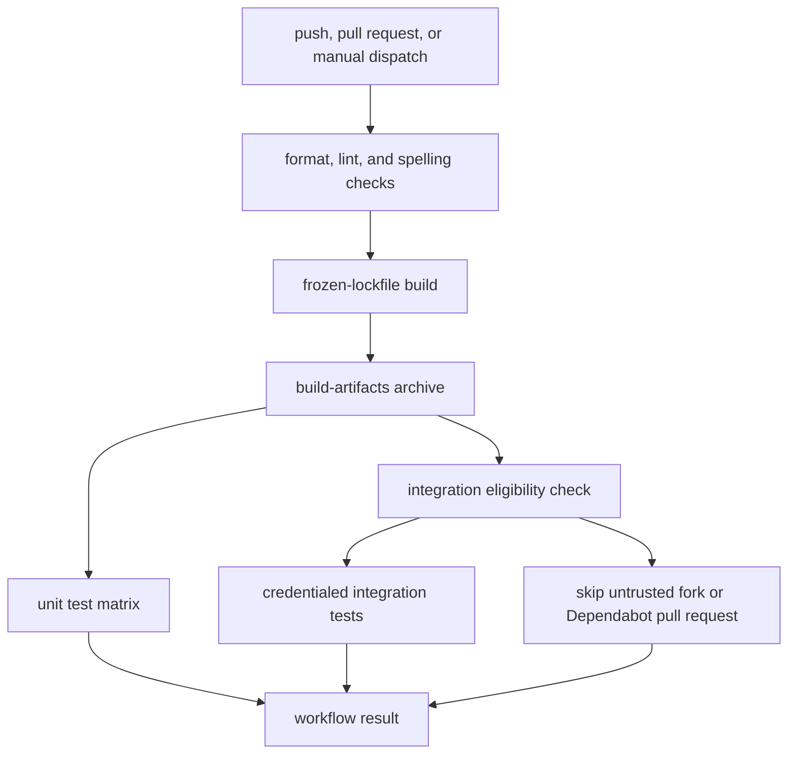
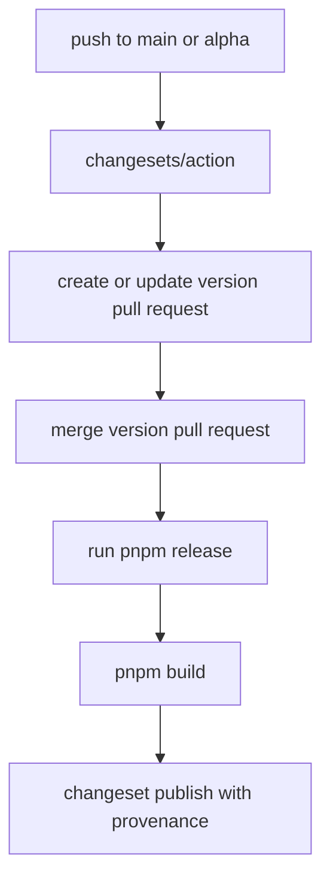

# CI, Integration Environments, and Release Operations

This repository uses pnpm workspaces and GitHub Actions to separate fast repository checks, package builds, cross-platform unit tests, credentialed integration tests, package publication, and documentation refreshes. The boundaries matter: a successful unit run does not prove that external sandboxes or LLM-backed integrations are available, and a pull request from a fork is intentionally not given provider credentials.

## Workspace and local command surface

The workspace includes direct packages under `libs/*`, provider packages under `libs/providers/*`, and the `internal/*`, `evals/*`, and `examples` trees, including nested examples. The root package declares pnpm `10.29.2`; `.nvmrc` selects Node.js 24 for the repository's default development and CI setup.

The root scripts are the supported entrypoints:

```bash
pnpm install
pnpm format:check
pnpm lint
pnpm typecheck
pnpm build
pnpm test
pnpm test:unit
pnpm test:int
pnpm test:watch
pnpm test:coverage
pnpm changeset:version
pnpm release
```

Their scope is intentionally not identical:

| Command | What it does |
| --- | --- |
| `pnpm build` | Runs each package's `build` script for `libs/*` and `libs/providers/*`. Those packages build with `tsdown`. |
| `pnpm typecheck` | Runs `typecheck` for direct `libs/*` packages. It is available locally but is not a separate job in `.github/workflows/ci.yml`. |
| `pnpm test` | Runs `pnpm format:check`, then `pnpm lint`, then `test` for direct `libs/*` packages. Package `test` scripts run `vitest run`, whose default configuration selects unit tests. |
| `pnpm test:unit` | Runs `test:unit` for direct `libs/*` packages. |
| `pnpm test:int` | Runs `test:int` for both direct `libs/*` and `libs/providers/*` packages. Each participating package invokes `vitest run --mode int`. |
| `pnpm test:watch` and `pnpm test:coverage` | Run the corresponding test modes for direct `libs/*` packages. |
| `pnpm release` | Builds the publishable libraries, then runs `changeset publish`. |

The practical dependency chain is therefore **format and lint → build → tests** for the CI pipeline, while `pnpm test` also repeats format and lint immediately before the direct-library test run. A clean `pnpm typecheck` is useful before a change, but it should not be mistaken for a required CI gate unless the workflow is changed.

## CI workflow and artifact flow

`.github/workflows/ci.yml` runs for pushes to `main`, pull requests, and manual dispatch. Its concurrency group is the workflow plus ref, and a newer run cancels an older run for the same ref. The first four checks run independently on Ubuntu: formatting, linting, README spelling, and code spelling under `libs`.



*This flow shows the CI job dependency and the deliberate credential boundary around integration tests.*

The build job waits for all four checks, installs with `pnpm install --frozen-lockfile`, runs `pnpm build`, and archives package `dist` output. On pull requests it also attempts `pnpm dlx pkg-pr-new publish './libs/*' './libs/providers/*'`; that preview publication is `continue-on-error: true`, so it is not a build gate. The archive is retained for one day and is downloaded by both test jobs, rather than rebuilding independently.

The unit job waits for the build and expands a four-cell matrix:

- `ubuntu-latest` and `windows-latest`
- Node.js `22.x` and `24.x`

Each cell installs with the frozen lockfile, restores the build archive, and runs `pnpm test`. That means the unit matrix checks both operating systems and both supported Node versions, while the root test script still performs its format and lint checks. Direct provider packages are not selected by the root `test` and `test:unit` filters; provider packages enter the CI test graph through `pnpm test:int`.

## Integration environments and credentials

The integration job also waits for the build and runs on Ubuntu with the repository's Node version. It installs from the frozen lockfile, downloads the same build archive, and runs `pnpm test:int`. It is allowed for pushes and manual runs, and for same-repository pull requests except when the actor is `dependabot[bot]`; fork pull requests and Dependabot pull requests are skipped so secrets cannot be exposed to untrusted code.

The workflow supplies these repository secrets to the integration process:

| Secret | Used for |
| --- | --- |
| `LANGSMITH_GATEWAY_KEY` | Optional routing of supported LLM SDK calls through the LangSmith LLM Gateway. |
| `OPENAI_API_KEY`, `ANTHROPIC_API_KEY` | Direct-provider fallback credentials when gateway routing is not configured. |
| `DENO_DEPLOY_TOKEN` | Real Deno Deploy sandboxes. |
| `DAYTONA_API_KEY` | Daytona sandboxes. |
| `MODAL_TOKEN_ID`, `MODAL_TOKEN_SECRET` | Real Modal sandboxes. |

These are not dummy switches. External-provider and LLM-backed tests are not safe to run as though they were offline unit tests: they can create remote resources, consume provider quota, require deployed templates, or call an LLM. Run them only with the required credentials and an environment where the resulting resources and costs are understood.

The test sources make the skip and failure behavior explicit:

- Deno tests skip when `DENO_DEPLOY_TOKEN` is absent and probe sandbox availability before running the standard and provider-specific suites. A valid token without sandbox-plan access can also cause the suite to skip for the provider's specific verification error.
- Modal tests skip unless both `MODAL_TOKEN_ID` and `MODAL_TOKEN_SECRET` are present. They create real sandboxes and run sequentially.
- Daytona tests require `DAYTONA_API_KEY` and label created sandboxes with the GitHub run identity so cleanup can target the current test execution. Their final cleanup is best effort after the suite.
- LangSmith sandbox tests require `LANGSMITH_API_KEY` and a deployed `deepagents-cli` template. Context Hub tests likewise skip without `LANGSMITH_API_KEY` and clean up their temporary agents.
- The ACP integration test starts the built CLI and speaks ACP over stdio. It supplies a `test-key` fallback to the child process for startup tests, but that does not make provider-backed model behavior generally credential-free.

The CI workflow does not pass `LANGSMITH_API_KEY` itself; LangSmith tests that specifically check that variable remain skipped unless it is supplied by another local or trusted environment. A gateway key is a routing credential, not a blanket replacement for every LangSmith control-plane credential.

### LLM Gateway setup

The integration Vitest configurations for `acp`, `deepagents`, and provider packages load `scripts/vitest-setup-langsmith-gateway.ts` for `--mode int`. The setup first loads the repository `.env`. If `LANGSMITH_GATEWAY_KEY` or `LC_GATEWAY_KEY` is set, it:

1. Selects `LANGSMITH_GATEWAY_BASE_URL` or `https://gateway.smith.langchain.com`.
2. Points Anthropic, OpenAI, Gemini, Fireworks, and Baseten base URLs at that gateway.
3. Replaces the corresponding provider API-key environment variables with the gateway key and sets Anthropic's custom header.

When no gateway key is present, the setup is a no-op, leaving direct-provider local or CI fallbacks in place. Modal and Deno load `dotenv/config` before the gateway setup so gateway values win over provider keys from `.env`; this ordering is important when reproducing CI locally.

Vitest's default mode excludes `**/*.int.test.ts` and includes ordinary `*.test.ts` files. `--mode int` removes that exclusion, includes integration files, applies longer timeouts, and uses the `int` project name; provider configurations additionally run integration files sequentially. `deepagents` enables Vitest typechecking for its common test configuration. Use a package's `test:all` entrypoint where it exists (for example, `libs/acp` supports `vitest run --mode all`); do not use an all-tests mode as a substitute for supplying provider credentials.

## Changesets and the JavaScript release flow

A change intended to affect a published package is recorded as a Markdown file under `.changeset`. Its YAML frontmatter names the package and bump level, followed by release-note prose. The repository Changesets configuration publishes public packages, uses the GitHub changelog for `langchain-ai/deepagentsjs`, updates internal dependencies at patch level, uses `main` as its base branch, and ignores `examples`. There are no fixed or linked package groups configured.

The release workflow is separate from CI and runs on pushes to `main` and `alpha`:



*This flow describes the Changesets decision point: versioning is reviewed in a pull request before publication.*

The workflow checks out full history, installs pnpm and the `.nvmrc` Node version, upgrades npm to `11.19.0` because npm 12's `pnpm info --json` shape is incompatible with Changesets v3, and installs with `pnpm install --frozen-lockfile`. `changesets/action` uses `pnpm run changeset:version` to prepare versions and `pnpm release` to publish. It has write permission for contents and pull requests plus an OIDC identity token; `NPM_CONFIG_PROVENANCE: true` enables npm provenance and `GITHUB_TOKEN` authorizes the GitHub operation.

For maintainers, the normal sequence is:

1. Add a focused `.changeset/*.md` entry for a publishable package.
2. Push to `main` or `alpha` and review the Changesets version pull request.
3. Merge that version pull request.
4. Let the resulting push build packages and publish them through `pnpm release`.

## Separate `deepagents-cli` release

`.github/workflows/cli-release.yml` is not the Changesets flow. It wraps the Python `deepagents-cli` release from PyPI in platform-specific npm packages. It runs manually or daily at 06:00 UTC, with optional `version` and `dry_run` inputs, and uses non-canceling `cli-release` concurrency so two CLI releases do not overlap.

The `check-version` job compares the latest PyPI version with the current npm version. A manual version always wins; otherwise it builds only when the versions differ. When a build is needed, a non-fail-fast matrix creates packages for Linux x64, Linux ARM64, macOS x64, macOS ARM64, and Windows x64, using Python 3.11 and Node 22. The workflow uploads one artifact per platform, downloads and merges them in `publish`, updates all package versions, and publishes platform packages followed by the main `deepagents-cli` package with `NPM_TOKEN`. A manual dry run skips npm publication and prints the versions that would be published. A successful non-dry run creates the `cli-v<version>` GitHub release; the supported installation is `npm install -g deepagents-cli`.

## Scheduled OpenWiki refresh

`.github/workflows/openwiki-update.yml` is a documentation automation lane, not a test or package-release lane. It runs manually or daily at 08:00 UTC with permissions to write contents and pull requests.

Its full-history checkout is intentional: `openwiki code --update` needs the commit it last documented to calculate a change summary. The job installs Node 22, globally installs `openwiki@0.5.2` together with `mermaid@11.16.0` and `jsdom@29.1.1` for diagram validation, then runs:

```bash
openwiki code --update --print
```

The run uses the OpenAI provider and `gpt-5.6-luna`, requires `OPENAI_API_KEY`, and passes `OPENWIKI_LANGSMITH_API_KEY` for LangSmith connector pulls. LangSmith tracing of the OpenWiki run is optional through `LANGSMITH_API_KEY`, `LANGCHAIN_PROJECT=openwiki`, and `LANGCHAIN_TRACING_V2=true`.

The OpenWiki step uses `continue-on-error: true` so the workflow can remove transient `openwiki/.run.json` state and create a useful pull request even after a partial update. The pull request is created on `openwiki/update` with changes limited to `openwiki`, the repository agent instruction files, and the OpenWiki workflow. Its body records the OpenWiki outcome and explains that a failed run intentionally preserves pages completed before the failure; merging that PR establishes the new baseline. The final workflow step propagates the OpenWiki failure status after the PR has been created.

When operating this workflow, treat generated page changes as a reviewable batch: inspect the proposed PR, verify that source-backed claims and Mermaid diagrams remain accurate, and do not interpret a partial-update PR as evidence that the entire wiki refresh succeeded.
