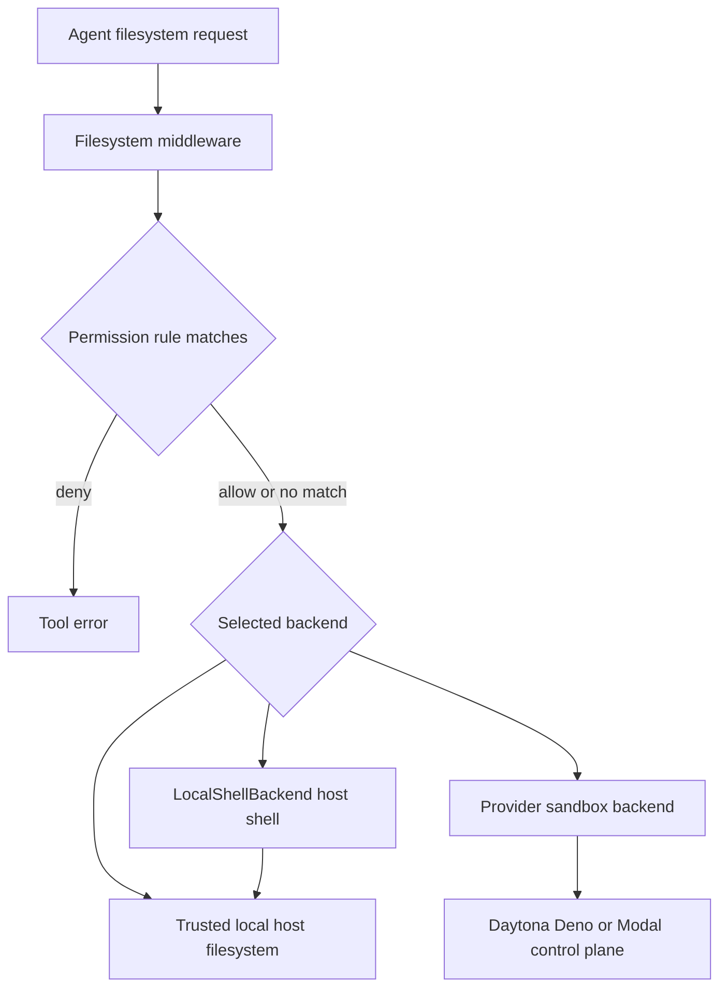

# Configuration, Credentials, and Security Boundaries

DeepAgents has several independent configuration layers. The most important operational distinction is **where code runs**:

- A `FilesystemBackend` or `LocalShellBackend` can operate on the host. These are trusted-local tools, not security sandboxes.
- A Daytona, Deno, or Modal backend delegates execution and storage to a provider-managed sandbox. Isolation, quotas, and the provider's control plane are then part of the security boundary.
- Filesystem permissions are a tool-layer policy. They are useful for file tools, but they do not turn arbitrary shell execution into a confined shell.
- ACP is a protocol transport. Its stdout is reserved for protocol messages; diagnostics belong on stderr or in a log file.

This diagram shows the boundary between policy checks in DeepAgents and isolation supplied by the selected backend or provider.

## Package and runtime baseline

The `deepagents` package is an ESM package with Node-oriented filesystem and shell implementations. Its runtime dependencies include `fast-glob`, `micromatch`, `yaml`, and `zod`; its peer dependencies include `@langchain/core`, `@langchain/langgraph`, `@langchain/langgraph-checkpoint`, `@langchain/langgraph-sdk`, `langchain`, and a compatible `langsmith` version. Install compatible peer versions in the application rather than assuming that the package's development dependencies are production runtime dependencies (`libs/deepagents/package.json`).

The ACP package is a separate `deepagents-acp` executable. It depends on `@agentclientprotocol/sdk` and `deepagents`, and declares `@langchain/core` and `@langchain/langgraph` as peers (`libs/acp/package.json`). The provider packages declare `deepagents` as a peer and their provider SDK as a direct dependency: `@langchain/daytona` uses `@daytona/sdk`, `@langchain/deno` uses `@deno/sandbox`, and `@langchain/modal` uses `modal` (`libs/providers/daytona/package.json`, `libs/providers/deno/package.json`, `libs/providers/modal/package.json`).

For repository operations, the root scripts run formatting, linting, builds, unit tests, and integration tests separately. CI builds after formatting, linting, and spelling checks, then runs the unit-test matrix on Ubuntu and Windows across Node 22 and 24. Integration tests receive provider and model credentials only through GitHub Actions secrets (`.github/workflows/ci.yml`).

## Configuration surfaces

### ACP CLI: workspace, skills, memory, and model

The `deepagents-acp` CLI accepts:

- `--model` (`-m`) for the model identifier, defaulting to `claude-sonnet-4-5-20250929`.
- `--workspace` (`-w`) for the workspace root, defaulting to the current directory.
- `--skills` (`-s`) and `--memory` for comma-separated paths.
- `--debug` for diagnostic output and `--log-file` (`-l`) for persistent diagnostics (`libs/acp/src/cli.ts#L6-L19`).

The CLI resolves an explicit workspace path with `path.resolve`. Explicit skill and memory paths are resolved relative to the workspace; absent values default to `<workspace>/.deepagents/skills`, `<workspace>/skills`, `<workspace>/.deepagents/AGENTS.md`, and `<workspace>/AGENTS.md` (`libs/acp/src/cli.ts#L262-L285`). Treat these files as agent instructions: only point them at content you trust.

The help text advertises `WORKSPACE_ROOT` as an alternative to `--workspace`, but the parser initializes `options.workspace` to `process.cwd()` and the later fallback is `options.workspace || process.env.WORKSPACE_ROOT || process.cwd()`. Consequently, `WORKSPACE_ROOT` does not override the normal default in the current implementation. Use `--workspace` when selecting a non-current root (`libs/acp/src/cli.ts#L71-L83`, `libs/acp/src/cli.ts#L262-L265`).

The CLI constructs a `FilesystemBackend({ rootDir: workspaceRoot })` and passes it explicitly to the server. Because that backend uses legacy non-virtual path semantics by default, the CLI workspace argument is an operational working directory, not a hard containment boundary (`libs/acp/src/cli.ts#L304-L318`). Do not expose this CLI to untrusted prompts or treat `--workspace` as a sandbox.

### Project and user configuration paths

`createSettings` detects a project by walking upward from `startPath` (or the current working directory) until it finds `.git`. It exposes project-level `.deepagents/agent.md` and `.deepagents/skills/`, plus user-level `~/.deepagents/{agentName}/agent.md` and `~/.deepagents/{agentName}/skills/` (`libs/deepagents/src/config.ts#L101-L129`, `libs/deepagents/src/config.ts#L151-L220`). If there is no `.git` directory, project paths are `null` rather than being guessed.

Agent names are validated before they are joined to the user directory. Empty names and names containing characters outside letters, numbers, hyphens, underscores, and whitespace are rejected (`libs/deepagents/src/config.ts#L131-L143`, `libs/deepagents/src/config.ts#L160-L168`). This protects the user-level path construction, but it does not validate arbitrary skill or memory paths supplied to the ACP CLI; resolve and review those paths as part of deployment configuration.

## Filesystem backends and path containment

### `FilesystemBackend`

`FilesystemBackend` supports read, raw read, write, edit, delete, list, glob, grep, upload, and download operations. It has three relevant constructor settings:

- `rootDir` is resolved to an absolute `cwd` and defaults to `process.cwd()`.
- `virtualMode` defaults to `false`.
- `maxFileSizeMb` defaults to 10 MB and limits the fallback literal-search path (`libs/deepagents/src/backends/filesystem.ts#L51-L67`, `libs/deepagents/src/backends/filesystem.ts#L711-L763`).

**Virtual mode is the containment mode.** Incoming paths are treated as virtual absolute paths under `rootDir`; a missing leading slash is added, paths containing `..` or `~` are rejected, and the resolved path must remain under the root. Virtual listings and search results use `/`-prefixed virtual paths (`libs/deepagents/src/backends/filesystem.ts#L69-L99`, `libs/deepagents/src/backends/filesystem.test.ts#L104-L151`). Use `virtualMode: true` when the backend root is intended to be a virtual filesystem.

**Non-virtual mode preserves legacy behavior.** Absolute paths are accepted as-is and relative paths resolve under `rootDir`. Thus an absolute path, or a relative path containing `..`, can escape `rootDir`. This is intentional compatibility behavior, not a security guarantee (`libs/deepagents/src/backends/filesystem.ts#L69-L99`). The ACP CLI and the documented `LocalShellBackend` example both need this distinction called out in security reviews.

File I/O adds symlink defenses independent of virtual path handling. On platforms with `O_NOFOLLOW`, reads and edits open files without following a final symlink, and writes use `O_NOFOLLOW`; the fallback path rejects symlink files. Deletes unlink a symlink rather than recursively following it. In virtual mode, delete additionally checks each parent and compares real paths so a symlinked parent cannot redirect deletion outside the root (`libs/deepagents/src/backends/filesystem.ts#L101-L136`, `libs/deepagents/src/backends/filesystem.ts#L238-L318`, `libs/deepagents/src/backends/filesystem.ts#L398-L500`). The tests verify that a symlink target remains unchanged and that virtual-mode symlinked parents are rejected (`libs/deepagents/src/backends/filesystem.test.ts#L461-L491`, `libs/deepagents/src/backends/filesystem.test.ts#L581-L604`).

Deletes are recursive for real directories. In virtual mode, deleting `/` clears the root's contents without deleting the root itself; it does not mean that permissions or shell commands are automatically confined to that root (`libs/deepagents/src/backends/filesystem.ts#L451-L489`, `libs/deepagents/src/backends/filesystem.test.ts#L522-L550`).

Search is literal, not regular-expression search. `grep` prefers ripgrep fixed-string mode and falls back to a substring walk; symlink traversal is disabled in the fallback and glob walkers. A `maxCount` cap is applied to returned matches and can mark the result truncated (`libs/deepagents/src/backends/filesystem.ts#L579-L624`, `libs/deepagents/src/backends/filesystem.ts#L635-L709`, `libs/deepagents/src/backends/filesystem.ts#L721-L800`).

### `LocalShellBackend`: trusted local execution

`LocalShellBackend` extends `FilesystemBackend` and adds `execute`. Its own documentation is explicit: commands run on the host with `spawn(..., { shell: true })`, the user's permissions, no process isolation, and no security restrictions. `rootDir` sets the shell working directory but does not restrict what the shell can access; `virtualMode` affects inherited filesystem operations only, not shell commands (`libs/deepagents/src/backends/local-shell.ts#L1-L7`, `libs/deepagents/src/backends/local-shell.ts#L29-L77`, `libs/deepagents/src/backends/local-shell.ts#L88-L109`).

Important runtime controls are bounded but not isolating:

- `timeout` defaults to 120 seconds; timeout sends `SIGTERM` and returns exit code 124.
- `maxOutputBytes` defaults to 100,000; excess output is truncated.
- `inheritEnv` defaults to `false`, so commands receive only the explicit `env` map. When `true`, the complete parent environment is copied and then overridden by `env` (`libs/deepagents/src/backends/local-shell.ts#L149-L175`, `libs/deepagents/src/backends/local-shell.ts#L344-L446`).
- `initialize()` creates `rootDir` and must run once before execution; `LocalShellBackend.create()` initializes and optionally uploads initial files. `close()` only flips the local running flag because there is no remote resource (`libs/deepagents/src/backends/local-shell.ts#L192-L220`, `libs/deepagents/src/backends/local-shell.ts#L448-L474`).

For a trusted local development assistant, prefer an explicit minimal environment and a dedicated working directory. Set `inheritEnv: true` only when the command really needs the parent environment, because that can expose provider keys and other process secrets to shell commands. For untrusted code or prompts, use a provider sandbox instead.

## Filesystem permissions: policy, ordering, and limits

`FilesystemPermission` rules contain `operations` (`read` or `write`), absolute glob `paths`, and an optional `mode` (`allow` or `deny`). Paths must start with `/` and cannot contain `..` or `~`; glob matching supports `**`, `*`, brace expansion, and dotfiles (`libs/deepagents/src/permissions/types.ts#L11-L39`, `libs/deepagents/src/permissions/enforce.ts#L8-L63`).

The evaluation invariant is **first-match-wins with a permissive no-match default**:

1. Iterate rules in declaration order.
2. Ignore rules that do not list the requested operation.
3. The first rule whose path glob matches returns its mode, defaulting to `allow`.
4. If no rule matches, return `allow`.

Therefore, an early broad `allow` defeats a later `deny`; a broad deny must come first if that is the intended policy. Empty permissions allow all file operations (`libs/deepagents/src/permissions/enforce.ts#L66-L90`, `libs/deepagents/src/permissions/enforce.test.ts#L67-L145`).

`createFilesystemMiddleware` validates permission patterns at construction. For `ls`, `read_file`, `write_file`, `edit_file`, `glob`, and `grep`, invalid paths and denied paths become tool errors before the backend is called; search results are filtered by the same read policy (`libs/deepagents/src/middleware/fs.ts#L659-L691`, `libs/deepagents/src/middleware/fs.ts#L1181-L1215`, `libs/deepagents/src/middleware/fs.ts#L1591-L1699`). Delete is special because it recursively removes directories: the middleware probes whether the target may have descendants and checks overlapping deny-write patterns before calling the backend (`libs/deepagents/src/middleware/fs.ts#L1480-L1551`).

Permissions do **not** constrain `execute`. A shell command can access arbitrary paths, so the middleware rejects a configuration that combines non-empty permissions, an enabled `execute` tool, and an execution-capable backend, unless every rule is scoped beneath a `CompositeBackend` route prefix. For a local shell, either disable `execute`, omit path permissions, or replace the backend with a real sandbox; do not assume a permission rule protects secrets from shell access (`libs/deepagents/src/middleware/fs.ts#L1744-L1808`, `libs/deepagents/src/middleware/fs.ts#L1853-L1871`, `libs/deepagents/src/middleware/fs.ts#L1973-L1987`).

A practical read-only configuration is an explicit tool allowlist such as `read_file`, `ls`, `glob`, and `grep`. `read_file` is required in every explicit allowlist, and backend capability checks can still remove `execute` when the backend does not implement the sandbox protocol (`libs/deepagents/src/middleware/fs.ts#L1827-L1848`, `libs/deepagents/src/middleware/fs.test.ts#L375-L428`).

## ACP operations and logging

The ACP server uses stdio: stdout carries ACP responses and notifications, while logs go through the logger to stderr and/or a file (`libs/acp/src/server.ts#L186-L220`, `libs/acp/src/logger.ts#L1-L6`). The server creates a shared in-memory checkpointer for session persistence, tracks sessions and cancellation, and closes the logger during shutdown (`libs/acp/src/server.ts#L135-L184`, `libs/acp/src/server.ts#L196-L215`, `libs/acp/src/server.ts#L1214-L1279`).

Backend selection is capability- and configuration-dependent. A custom `config.backend` always wins. If no custom backend is supplied and the ACP client advertises both text-file capabilities, the server uses `ACPFilesystemBackend`; otherwise it uses a local `FilesystemBackend` rooted at `workspaceRoot` (`libs/acp/src/server.ts#L1302-L1360`). The ACP filesystem adapter proxies reads and writes to the IDE for the active session, allowing unsaved buffers, and falls back to the local filesystem when an ACP operation fails; list, glob, and grep remain local (`libs/acp/src/acp-filesystem-backend.ts#L1-L7`, `libs/acp/src/acp-filesystem-backend.ts#L20-L83`). The CLI supplies its own backend, so it takes the custom-backend path rather than automatically gaining the ACP proxy.

`Logger` creates parent directories, appends to the configured file, writes timestamped file records, formats errors with stack traces, and flushes on `close()`. Debug logging goes to stderr; warnings and errors still go to stderr when debug is off. A log file is operationally useful but may contain prompts, paths, tool arguments, and error stacks, so protect its directory and retention policy (`libs/acp/src/logger.ts#L48-L113`, `libs/acp/src/logger.ts#L118-L175`, `libs/acp/src/logger.ts#L240-L275`). Never put credentials in prompts, debug output, or log-file paths.

## Provider credentials and sandbox lifecycle

Provider auth helpers use explicit options first and environment variables as fallbacks. They return credentials only after required values are present; they do not print the credential values.

| Provider | Explicit option | Environment fallback | Missing-credential behavior |
| --- | --- | --- | --- |
| Daytona | `auth.apiKey`; optional API URL and target | `DAYTONA_API_KEY`, `DAYTONA_API_URL`, `DAYTONA_TARGET` | Throws if the API key is absent; API URL defaults to `https://app.daytona.io/api` (`libs/providers/daytona/src/auth.ts#L25-L36`, `libs/providers/daytona/src/auth.ts#L87-L133`) |
| Deno | `auth.token` | `DENO_DEPLOY_TOKEN` | Throws `DenoSandboxError` with code `AUTHENTICATION_FAILED` if absent (`libs/providers/deno/src/auth.ts#L20-L28`, `libs/providers/deno/src/auth.ts#L57-L78`) |
| Modal | `auth.tokenId` and `auth.tokenSecret` independently | `MODAL_TOKEN_ID`, `MODAL_TOKEN_SECRET` | Throws and identifies which required variable is missing (`libs/providers/modal/src/auth.ts#L21-L41`, `libs/providers/modal/src/auth.ts#L58-L89`) |

Use environment injection from a secret manager or CI secret store for deployments. Do not commit `.env` files or replace variable names with real values. The repository's `.env.example` contains only empty placeholders for `ANTHROPIC_API_KEY` and `TAVILY_API_KEY`; CI maps model, gateway, and provider credentials from GitHub secrets (`.env.example#L1-L2`, `.github/workflows/ci.yml#L160-L172`).

Provider sandbox implementations validate credentials during initialization or reconnection before creating or retrieving the remote resource. Their SDK/provider is responsible for the remote execution boundary; DeepAgents supplies the common backend protocol and tool integration. Daytona's example creates an isolated cloud sandbox, passes it as the agent backend, and closes it in a `finally` block; its auto-stop interval is a provider option (`examples/sandbox/daytona-sandbox.ts#L78-L102`, `examples/sandbox/daytona-sandbox.ts#L124-L128`). Follow the same lifecycle for Deno and Modal: create or initialize once, do not reuse a closed resource, and close or terminate in a `finally` block.

The provider boundary does not make credential handling automatic. A shell or process inside a provider sandbox may receive credentials intentionally supplied by provider secrets or environment configuration. Decide whether the model should be able to read those values, use least-privilege tokens, and avoid inheriting host environment variables into local shells.

## External services and CI operations

Model and tool credentials are application configuration, not DeepAgents filesystem policy. ACP advertises Anthropic and OpenAI environment-based authentication methods, and its CLI help names `ANTHROPIC_API_KEY`, `OPENAI_API_KEY`, `DEBUG`, and `DEEPAGENTS_LOG_FILE` (`libs/acp/src/server.ts#L54-L84`, `libs/acp/src/cli.ts#L189-L194`). `TAVILY_API_KEY` is used by repository examples for optional web search, while `LANGSMITH_API_KEY` and `LANGSMITH_GATEWAY_KEY` are used by selected integration paths; these integrations are opt-in and should be supplied through the runtime environment or CI secret store rather than source control (`.env.example#L1-L2`, `.github/workflows/ci.yml#L160-L172`).

CI intentionally separates ordinary unit testing from integration testing. The integration job is skipped for untrusted pull-request contexts and receives provider/model secrets only in that job's environment. Preserve that separation when adding integrations: do not broaden secret exposure to formatting, lint, spelling, build, or forked pull-request jobs (`.github/workflows/ci.yml#L110-L172`).

## Safe deployment checklist

1. **Classify trust first.** Use `FilesystemBackend` or `LocalShellBackend` only for trusted local development, controlled CI, or similarly trusted execution. Use Daytona, Deno, Modal, or another provider sandbox for untrusted code.
2. **Choose path semantics deliberately.** Set `virtualMode: true` when `rootDir` must be a containment boundary. In non-virtual mode, review every absolute and `..` path as potentially outside `rootDir`.
3. **Treat shell as a separate authority.** `LocalShellBackend` can read credentials and modify the host even when virtual filesystem paths look confined. Prefer `inheritEnv: false` and an explicit `env` map.
4. **Make permissions explicit.** Put deny rules before broad allows, remember that no match allows, and disable `execute` if path rules are intended to be meaningful.
5. **Keep instructions and logs private.** Review `AGENTS.md`, skill directories, log files, and ACP workspace settings for secrets or untrusted content.
6. **Inject credentials at runtime.** Use provider-specific environment variables or explicit options from a secret manager; never commit values or echo them in diagnostics.
7. **Test the boundary.** Run the focused permission, filesystem symlink/virtual-mode, local-shell lifecycle, provider auth, logger, and ACP CLI tests before changing security-sensitive code. The repository includes those tests under `libs/deepagents/src/permissions`, `libs/deepagents/src/backends`, `libs/providers/*/src/auth.test.ts`, and `libs/acp/src`.
