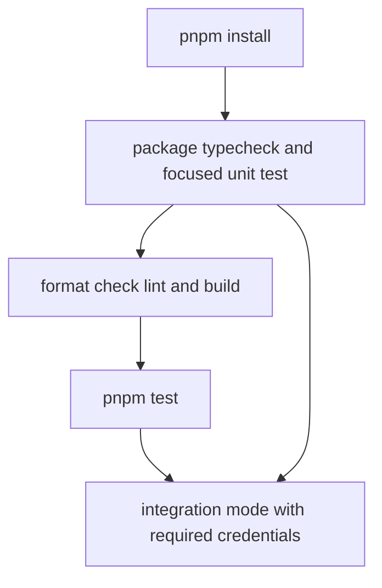

# Repository Wiki Quickstart

DeepAgents is a TypeScript monorepo for a LangGraph-based agent harness. Start with the package and workflow that own the boundary you are changing; do not assume that a green unit test proves model-backed behavior, an external sandbox, or an IDE transport.

## Start locally

The repository pins Node.js 24 in `.nvmrc` and declares `pnpm@10.29.2` as its package manager. The workspace includes `libs/*`, `libs/providers/*`, `internal/*`, `evals/*`, and `examples` (including nested example directories).

```bash
pnpm install
```

The smallest useful package check is:

```bash
pnpm --filter deepagents typecheck
pnpm --filter deepagents test:unit
```

For a repository-wide quality pass, use the supported root scripts:

```bash
pnpm format:check
pnpm lint
pnpm build
pnpm test
```

`pnpm test` runs formatting and lint checks before the direct library test scripts. `pnpm build` builds the library and provider packages selected by the root filter; it is useful before running examples that consume workspace packages. The `examples` workspace has a `typecheck` script but no single general-purpose runner, so use the README or entrypoint in the particular example directory.



*This is the recommended narrow-to-broad validation loop; stop at the first boundary that can disprove the change.*

## Minimal agent smoke test

The public Node entrypoint exports `createDeepAgent`; the default `deepagents` entrypoint includes the full Node API, while `deepagents/browser` omits Node-only exports and `deepagents/node` is an explicit Node alias. `createDeepAgent` returns a compiled LangGraph graph, so normal LangGraph invocation, streaming, and persistence options remain the execution surface.

```typescript
import { createDeepAgent } from "deepagents";

const agent = createDeepAgent();

const result = await agent.invoke({
  messages: [
    {
      role: "user",
      content: "Research LangGraph and write a summary in summary.md",
    },
  ],
});
```

This is the smallest API smoke test, not an offline test: the run exercises a chat model and the built-in filesystem workflow. For a controlled application, pass an explicit model, custom tools, and system prompt; add a checkpointer or store when the run must retain state beyond one invocation. Use `examples/backends/composite-backend.ts` when you need a concrete split between state-owned temporary files and a store-backed `/memories/` route, and `examples/hierarchical/hierarchical-agent.ts` when a full deep agent must act as a nested subagent.

## Validation modes

Choose the least expensive mode that proves the changed behavior.

| Need | First command | What it establishes |
| --- | --- | --- |
| Public types, exported options, or workspace wiring | `pnpm --filter deepagents typecheck` | TypeScript compilation for the package; add `pnpm --filter examples typecheck` when example code is part of the change. |
| Deterministic core behavior | `pnpm --filter deepagents test:unit` | Default Vitest mode, which excludes `**/*.int.test.ts` and includes `src/**/*.test.ts`. |
| A broad local check | `pnpm test` | Root format check, lint, and direct-library tests. |
| Agent composition or model-backed behavior | `pnpm --filter deepagents test:int` | `vitest run --mode int`, which selects integration tests, uses longer timeouts, and loads the LangSmith gateway setup. |
| All library/provider integration lanes | `pnpm test:int` | Integration scripts for `libs/*` and `libs/providers/*`; inspect the target suite before spending credentials or creating remote resources. |
| External sandbox behavior | The relevant provider package's `test:int` | Provider credentials, availability, lifecycle, and cleanup—not just the backend unit contract. |

The default unit mode is the safe first response for ordinary edits. Integration mode is not automatically offline: CI supplies `LANGSMITH_GATEWAY_KEY`, direct-provider fallback keys, and sandbox credentials such as `DENO_DEPLOY_TOKEN`, `DAYTONA_API_KEY`, and Modal token variables. Fork pull requests and Dependabot pull requests do not receive the integration secrets in CI. Treat remote sandboxes and LLM calls as costed, cleanup-sensitive operations.

## Task-routing map

### Architecture and runtime behavior

- [Deep Agent Runtime and Public Surface](architecture/agent-runtime.md) — `createDeepAgent`, model/profile resolution, prompt and middleware ordering, compiled graph construction, state typing, and streaming APIs.
- [Backend Protocol and File Storage Architecture](architecture/backend-storage.md) — v1/v2 backend contracts, structured file results, runtime resolution, state/store/filesystem/composite ownership, and persistence boundaries.

### Core concepts

- [Skills, Memory, Summarization, and Prompt Context](concepts/context-management.md) — `AGENTS.md` memory, progressive `SKILL.md` loading, source precedence, history offload, summarization, and cache behavior.
- [Subagent Delegation and Async Tasks](concepts/delegation.md) — declarative, compiled, forked, and remote workers; task routing; context isolation; state filtering; concurrency; and task status.
- [Filesystem Tools, Limits, and Permissions](concepts/filesystem-tools.md) — built-in file/search/execute tools, backend delegation, path normalization, pagination, truncation, large-result eviction, and permission enforcement.
- [Harness Model Profiles](concepts/model-profiles.md) — provider/model profile lookup, built-in and user registration, prompt/tool/middleware overlays, and profile serialization.

### Integrations

- [ACP IDE Server Integration](integrations/acp.md) — ACP stdio sessions, configured-agent selection, LangGraph checkpointed conversations, IDE file operations, modes, cancellation, authentication, and shutdown.
- [QuickJS Code Interpreter Integration](integrations/quickjs.md) — WASM-isolated evaluation, persistent REPL scope, host-tool and programmatic-tool-calling bridges, quotas, queues, and result boundaries.
- [Sandbox Backend Integrations](integrations/sandbox-providers.md) — the sandbox protocol and provider adapters for LocalShell, LangSmith, Daytona, Deno, Modal, and Node VFS, including lifecycle and error translation.

### Workflows and operations

- [End-to-End Agent Run](workflows/agent-run.md) — follow a request from configuration through the model/tool loop, backend updates, delegation, checkpointing, summarization, and final or streamed output.
- [Add or Change a Backend Provider](workflows/adding-backend-provider.md) — choose v2 or adapt v1, preserve path/binary/error semantics, expose the package, and run shared standard tests.
- [Run an Agent in a Sandbox](workflows/sandbox-backed-agent.md) — resolve credentials, create or initialize a sandbox, pass it as the backend, transfer files, and reliably stop or delete it.
- [CI, Integration Environments, and Release Operations](operations/ci-release.md) — workspace commands, CI dependency and artifact flow, unit matrix, credentialed integration gates, Changesets, and OpenWiki refreshes.
- [Configuration, Credentials, and Security Boundaries](operations/configuration-security.md) — runtime dependencies, model and memory/skills paths, workspace roots, permissions, traversal defenses, shell warnings, credentials, and external-service variables.

### Testing and evaluation

- [Testing Strategy and Boundary Coverage](testing/strategy.md) — focused unit/type tests, local integration modes, ACP protocol checks, shared sandbox standard suites, and a change-to-test map.
- [Behavioral Eval Harness and Suites](testing/evals.md) — trajectory and filesystem snapshots, model runners, LangSmith feedback, custom matchers, and behavior suites for files, memory, HITL, delegation, summarization, skills, and tools.

## Change-oriented shortcuts

| If you are changing… | Read first | Then validate with… |
| --- | --- | --- |
| Agent construction, middleware, public state, or streams | [runtime](architecture/agent-runtime.md) | package typecheck, focused core unit tests, then the relevant integration test |
| A backend, route, file result, or permission | [backend storage](architecture/backend-storage.md) and [filesystem tools](concepts/filesystem-tools.md) | backend/permission unit tests, then a local or provider integration |
| Skills, memory, history, or context size | [context management](concepts/context-management.md) | focused middleware tests; use model-backed integration only for trajectory-dependent behavior |
| Tasks, workers, forks, or async status | [delegation](concepts/delegation.md) | deterministic construction tests, then delegation integration tests when model orchestration matters |
| Model/provider profiles or prompt overlays | [model profiles](concepts/model-profiles.md) | typecheck plus profile and agent-construction unit tests |
| ACP or QuickJS boundaries | the matching [integration page](integrations/acp.md) or [QuickJS page](integrations/quickjs.md) | mocked/unit protocol tests first, then the package integration boundary |
| A sandbox adapter or provider credentials | [sandbox integrations](integrations/sandbox-providers.md) and [sandbox workflow](workflows/sandbox-backed-agent.md) | shared standard tests and provider-specific integration with a cleanup plan |
| CI, publishing, credentials, or security | [CI and release](operations/ci-release.md) and [configuration/security](operations/configuration-security.md) | the narrow local command, then the corresponding workflow or integration lane |
| Behavioral regressions across agent scenarios | [evals](testing/evals.md) and [testing strategy](testing/strategy.md) | focused unit/type test before an eval or external run |

## Safe-change invariants

- Keep public package entrypoints and workspace package boundaries intact when adding functionality; expose new APIs from the owning package rather than importing internal source paths.
- Preserve the distinction between graph/checkpoint state and externally persistent stores. A backend route or storage change should explain which lifecycle owns the data and whether it survives a new thread.
- Preserve the validation boundary: unit tests should remain deterministic, while model-backed and provider-backed tests should declare their credentials, network/resource effects, and cleanup expectations.
- When a change crosses packages, validate the producer before the consumer: typecheck/build the owning library, run its focused tests, then typecheck examples or integrations that consume its public surface.

## Related starting points

- Package/API source: `libs/deepagents/src/index.ts`, `libs/deepagents/package.json`
- Monorepo commands: `package.json`, `pnpm-workspace.yaml`, `.nvmrc`
- Public usage and entrypoint examples: `README.md`
- Storage routing example: `examples/backends/composite-backend.ts`
- Nested-agent example: `examples/hierarchical/hierarchical-agent.ts`
