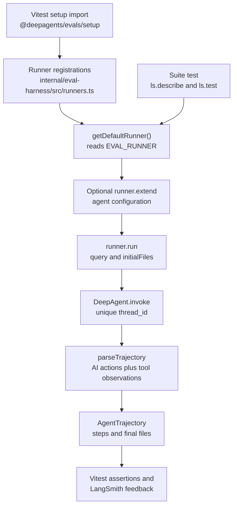

# Behavioral Eval Harness and Suites

The `evals/` workspace contains behavioral evaluations for `deepagents`. These are Vitest tests that invoke a real agent through an external model API and assert on the resulting behavior, rather than deterministic unit tests of middleware internals. Results are reported as LangSmith experiments so runs can be compared across models and over time.

Because a model provider is involved, a passing run is not a proof of deterministic behavior. Exact step counts, tool choices, and wording can vary with the selected model, provider responses, and prompt changes. Tests should assert the behavior that matters and avoid imposing an incidental trajectory when several trajectories are valid.

## Execution model

A suite receives an `EvalRunner`, supplies invocation inputs, and examines the normalized trajectory and final virtual filesystem returned by `run()`. The runner keeps agent configuration—model, prompt, tools, memory, skills, or subagents—separate from the query and seed files.



*The eval lifecycle from Vitest setup through runner selection, agent invocation, normalization, and assertions.*

### The `EvalRunner` contract

The public harness contract is intentionally small:

- `name` identifies the model runner.
- `run({ query, initialFiles? })` sends one user request. `initialFiles` is a `Record<string, string>` used to seed the agent's state-backed virtual filesystem.
- `extend(overrides)` returns another runner with agent configuration overrides such as `systemPrompt`, `tools`, `subagents`, `memory`, or `skills`. The invocation still supplies only the task and its seed files.

A run returns:

```ts
interface AgentTrajectory {
  steps: AgentStep[];
  files: Record<string, string>;
}
```

Each `AgentStep` has a 1-based `index`, the model's `AIMessage` action, and the following `ToolMessage` observations. `files` is the final filesystem snapshot, normalized to plain strings. This gives an eval two complementary oracles: the visible conversation and tool trajectory, and the state produced by file operations.

### Runner lifecycle and normalization

`DeepAgentEvalRunner` bridges the generic contract to `createDeepAgent`:

1. It turns the query into a user message. Each seed file is converted into the state backend's file representation: content split into lines plus creation and modification timestamps.
2. It generates a fresh UUID `thread_id` for every `run()` and invokes the compiled agent with that configuration. Runs therefore do not intentionally share a LangGraph thread.
3. It rejects a non-object invoke result. `parseTrajectory` skips the initial human message, starts a step at each `AIMessage`, attaches subsequent `ToolMessage`s, and returns the final file map.
4. File normalization accepts either a plain string or an object with `content`; malformed file maps raise a `TypeError` instead of silently producing a misleading snapshot.

The default registered runner constructs its agent when the runner is registered. Calling `extend()` constructs a separate runner and agent with the supplied overrides; subsequent calls to that derived runner reuse that configured agent. This keeps test-specific configuration from mutating the shared default runner while avoiding a new agent construction for every invocation.

The adapter's file representation is the legacy text `FileData` shape used by the state backend: line arrays and timestamps. The returned `AgentTrajectory.files` deliberately hides that storage detail so assertions can compare strings and paths directly.

## Registry, model setup, and extension

The harness registry is a process-local map keyed by runner name. The current built-in registrations are:

| `EVAL_RUNNER` | Provider and model |
| --- | --- |
| `sonnet-4-5` | `ChatAnthropic` with `claude-sonnet-4-5-20250929` |
| `sonnet-4-5-thinking` | Anthropic Sonnet with a 5,000-token thinking budget |
| `opus-4-6` | `ChatAnthropic` with `claude-opus-4-6` |
| `sonnet-4-6` | `ChatAnthropic` with `claude-sonnet-4-6` |
| `gpt-4.1` | `ChatOpenAI` with `gpt-4.1` |
| `gpt-4.1-mini` | `ChatOpenAI` with `gpt-4.1-mini` |
| `o3-mini` | `ChatOpenAI` with `o3-mini` |

The `@deepagents/evals/setup` Vitest setup import loads the harness package. The package entrypoint imports the matchers and exports `runners.ts`, whose registration calls have the side effect of populating the registry. `getDefaultRunner()` reads `EVAL_RUNNER`, resolves the name, and caches the result. A missing variable or unknown name fails early with an error that lists available runners; `getRunner(name)` is available when a test needs an explicit lookup.

To add a model runner, add a `registerDeepAgentRunner()` call in `internal/eval-harness/src/runners.ts`. The factory should spread the received configuration into `createDeepAgent` and set the provider model, for example:

```ts
registerDeepAgentRunner("my-model", (config) =>
  createDeepAgent({
    ...config,
    model: new ChatMyProvider({ model: "my-model" }),
  }),
);
```

Use the new name as `EVAL_RUNNER`. For a backend that is not `deepagents`, implement `EvalRunner` directly and register it with `registerRunner()`, or use it directly in a suite. A custom factory must return an invokable agent; the deepagents adapter owns input conversion, thread isolation, and trajectory parsing.

## LangSmith experiments and matcher semantics

Every suite's `eval.test.ts` obtains the default runner, wraps its suite in `ls.describe`, and passes `{ projectName: runner.name, upsert: true }`. The suite Vitest configuration uses the Node environment, the harness setup import, and the `langsmith/vitest/reporter`. The combined `evals/all` package invokes the suite functions inside one `deepagents-js-all` description, while individual packages expose focused runs such as `@deepagents/eval-files`.

The harness installs these custom Vitest matchers when `@deepagents/evals` is imported:

| Matcher | What it checks |
| --- | --- |
| `toHaveAgentSteps(n)` | The trajectory has exactly `n` agent steps. It records actual, expected, and binary match scores through `ls.logFeedback`. |
| `toHaveToolCallRequests(n)` | The total number of tool-call requests across all AI actions equals `n`; it also records the count and match feedback. |
| `toHaveToolCallInStep(step, match)` | A 1-based step contains a call with the requested `name`. `argsContains` requires strict equality for each named key; `argsEquals` compares the JSON-serialized argument object. Non-positive or out-of-range step numbers fail. |
| `toHaveFinalTextContaining(text, caseInsensitive?)` | The last step's string content contains the requested substring, optionally after lowercasing both sides. A trajectory without steps fails. |

The first two matchers explicitly emit feedback in the harness. Suites also commonly call `ls.logFeedback` themselves for an informational `agent_steps` score. The HITL suite, which invokes an agent directly rather than through `EvalRunner`, calls `ls.logOutputs` for its raw results. Assertions remain hard failures; a feedback score does not make a failed assertion pass.

## Environment and operations

A run needs:

- `EVAL_RUNNER`, set to one of the registered names. It is mandatory because `getDefaultRunner()` throws when it is absent.
- `LANGSMITH_API_KEY` for LangSmith experiment tracking.
- `ANTHROPIC_API_KEY` when selecting an Anthropic runner, or `OPENAI_API_KEY` when selecting an OpenAI runner.

Provide these values through the local environment, a secret manager, or CI secret injection; do not commit or paste credential values into the repository or this page. The selected provider credential must match the runner. Tests are external-model calls and can be slow, rate-limited, or unavailable; the suite configs allow a 120-second test timeout, 60-second hook timeout, and 60-second teardown timeout.

Examples:

```bash
# Run one focused suite
EVAL_RUNNER=sonnet-4-5 pnpm --filter @deepagents/eval-files test:eval

# Run the combined aggregate session
EVAL_RUNNER=sonnet-4-5 pnpm --filter @deepagents/eval-all test:eval

# Use an OpenAI runner for the skills suite
EVAL_RUNNER=gpt-4.1 pnpm --filter @deepagents/eval-skills test:eval
```

The package scripts run `vitest run`. Run `pnpm install` from the repository root after adding a new workspace package so the workspace link is available.

## Adding a suite

A focused suite is a workspace package, not a global registry entry:

1. Create `evals/my-eval/` with an `index.ts` exporting a function such as `myEvalSuite(runner: EvalRunner): void`.
2. Add `package.json` with a private package name, `test:eval: "vitest run"`, and dependencies on `@deepagents/evals`, `deepagents`, `langsmith`, and `vitest` (plus any libraries used by the suite).
3. Add the standard Node `vitest.config.ts`: include `**/*.test.ts`, use `setupFiles: ["@deepagents/evals/setup"]`, and enable the `langsmith/vitest/reporter`.
4. Add `eval.test.ts` that calls `getDefaultRunner()`, wraps the suite in `ls.describe`, and sets `projectName` to `runner.name` with `upsert: true`.
5. Import and invoke the suite from `evals/all/eval.test.ts` if it should participate in the aggregate run, then run it through its package filter.

A suite may customize an agent with `runner.extend({ ... })`; seed deterministic test data through `initialFiles`. Keep test inputs and reference outputs in the LangSmith test metadata, and assert final behavior, file state, and only trajectory details that are part of the intended contract.

## What the suites cover

### Basic behavior

`basic` checks that an overridden system prompt changes the answer and that a simple arithmetic request is answered without requiring a tool. It logs the observed step count, but does not make a model-specific step count the core correctness condition.

### Files and state snapshots

`files` is the broad filesystem behavior suite. It seeds files and checks reads, overwrites, targeted `edit_file` changes, deletion of files and nested directories, directory listing, `grep`, `glob`, deep nesting, empty files, truncation recovery, derived outputs, and parallel reads or writes. Some cases inspect the trajectory—for example, an overwrite must use one `write_file` call and a targeted replacement must use `edit_file`—while most cases assert the final `files` snapshot and response. Ambiguous parallel-write cases intentionally do not require one exact number of steps or verification reads.

### Memory

`memory` passes `memory: ["/path/AGENTS.md"]` through `extend()` and seeds those AGENTS files in the virtual filesystem. It checks recall of project facts, memory-guided naming and code style, combining user and project sources, graceful behavior when a source is missing, avoiding redundant reads when the memory already contains the answer, and updating stable formatting preferences without persisting transient context. This matches the agent contract: memory files are loaded into the system prompt at startup, while their file contents remain observable in the final snapshot when the agent edits them.

### Human-in-the-loop

`hitl` is a focused integration suite that constructs `createDeepAgent` directly with a `MemorySaver`, three tools, and `interruptOn`. The configuration demonstrates three policies: `true` for the default review decisions, `false` for no interrupt, and an explicit `{ allowedDecisions: ["approve", "reject"] }` policy. The first invocation is expected to return one interrupt containing two reviewable action requests; the test checks their names and allowed decisions. It then resumes the same `thread_id` with `Command({ resume: { decisions: [...] } })` and checks that approved tools produce results. Additional cases verify that the configuration and interrupt behavior apply inside the general-purpose or named `task` subagent.

This suite therefore tests the pause-and-resume lifecycle, not merely whether a tool was called. A checkpointer is required for this lifecycle; the suite's `MemorySaver` provides it. It also tests that a non-interrupted tool can execute alongside interrupted tools in the same request.

### Delegation and subagents

`subagents` extends the runner with a named `weather_agent` carrying a fake weather tool, then separately exercises the built-in general-purpose subagent with the same tool available to the parent. Both requests must route through delegation and return the fake response. The underlying subagent contract defaults to an isolated delegated task; named agents receive their declared tools and prompt, while the general-purpose path is provided by the deep-agent runtime.

### Summarization and history offloading

`summarization` builds a large Python file with 1,600 generated functions and a marker at the end. It asks the agent to read in chunks of at most 100 lines, recover the final marker, and answer a follow-up about the first standard-library import. A separate test records whether `/conversation_history/` files appear and, when they do, checks for the `## Summarized at` section. The production middleware monitors context thresholds, offloads evicted messages to backend storage, summarizes them, and retains recent context; the eval checks both continued answerability and the observable offload when compaction occurs.

### Skills

`skills` seeds `SKILL.md` files with YAML frontmatter below configured source directories and verifies full-content reading, selection by skill name, combining two skills, direct typo edits, read-before-edit behavior when the typo is unspecified, and editing the correct project path when multiple sources exist. It also checks that a non-selected skill's content is not leaked into the final response. The runtime accepts POSIX source paths and gives later sources precedence for duplicate skill names, so source ordering is part of the extension contract.

### Tool selection and chaining

`tool-selection` supplies mocked Slack, GitHub, Linear, Gmail, calendar, and web-search tools with spies. It covers direct requests, indirect intent routing, multiple independent actions, and chains such as search-then-email or create-issue-then-notify. Tests assert both that the correct tool spy was called and that the final response preserves important arguments or outcomes; the mocks avoid external side effects while the model still has to select and sequence the tools.

### Aggregate and neighboring suites

The aggregate package currently imports and invokes the basic, external-benchmark, files, follow-up-quality, HITL, memory, memory-agent-bench, memory-multiturn, skills, subagents, summarization, Tau2-airline, todos, tool-selection, and relational tool-usage suites. Some Oolong dataset imports remain commented out. The repository also contains focused packages for those additional scenarios; choose a focused package when iterating on one behavior and `@deepagents/eval-all` when comparing the complete enabled set.

## Failure-aware authoring guidance

- Treat exact step and tool-count assertions as deliberate contract checks. If a task permits a read-back or another valid strategy, assert the final state and response instead; the files suite documents this distinction in its ambiguous parallel cases.
- Use `toHaveToolCallInStep` only when ordering is material. Remember that step numbers are 1-based and that `argsContains` is shallow and strict.
- Prefer fake tools and spies for tool-selection tests. They verify routing and chaining without depending on Slack, GitHub, or other service credentials.
- For HITL, keep the same checkpointer and `thread_id` between the interrupting invocation and the `Command` resume.
- For filesystem and memory cases, assert the final snapshot as well as the final text when state mutation is the behavior under test.
- Do not describe an external-model suite as deterministic. Compare repeated LangSmith experiments across runners instead of treating one trajectory as universally canonical.
