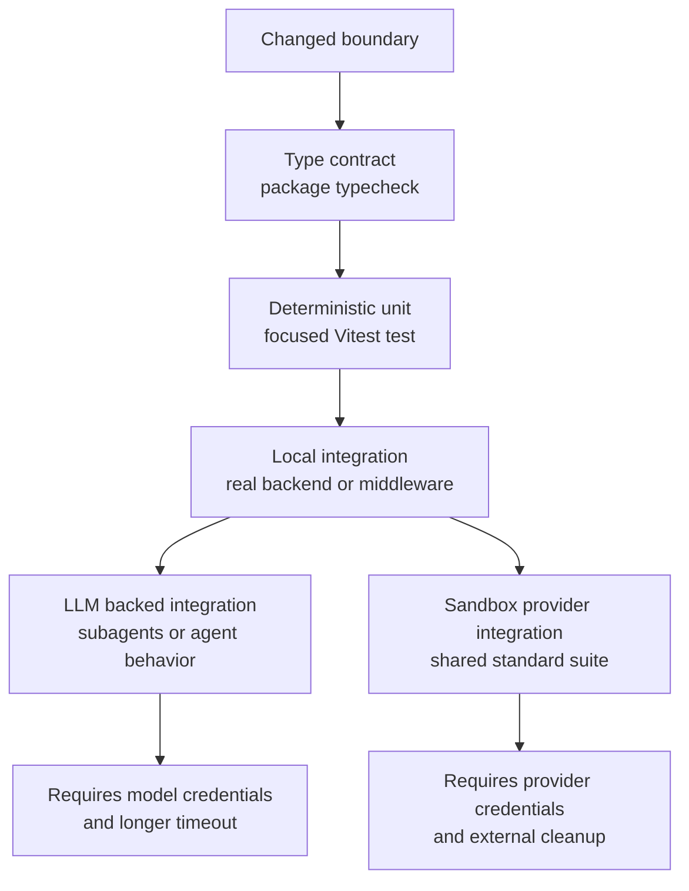
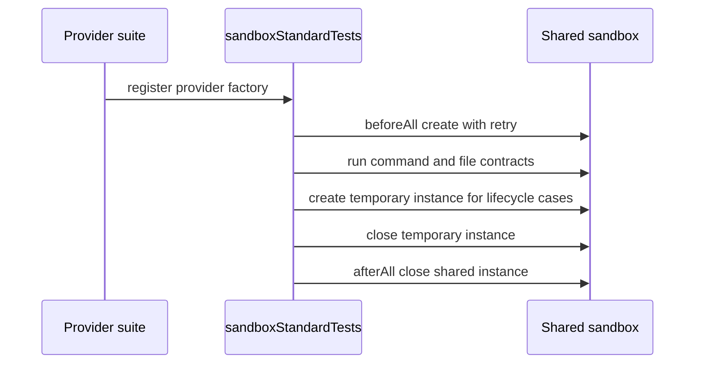

# Testing Strategy and Boundary Coverage

Testing in this repository is most effective when it follows the boundary being changed rather than the directory containing the implementation. The narrowest useful check is normally a deterministic Vitest unit test; move to a real filesystem or backend integration only when the contract crosses that boundary, and reserve LLM-backed or external-provider runs for behavior that cannot be proved with fakes.

The main validation layers are:

- **Type contracts**: package `typecheck` scripts and the Deep Agents `.test-d.ts` suites protect public state, middleware, subagent, response-format, skills, and streaming inference.
- **Deterministic units**: Vitest tests use fake chat models, mocked SDKs, in-memory stores, and temporary local directories to isolate reducers, routing, permissions, protocol translation, and configuration errors.
- **Local integration**: `*.int.test.ts` suites exercise real middleware composition, local backends, delegation, and lifecycle behavior. Some of these still use the sample LLM and therefore are not quiet or deterministic.
- **Provider integration**: `sandboxStandardTests()` applies one shared behavior contract to local and remote sandboxes, with provider-specific tests for capabilities that the common contract cannot express.

*Use the first boundary that can falsify the suspected regression; do not promote a deterministic check to an external run without a boundary reason.*

## Test execution modes and quiet validation

`libs/deepagents/vitest.config.ts` makes the split explicit. The default Node test configuration includes `src/**/*.test.ts`, excludes `**/*.int.test.ts`, enables Vitest typechecking, and uses 60-second test, hook, and teardown limits. `--mode int` instead includes only `**/*.int.test.ts`, raises the test timeout to 100 seconds, and loads the LangSmith gateway setup. This prevents the ordinary unit command from accidentally spending tokens or contacting sandbox providers.

Package scripts expose the same separation. `deepagents` and `deepagents-acp` provide `test:unit`, `test:int`, `typecheck`, and coverage scripts; the repository provides `pnpm test:unit`, `pnpm test:int`, and `pnpm typecheck`. A focused local check should therefore look like this before a broader run:

1. Run `pnpm --filter deepagents typecheck` when changing exported types or middleware state.
2. Run the smallest focused Vitest file, for example `pnpm --filter deepagents exec vitest run src/backends/state.test.ts`, for a reducer or backend change.
3. Run `pnpm --filter deepagents test:unit` for changes spanning several deterministic boundaries.
4. Run `pnpm --filter deepagents test:int` only when the change affects real model orchestration, local integration composition, or an explicitly selected integration suite.
5. Run the relevant provider package's `test:int` only with its credentials and cleanup plan. The root `pnpm test` also adds format and lint checks, so it is a release or broad-change check rather than the quiet first response to a local edit.

The `test:int` script is a mode selector, not a guarantee that every integration is free of outside dependencies. Read the target file's credential gate and timeout before invoking it.

## Core agent and public type boundary

### Deterministic construction and invocation

`libs/deepagents/src/agent.test.ts` is the focused unit boundary for `createDeepAgent` and model/provider-specific setup. It uses `FakeListChatModel` to prove system-prompt assembly without calling an LLM, including the absence of an authored base prompt by default and preservation of prompt content blocks and cache controls. It also verifies:

- Anthropic detection for model strings, model objects, and configurable provider wrappers.
- Model-profile tool exclusions both before graph construction and at execution time. An excluded call becomes an error `ToolMessage` while an allowed call still runs; the same rule is applied inside custom subagents.
- Explicit opt-in for todo middleware and collision detection for built-in tool names. Collisions raise `ConfigurationError` with the `TOOL_NAME_COLLISION` code rather than silently shadowing a tool.
- State-schema propagation: custom channels are present alongside the built-in `files` channel and filesystem, deletion, and delegation tools.

`libs/deepagents/src/testing/utils.ts` centralizes the invariant helper `assertAllDeepAgentQualities`. It checks the `files` graph channel and the baseline `ls`, `read_file`, `write_file`, `edit_file`, `delete`, and `task` tools. Use that helper when a construction test needs to prove that middleware composition is complete, but use direct assertions when testing a deliberate tool allowlist or exclusion.

### Type tests are executable API contracts

`libs/deepagents/src/agent.test-d.ts` uses `expectTypeOf` and real `invoke()` calls. It checks that middleware state merges with `stateSchema` state, that built-in `files` and opted-in `todos` remain typed, that regular and compiled subagents preserve literal names and configuration, and that `providerStrategy` and `toolStrategy` expose the inferred `structuredResponse`. It also checks the conditional `skillsMetadata` input and output contract, including the important negative cases where omitted or empty `skills` must reject that field.

`libs/deepagents/src/stream.test-d.ts` protects the typed streaming surface: discriminated tool-call names and inputs, typed subagent streams, and custom `StreamTransformer` extension channels. These are compile-time tests, not a replacement for the runtime tests that prove the stream actually emits events. A public signature or state-schema change should run both `typecheck` and the relevant runtime unit or integration test.

## Backend and filesystem boundaries

### State reducer and result semantics

`libs/deepagents/src/backends/state.test.ts` is the narrow test for the state-owned backend. It verifies the full synchronous operation set—write, read, edit, list, grep, and glob—using a fake LangGraph config. The important invariant is that state mutations are returned as `filesUpdate` or sent through the Pregel `files` channel; a test must simulate committing those updates before asserting a later read. Zero-argument construction exercises the current task config and sends deletion updates as `null` markers, including all descendants for recursive deletion.

The same suite protects failure and compatibility behavior: missing deletes and edits return structured error fields, repeated writes overwrite content, `readRaw` returns v2 metadata and binary bytes, and legacy v1 line-array data remains readable. Offset and limit reads, literal grep patterns, glob filters, replacement multiplicity, and nested directory listings are representative behavioral invariants rather than implementation trivia.

### Composite routing and persistence boundary

`libs/deepagents/src/backends/composite.test.ts` proves the boundary between ephemeral state and externally persisted stores. A root `StateBackend` owns ordinary paths and returns state updates; a mounted `StoreBackend` receives paths under prefixes such as `/memories/`, has the route prefix stripped for the delegated call, and returns `filesUpdate: null`. Listings, grep, glob, raw reads, edits, and recursive deletes must preserve virtual paths while combining only the backends that are relevant to the requested path.

The high-value failure mode is route leakage. The focused grep and glob tests assert that a backend mounted at `/skills/` is not called for a search rooted at `/workspace`, while a backend mounted below `/workspace/memories/` is called with the prefix removed and its results restored to virtual paths. When changing route matching, run these tests before testing a real store.

### Filesystem middleware and permissions

`libs/deepagents/src/middleware/fs.permissions.test.ts` tests permissions at the tool boundary, not just the matcher. Invalid configured paths such as relative paths, `..`, and `~` fail during construction. Malformed model paths return recoverable error `ToolMessage` results, do not throw out of the run, and do not reach the backend. Denied reads, writes, edits, listings, globs, and grep calls return structured errors and do not call the underlying operation; successful paths retain the normalized backend arguments.

Deletion is the security-sensitive failure mode. The middleware probes whether a target may have descendants and computes every deny pattern whose glob overlaps the possible subtree. It must block a parent delete when a descendant is denied, preserve all files on a denied recursive operation, distinguish a confirmed leaf from a possible subtree, and handle wildcard ancestors without prefix confusion. The suite covers both in-memory stateful behavior and a real `FilesystemBackend` in a temporary directory, so changes to either the overlap algorithm or the `ls` shape need both levels.

A sandbox backend is a separate capability boundary: command-executing backends cannot be combined with broad filesystem permissions, because the command tool could bypass the path policy. The tests allow permissions only when execute is disabled or when every permission path is scoped to a mounted composite route, and test factory backends at runtime because their capability is not known at middleware construction.

## Delegation, LLM-backed behavior, and failure modes

`libs/deepagents/src/middleware/subagents.int.test.ts` is intentionally integration-level. It uses `SAMPLE_MODEL` (`claude-sonnet-4-5-20250929`) and long 90- or 120-second test budgets to verify behavior that a fake model would not establish: the `task` tool chooses the general-purpose or named worker, worker tools actually execute, custom middleware and models are installed in the worker, compiled deep agents can be nested, and skills influence a delegated file-writing task.

The suite targets concurrency and lifecycle regressions that are easy to miss in units:

- Parallel delegations do not leak subagent model-call counts into the parent's count.
- Parallel subagents writing files do not trigger a LangGraph `LastValue` error; file updates merge through the reducer.
- Parent to deep-agent to tool call chains remain observable in streamed subgraph updates.
- `lc_agent_name` metadata reaches tools inside a named worker, and an Anthropic fork can reuse the parent's prompt-cache prefix.

These tests require the configured model provider and are sensitive to model trajectories. Assert the invariant—delegation occurred, the right named tool ran, state merged, or metadata arrived—not exact prose or an incidental number of turns. Run this file only when a delegation, reducer, skills, cache, or agent-context change warrants the external call. `subagents-hitl.int.test.ts` separately exercises `interrupt()` and resume behavior; its skipped tests document a boundary that should not be treated as covered merely because ordinary delegation passes.

`libs/deepagents/src/agent.int.test.ts` is the broader agent-construction and real-model integration surface. It combines base agents, custom tools, middleware state, named and general-purpose subagents, structured responses, and nested configurations. For middleware-only changes, prefer the deterministic `fs.int.test.ts` cases that run real agent composition against StateBackend and CompositeBackend; promote to the model-backed suite only when tool selection or generated behavior is part of the change.

## ACP protocol boundary

`libs/acp/src/server.test.ts` is a deterministic unit suite for `DeepAgentsServer`. It mocks both `deepagents` and `@agentclientprotocol/sdk`, so it does not prove an IDE or ACP transport connection. It does prove the server-owned protocol contract: initialization capabilities and auth methods, client capability storage, session creation and mode changes, unknown-agent and unknown-session errors, cancellation through an `AbortController`, slash commands, history replay, thinking versus message chunk routing, tool-call locations and kinds, terminal output and exit codes, permission decision caching, and cleanup on stop.

Keep ACP tests narrow and mocked when changing handler logic or update shapes. Use a real ACP client or transport test only when changing SDK wiring, JSON stream setup, or the process boundary; the package's `test:int` script exists, but the seeded server suite is specifically a mocked unit suite.

## Shared sandbox standard tests

`libs/standard-tests/src/sandbox.ts` is the reusable contract for sandbox implementations. It creates one shared sandbox in `beforeAll`, reuses it for command and file-operation tests, closes it in `afterAll`, and creates at most one temporary sandbox for lifecycle or `initialFiles` cases. Creation uses `withRetry` with five attempts and a 15-second delay to absorb transient provider concurrency failures. The registered categories cover lifecycle, command execution, upload and download, write, read, edit, `ls`, grep, glob, initial files, integration workflows, and error handling.

The integration workflow tests in `libs/standard-tests/src/tests/integration.ts` are deliberately cross-operation: write then read then edit then read again, and create a nested directory tree whose listing, glob, and grep results agree. These catch adapter mismatches that isolated operation tests cannot.

*The standard suite's shared-instance lifecycle and its bounded temporary-sandbox usage.*

Provider suites should inherit this contract and add only provider-specific behavior. `LocalShellBackend` runs it sequentially against a temporary local root without credentials. LangSmith skips when `LANGSMITH_API_KEY` is absent and documents platform-specific expected failures. Deno probes availability, skips only the documented plan-verification error, and otherwise rethrows provider failures. Modal gates on both token variables and warns about usage costs. Daytona labels sandboxes for CI cleanup, sets auto-stop and auto-delete intervals, and adds provider-specific runtime checks. Remote suites can take two or three minutes and may incur cost; a missing credential should skip the external suite, not turn a local unit command into a network test.

## Change-to-test map

| Change or failure mode | First validation | Escalate when |
| --- | --- | --- |
| Public state, middleware, subagent, strategy, skills, or stream types | `typecheck`, then `agent.test-d.ts` or `stream.test-d.ts` | A runtime channel or event is also changed |
| Agent construction, prompt assembly, tool exclusions, or collisions | `agent.test.ts` with `FakeListChatModel` | Provider-specific model behavior or generated tool choice matters |
| State reducer, v1 or v2 file data, structured errors | `backends/state.test.ts` | A real filesystem or persistence adapter is involved |
| Composite route prefix, fan-out, or store isolation | `backends/composite.test.ts` | The external store implementation or checkpoint lifecycle changes |
| Permission matching or recursive delete safety | `fs.permissions.test.ts` | A real backend contract changes, then include its temporary-filesystem cases |
| Subagent delegation, parallel updates, skills, metadata, or cache | Deterministic construction test where possible | `subagents.int.test.ts` with model credentials |
| ACP handler, session, notification, or permission semantics | `libs/acp/src/server.test.ts` | SDK transport or IDE interoperability changes |
| Sandbox adapter operation or lifecycle | Provider's `sandbox.int.test.ts` through `sandboxStandardTests()` | Provider-only capability needs a focused additional test |

This ordering keeps routine development quiet while still making the expensive boundaries explicit. A green unit run does not certify an LLM trajectory, a remote sandbox, or an ACP transport; those claims require the corresponding integration boundary and its operational prerequisites.
