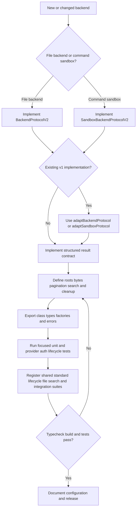

# Add or Change a Backend Provider

Use this workflow when adding a storage backend, a command-capable sandbox provider, or a provider-specific extension. The goal is not merely to satisfy TypeScript: a backend is an integration boundary whose results are consumed by filesystem middleware and the agent. Preserve the observable contract for structured errors, partial bulk operations, text pagination, binary bytes, search truncation, path containment, and cleanup.

Related context:

- [Backend Protocol and File Storage Architecture](/openwiki/architecture/backend-storage.md) explains v1/v2 adaptation and the checkpoint-versus-external persistence boundary.
- [Sandbox Backend Integrations](/openwiki/integrations/sandbox-providers.md) compares provider lifecycles, authentication, and existing adapters.
- [Configuration, Credentials, and Security Boundaries](/openwiki/operations/configuration-security.md) explains why a path root is not automatically a shell-security boundary.
- [Testing Strategy and Boundary Coverage](/openwiki/testing/strategy.md) describes the repository's quiet-to-expensive validation order.

## The implementation path



*Caption: Implementation and validation gates for a backend provider, from protocol choice through package exposure and shared conformance testing.*

The rest of this page expands each gate and calls out the failure modes that a superficial adapter tends to miss.

## 1. Choose the protocol and persistence boundary

### Implement v2 for new code

`BackendProtocolV2` is the current contract. It replaces v1's `lsInfo`, string-returning `read`, raw `readRaw`, `grepRaw`, and `globInfo` methods with structured `LsResult`, `ReadResult`, `ReadRawResult`, `GrepResult`, and `GlobResult` responses. `SandboxBackendProtocolV2` adds `execute(command)` and a non-empty `id`; use it only when the provider actually exposes command execution. `VfsBackend` is a useful counterexample: it implements `BackendProtocolV2` but intentionally has no `execute()` or sandbox `id`.

Choose the storage boundary before choosing the class shape:

- **Thread or checkpoint-owned files:** use the state-style `filesUpdate` behavior. The graph owns persistence and may need update maps or Pregel sends.
- **External or remote persistence:** return `filesUpdate: null` after the provider has persisted the write.
- **Local or in-memory files:** make the root and lifetime explicit; do not imply remote isolation.
- **Command execution:** implement the sandbox protocol only if the command authority and its security boundary are understood.

For a new implementation, implement v2 directly. The v1 interfaces are deprecated and retained for compatibility. If an existing provider cannot be migrated in the same change, pass it through `adaptBackendProtocol` or `adaptSandboxProtocol`. The adapters wrap legacy strings and arrays, migrate v1 `FileData` line arrays to v2, cap legacy grep results when requested, and preserve a sandbox's `execute` and `id`. Do not hand-roll a second compatibility shape.

### Decide whether `BaseSandbox` fits

A remote, shell-backed provider can extend `BaseSandbox`. Concrete subclasses provide only `id`, `execute`, `uploadFiles`, and `downloadFiles`; the base class derives `ls`, text and binary `read`, `readRaw`, `grep`, `glob`, `write`, `edit`, and `delete`. Its host-side implementation uses POSIX `awk`, `grep`, `find`, and `stat`, so the sandbox image need not provide Python or Node.js for those defaults.

Do not inherit the defaults blindly:

- `write()` encodes text as UTF-8 and treats non-text input as base64 before uploading.
- `read()` downloads binary files in full, but paginates text by line offset and limit.
- `readRaw()` downloads the complete file and constructs v2 metadata in the host process.
- `edit()` downloads, replaces in the host process, and uploads; multiple matches are an error unless `replaceAll` is true.
- `grep()` is literal, skips binary MIME types, and applies `maxCount` after collecting matches.
- `glob()` walks recursively and reports truncation when its walk or command output is capped.
- `delete()` shell-quotes the argument but uses `rm -rf`; this is not path containment. A provider that needs a restricted root must enforce that restriction in its own transfer and execution layer.

A provider with a native file API may implement v2 directly, as `VfsBackend` does, to preserve native metadata, byte fidelity, confinement, and error handling instead of forcing file operations through shell commands.

## 2. Implement the result and data contracts

### Structured results are the API

Return data in the result fields and reserve thrown exceptions for setup or provider failures. The important shapes are:

| Operation | Success and failure obligations |
| --- | --- |
| `read` | Return text with optional `totalLines`, `startLine`, `endLine`, and `nextOffset`; return a complete `Uint8Array` for binary; put not-found failures in `error`. |
| `readRaw` | Return v2 `FileData` in `data`, with MIME type and timestamps; do not return a bare `FileData` from a v2 implementation. |
| `ls` and `glob` | Return `FileInfo` entries. Directories use `is_dir`; directory paths conventionally have a trailing `/` in listings. `glob` may return partial `files` with `truncated: true`. |
| `grep` | Match literal text, return `{ path, line, text }`, skip binary files, and preserve partial matches with `truncated: true` when a cap is hit. `maxCount` is a total match cap, not a per-file promise. |
| `write`, `edit`, and `delete` | Return the affected `path` on success and a structured `error` on failure. External providers use `filesUpdate: null`; edit reports `occurrences`. Recursive delete must state whether a partial failure can leave earlier deletions applied. |
| `uploadFiles` and `downloadFiles` | Return one response for every input, in input order. A download uses `content: null` on failure; standard error codes are `file_not_found`, `permission_denied`, `is_directory`, and `invalid_path`. Continue after an individual failure when the provider can do so. |
| `execute` | Return combined output, an exit code, and `truncated`. A normal non-zero command exit is a response, not necessarily a thrown wrapper error; timeout and SDK failures should be translated to actionable provider errors. |

Do not convert a partial batch into an all-or-nothing exception. Daytona downloads each path independently and maps failures; the standard tests deliberately exercise mixed success and failure. The same invariant applies to uploads: a response array is the caller's only reliable way to know which paths succeeded.

### Preserve text, binary, and pagination semantics

Use the shared v2 model: text is a string, binary is a `Uint8Array`, and `mimeType` identifies the distinction. Path-derived MIME classification treats common images, audio, video, PDF, and presentation files as binary while treating text formats, JSON, JavaScript, SVG, and unknown extensions as text. Literal search must not attempt to decode binary content as searchable text.

For text reads, normalize offset and limit with `normalizeReadPagination`: finite values are floored and clamped to zero. Calculate the returned slice and its metadata from those same normalized values. A partial read should make `nextOffset` point to the next unread zero-based line, omit it at EOF, and report 1-indexed `startLine` and `endLine`. A zero limit returns no content. Binary reads ignore line pagination and return all bytes.

When writing through the common tool contract, text is ordinary string content and binary input is base64 text. When implementing bulk transfer, accept and return bytes without a text round trip. Preserve creation and modification timestamps in raw file data where the backing system exposes them; do not silently replace binary bytes with a base64 string in `read()` or `readRaw()`.

### Define path semantics and containment

Document the path vocabulary before writing the adapter:

1. Are inputs absolute, relative to a work directory, or both?
2. Are results absolute provider paths, virtual paths, or paths relative to the search root?
3. Does a trailing slash identify a directory?
4. What happens to `..`, `~`, redundant separators, symlinks, and a path that names a directory?
5. Does command execution share the same root as file transfer?

Containment must be enforced by the provider, not inferred from `shellQuote`. `VfsBackend` resolves both absolute and relative inputs below `/workspace` and returns `invalid_path` for candidates outside that root. It also rejects writes through symlinks. Its tests prove that uploads and downloads such as `../../outside.txt` cannot escape the virtual workspace. Conversely, `BaseSandbox.delete()` explicitly warns that its shell quoting is not a security boundary, and the remote shell can remove anything it can reach. If a provider claims confinement, add tests for traversal, symlink or link-like paths, absolute paths, and command/file-root mismatch.

For globbing, preserve the difference between a non-recursive `*` and recursive `**`, include directories when the contract says so, and bound pathological patterns or walks. `VfsBackend` rejects overlong or overly segmented patterns; `BaseSandbox` caps recursive find output and marks results truncated. Never report a complete search after an underlying command or walk was cut short.

## 3. Own lifecycle, errors, authentication, and operations

### Make state transitions explicit

A provider should expose a stable non-empty `id` and a truthful `isRunning` indicator when it participates in the sandbox standard suite. Provide either a one-step `create()` or an explicit `new` plus `initialize()`; support both when the provider's API has a meaningful two-step lifecycle. Reject operations before initialization with a structured provider error rather than an opaque null dereference. Reject double initialization if the provider cannot safely reinitialize.

Define cleanup precisely:

- Does `close()` delete or terminate the remote resource, stop it for later restart, detach from it, or only drop local references?
- Is `stop()` resumable with `start()`?
- Does cleanup preserve files, and which resources survive process interruption?
- Can a closed wrapper be used again, or must callers create or reconnect?

`DaytonaSandbox` illustrates a cloud lifecycle: `create()` initializes, `stop()` preserves a restartable sandbox, `start()` resumes it, and `close()` deletes it and clears SDK references. `VfsBackend` has no command lifecycle: `stop()` drops its in-memory filesystem and resets initialization. These are different valid contracts; document which one the provider implements and test it rather than copying method names without their semantics.

Translate provider failures without losing their cause. Use the common `SandboxError` shape and provider-specific codes where useful, such as authentication failure, creation failure, not found, command timeout, command failure, and file-operation failure. Keep ordinary command exit codes in `ExecuteResponse`; throw or reject for a timeout, unavailable SDK, or failed provisioning. For file transfer, map provider errors to the standardized per-item codes and keep the original exception available as a cause on wrapper errors.

### Make authentication configurable but not secret-bearing

Resolve explicit options before environment variables, and fail early with setup instructions when a required credential is absent. Daytona's current resolution is `auth.apiKey`, then `DAYTONA_API_KEY`; its API URL is `auth.apiUrl`, then `DAYTONA_API_URL`, then `https://app.daytona.io/api`, and its target prefers an explicit value over `DAYTONA_TARGET`. Add equivalent focused tests for any new provider. Do not print or commit credential values, pass secrets through prompts, or broaden environment inheritance merely to make a command work.

Provider options should capture operational controls that affect correctness and cost: image or snapshot selection, resource sizing, command timeout, environment variables, auto-stop or auto-delete behavior, labels, and initial files. Validate incompatible options at the provider boundary. If initial files are supported, create parent directories, preserve bytes where the type permits them, and make an initialization failure visible rather than silently starting a partially populated sandbox.

### Expose a usable package surface

The package entrypoint is part of the feature. Export the main backend class, its factory functions, public option and error types, and the error class as a value export. `@langchain/daytona` exports `DaytonaSandbox`, its fresh and reuse factory helpers, auth utilities, options, error-code type, and `DaytonaSandboxError`. `@langchain/node-vfs` exports `VfsBackend`, its fresh and reuse factories, options, and `VfsSandboxError`.

Keep the package build and export map aligned with the source entrypoint. The provider packages expose ESM and CommonJS distribution paths and declare `deepagents` as a peer dependency. Add a public usage example that shows creation, passing the backend to DeepAgents, and cleanup in `finally`. If a factory creates a fresh remote sandbox per invocation, say so and make ownership of `close()` unambiguous; if it reuses one instance, say that concurrency and cleanup are now the caller's responsibility.

## 4. Build the right tests before calling the provider complete

### Focused unit tests

Start with deterministic tests that mock the provider SDK or use the local implementation. Cover the behavior that the shared suite cannot know:

- **Authentication:** explicit option precedence, environment fallback, default URL or region, and helpful missing-credential failure.
- **Initialization:** default and custom options, stable ID after provisioning, `isRunning`, pre-init access, double initialization, and structured creation/auth errors.
- **Command adapter:** argument and timeout propagation, combined stdout and stderr, ordinary non-zero exit codes, timeout mapping, and the `truncated` flag.
- **Transfer adapter:** parent-directory creation, byte-preserving upload/download, input-order preservation, partial batch success, directory and missing-file mapping, and provider error causes.
- **Path and search invariants:** traversal and symlink defenses, relative and absolute forms, literal grep, binary exclusion, glob recursion, pattern bounds, pagination metadata, and truncation.
- **Cleanup:** close/delete behavior, stop/start or reconnect behavior, idempotent cleanup where promised, and resource references cleared after terminal cleanup.
- **Initial files and factories:** nested files, empty content, binary content when supported, fresh factory isolation, reuse factory behavior, and failure during initial population.

Daytona's focused tests mock `@daytona/sdk` and cover auth, initialization, command result mapping, parent directories, partial file errors, lifecycle methods, reconnect, label cleanup, and provider errors. Node VFS tests cover initialization, v2 raw data, recursive delete, symlink-safe writes, mixed transfer results, stop idempotence, path confinement, glob limits, and independent factories. Use these as patterns, not as a reason to test only the happy path.

### Register the shared standard suites

A command-capable sandbox must run `sandboxStandardTests()` from `@langchain/sandbox-standard-tests/vitest`. Supply:

- `name` for the suite;
- `createSandbox`, passing through standard `initialFiles` options;
- `resolvePath` to map test names into the provider's workspace;
- `closeSandbox` for deterministic teardown;
- optionally `createUninitializedSandbox` for two-step initialization;
- `timeout`, `skip`, or `sequential` when provider limits require them.

The harness creates one shared sandbox in `beforeAll`, reuses it for most tests, uses temporary instances for lifecycle and fresh-initial-file tests, retries creation up to five times with a 15-second delay for transient concurrency limits, and closes the shared instance in `afterAll` while ignoring cleanup errors. A remote provider should add an outer cleanup strategy for interrupted processes: Daytona's integration suite labels test sandboxes, configures short auto-stop and auto-delete intervals, and performs a label-based sweep in `afterAll`.

The suite is behavioral and must remain mandatory for sandbox providers. It covers lifecycle, command execution, upload/download, write, read, edit, `ls`, grep, glob, initial files, error handling, and integration workflows. The high-value tests are not interchangeable:

- `read` checks offsets, limits, zero limits, beyond-EOF behavior, Unicode, long lines, and chunked reads.
- grep checks literal and case-sensitive matching, line numbers, nested directories, glob filters, Unicode, and special characters.
- glob checks `*`, `**`, directories, extensions, hidden files, character classes, question marks, and deep paths.
- command execution checks stdout, stderr, multiline output, exit codes, environment variables, and missing commands.
- integration workflows write, read, edit, read again, then reconcile `ls`, recursive glob, and grep over a nested tree.

A file-only implementation such as `VfsBackend` does not satisfy the sandbox protocol and should not be forced into command tests. It needs its own local integration suite for file operations, path confinement, binary reads, search, pagination, factories, and stop semantics, as the existing Node VFS suite does.

### Run validation in cost order

Run the narrowest checks first, then promote to external tests only at their boundary:

```bash
# From a provider package
pnpm typecheck
pnpm test:unit
pnpm test:int

# From the repository root when the change spans packages
pnpm typecheck
pnpm test:unit
pnpm test:int
pnpm format:check
pnpm lint
pnpm build
```

The provider package scripts define `typecheck`, `test:unit`, and `test:int`; `test:int` uses Vitest's integration mode and may require cloud credentials, network access, quota, and a cleanup plan. Run the focused provider test file while iterating, then the full unit suite, then the shared standard integration suite with credentials injected by the environment. Keep missing-credential suites skipped rather than turning ordinary unit tests into network calls.

## Completion checklist

Before merging a provider change, verify all of the following:

- [ ] New code implements v2, or an existing v1 provider is routed through the shared adapter.
- [ ] The persistence boundary and `filesUpdate` behavior are documented and tested.
- [ ] `read`, `readRaw`, `ls`, `grep`, `glob`, `write`, `edit`, and optional `delete` return the right structured shapes.
- [ ] Text pagination uses normalized values and binary reads preserve complete bytes and MIME type.
- [ ] Uploads and downloads return one per-input result, preserve order, and allow partial success.
- [ ] Search and glob report incomplete results as truncated and enforce useful bounds.
- [ ] Paths, symlinks, working roots, shell access, and directory deletion have explicit containment semantics.
- [ ] Lifecycle, timeout, authentication, provider errors, initial files, and cleanup are focused-tested.
- [ ] The main class, factories, option types, error types, and package entrypoint are exported and typechecked.
- [ ] The shared standard lifecycle, file, search, command, and integration suites run for every command-capable provider.
- [ ] Integration resources have deterministic teardown plus an interrupted-run safety net.
- [ ] Documentation names credentials by variable or option, never by value, and distinguishes provider isolation from tool-layer path policy.
