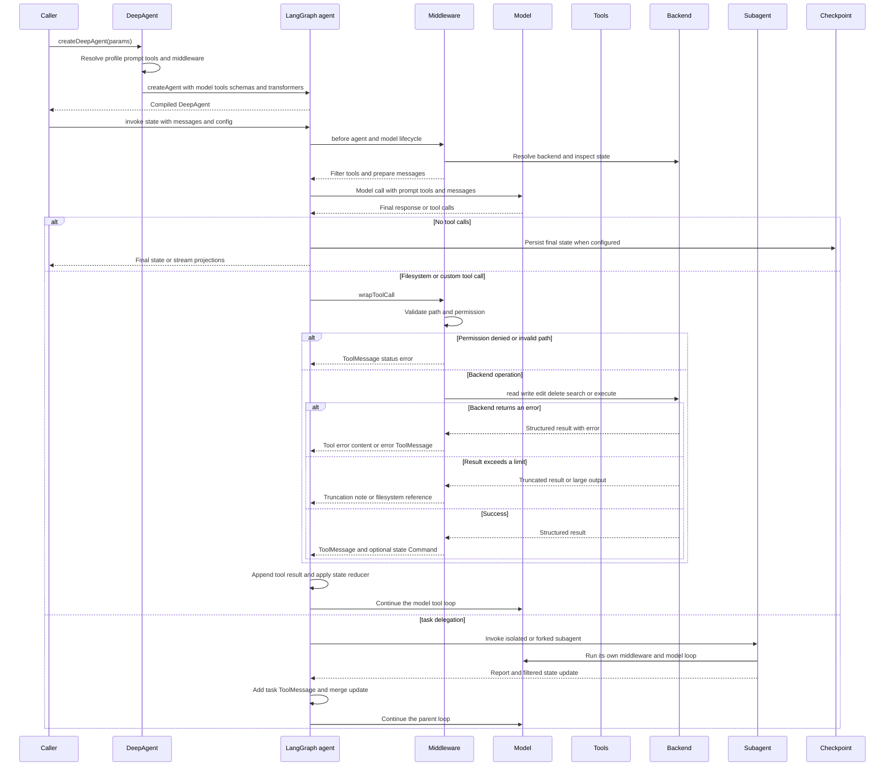

# End-to-End Agent Run

A deepagents run has two phases:

1. **Construction** — `createDeepAgent` resolves the model profile, assembles prompts and middleware, and delegates compilation to LangChain `createAgent`.
2. **Execution** — the compiled LangGraph agent repeatedly calls the model, executes selected tools or subagents, applies state updates, and stops when the model produces a final response or the run is interrupted or fails.

The package does not implement a second graph engine. It supplies the built-in middleware and backend adapters around the `ReactAgent` returned by `createAgent`.

## Main request and tool loop

*Caption: A model response either completes the run or enters a middleware-mediated tool or delegation loop; failures are returned to the graph as recoverable tool results where the tool contract supports that behavior.*

## 1. Construction: what `createDeepAgent` fixes before a run

The factory defaults to `anthropic:claude-sonnet-4-6`, no user tools, a `StateBackend`, no custom middleware or subagents, and no permissions. Callers can supply a model object or string, tools, `systemPrompt`, `stateSchema`, `contextSchema`, `responseFormat`, `checkpointer`, `store`, `backend`, `interruptOn`, `memory`, `skills`, permissions, a name, and `streamTransformers`.

Construction rejects a user tool whose name collides with a built-in filesystem tool, async task tool, or `task`; this is a `ConfigurationError` with code `TOOL_NAME_COLLISION`, rather than a run-time ambiguity. Otherwise user tools are additive to the built-ins. The factory resolves a harness profile from the model input. A profile may alter prompt text, tool descriptions, visible tools, middleware, and general-purpose-subagent settings, but it does not replace the selected model.

The final system prompt is assembled from the caller prefix, the caller or profile base, the caller suffix, and the profile suffix. An empty result is omitted from `createAgent`, so creating a default agent does not itself add an authored system message. Model-specific caching middleware is added only when the model is recognized as Anthropic or Bedrock; no provider behavior should be inferred beyond those source-level additions.

The root middleware order is deterministic:

1. optional `SkillsMiddleware`
2. `FilesystemMiddleware`
3. `SubAgentMiddleware`
4. deepagents `SummarizationMiddleware`
5. `PatchToolCallsMiddleware`
6. optional async-subagent bridge
7. profile middleware, provider cache middleware, optional memory, and optional human-in-the-loop middleware

Custom middleware replaces a same-named entry in place and otherwise participates between the core and tail regions. Profile exclusions are applied after replacement. Tool exclusions are appended after tool-injecting middleware, so they filter the final model-visible set. Finally, `createDeepAgent` calls `createAgent` with the resolved model, prompt, effective tools, schemas, middleware, persistence handles, name, and stream transformers, then applies a recursion limit of `10_000` and deepagents metadata.

### What is per-agent, per-run, and persistent

- The compiled graph and middleware instances are normally created once.
- Invocation state contains `messages`, filesystem state, and middleware or application fields. `stateSchema` fields are graph state; `contextSchema` describes invocation context rather than persisted state.
- A checkpointer persists graph state for a configured LangGraph `thread_id`. `StateBackend` files therefore survive steps on one thread but are not cross-thread storage.
- A `store` is a separate persistent boundary. For example, `CompositeBackend` can route `/memories/` to `StoreBackend` while routing other paths to `StateBackend`.
- A backend factory is resolved with the current runtime when a middleware or tool needs it. The current v2 backend contract returns structured `ReadResult`, `WriteResult`, `GrepResult`, `GlobResult`, and related values rather than requiring callers to interpret a single string.

## 2. Before the model: middleware prepares the request

LangGraph enters the agent and middleware lifecycle. `FilesystemMiddleware` resolves the configured backend and, at model-call time, removes `execute` when the resolved backend is not sandbox-capable and removes the built-in `delete` when deletion is unsupported. It also replaces an evicted human message with a reference to its stored file.

Filesystem permissions are checked before the backend is called for `ls`, `read_file`, `write_file`, `edit_file`, `glob`, and `grep`. Paths are validated and denied paths are not normalized through to the backend. Rules use declaration order and first match wins, with a permissive default. A denied or invalid path returns a `ToolMessage` with `status: "error"`, so the model sees a recoverable tool failure instead of a successful string that merely starts with `Error:`. `execute` is different: path permissions are not applied to arbitrary shell commands. A configured execution-capable backend is rejected unless execution is disabled or a `CompositeBackend` route configuration makes every permission path safe to scope.

Summarization wraps model calls after the effective message list is reconstructed. It lazily derives defaults from the resolved model profile when the caller did not provide them: profile-aware models use fraction thresholds, while models without `maxInputTokens` use fixed token and message fallbacks. It may truncate old tool arguments, then counts the prompt and tools. If the trigger fires, it selects a cutoff that avoids splitting an AI tool-call group from its `ToolMessage` results.

When summarization is needed, old messages are written to the configured history path, by default `/conversation_history/{session}.md`, a summarizer model creates a `HumanMessage` marked with `lc_source: "summarization"`, and the middleware returns a `Command` carrying a private summarization event. Later calls use that summary plus messages after the cutoff rather than rewriting the entire message list. If the model raises a `ContextOverflowError`, the middleware can recalibrate token estimation and retry with a more aggressive summary. An offload failure does not prevent summary generation; the summary simply has no history-file reference.

## 3. Tool execution and backend ownership

The model's tool call is routed through LangGraph and the middleware `wrapToolCall` chain. Built-in filesystem tools are adapters, not storage implementations:

- `ls`, `read_file`, `write_file`, `edit_file`, `delete`, `glob`, and `grep` resolve the backend, pass validated inputs, and format results for the model.
- Text reads are line-paginated. Binary reads return the full binary payload subject to the middleware's binary-size limit. Search results may carry `truncated: true` when a backend match cap is reached; `grep` adds a note telling the model that the result is incomplete.
- `execute` requires a backend implementing `SandboxBackendProtocol`. Its formatted result includes command output, an exit-code status when available, and an explicit truncation note when the backend reports truncated output.
- Writes and edits return a success `ToolMessage`. If a checkpoint-oriented backend returns `filesUpdate`, the tool returns a LangGraph `Command` that updates `files` and appends that message. External backends return the message after persisting outside graph state.

`StateBackend` is the important checkpoint-backed case. In its current zero-argument form it reads files from LangGraph's execution context and publishes updates through the internal `__pregel_send` channel. Its `files` state uses a reducer that merges concurrent updates and treats `null` values as deletion markers. The legacy runtime-injected constructor remains compatible and returns `filesUpdate` for the caller to apply.

`CompositeBackend` routes by the longest matching path prefix, strips the route prefix before delegating, and restores it in returned paths and updates. At `/`, listings aggregate the default backend and mounted route directories. A command always runs on the default backend rather than a mounted route. Multi-backend recursive deletion is sequential: an error stops later targets, earlier deletions are not rolled back, and the result reports that deletion may be partial.

### Failure semantics to expect

There are several deliberately different failure surfaces:

- **Configuration failure:** invalid construction, such as a colliding tool name or incompatible permission and execution setup, throws before invocation.
- **Permission or path failure:** filesystem middleware returns a `ToolMessage` with `status: "error"` and a permission or validation message; the model can choose another action.
- **Backend operation failure:** v2 results carry `error` with no successful content or path. Tool adapters convert that into an error result or error `ToolMessage`, depending on the operation.
- **Incomplete result:** grep and glob contracts can return partial data with `truncated: true`; command execution reports truncation separately. Large tool messages that exceed the eviction threshold are written to `/large_tool_results/{tool-call-id}.txt` when possible and replaced in context by a preview and file reference. If that write fails, the replacement explains that the large result could not be saved.
- **Model or graph failure:** errors not represented as tool results, including non-overflow model failures, propagate out of the run. Human-in-the-loop interrupts and abort signals are control-flow outcomes rather than backend success messages.

## 4. Delegation: the parent run and a subagent run

`SubAgentMiddleware` exposes the `task` tool. The task call selects a declarative or compiled subagent by name and invokes that runnable with its own model and middleware stack. Declarative subagents receive filesystem, summarization, patching, and optional skill middleware before their custom middleware. The automatically supplied `general-purpose` subagent uses the main model and effective tools unless disabled or replaced.

The default mode is isolated: the subagent receives only a new human task description. A `mode: "fork"` subagent receives the effective parent conversation and a preamble identifying it as the already-invoked subagent. Forks mirror prompt-producing parent middleware and may inherit skills and memory configuration, but cannot declare their own skills and cannot recursively delegate. Parent messages and private coordination fields are filtered at the boundary; summarization cutoffs are not copied because they are only valid for the message list that produced them.

When a task completes, the parent receives a `ToolMessage` containing the subagent's final non-empty AI text, or JSON for `structuredResponse`. The parent also receives filtered state fields such as application state or filesystem updates. Parallel file updates merge through the filesystem reducer rather than one subagent overwriting another's update. The parent then returns to its own model loop, so delegation is an intermediate tool result, not the final user response by itself.

## 5. Checkpointing, final state, and streaming

When the model stops requesting tools, LangGraph finalizes the graph state. With a checkpointer, that state is associated with the configured thread and can be used by a later invocation. `invoke` returns the final state, including messages and state contributed by middleware or the user schema; a configured response format additionally yields `structuredResponse`.

Normal `invoke`, `stream`, and inherited LangGraph configuration behavior come from the underlying `ReactAgent`. This includes `configurable.thread_id`, checkpointers, stores, recursion limits, interrupts, and abort signals.

### Legacy event streaming

If the caller omits `version`, `agent.streamEvents` preserves the legacy internal LangGraph event-stream behavior for compatibility with LangGraph Platform integrations. The source does not promise a new deepagents projection or provider-specific event shape for this path. Consumers that depend on the inherited event protocol should treat it as the compatibility interface and not assume the v3 projection properties are present.

### Opt-in v3 projection stream

Pass `version: "v3"` to opt into the experimental projection-oriented stream. This is a type overlay over LangChain's `AgentRunStream`, not a deepagents runtime stream class. The underlying `createAgent` registers the native named-agent transformer, while deepagents narrows the declared subagent types.

A v3 run provides:

- `run.messages` for message lifecycles and streamed text or reasoning
- `run.toolCalls` for individual calls, inputs, outputs, status, and errors
- `run.subagents` for named delegation streams and each subagent's own messages and tool calls
- `run.middleware` for middleware lifecycle events
- `run.values` for state snapshots and `run.output` for final state
- `run.subgraphs` for child graph streams
- `run.extensions` for projections from caller-supplied `streamTransformers`
- the raw async iterable, `path`, `signal`, `interrupted`, and `interrupts`

These are live async iterables. A consumer should iterate a subagent's `messages` or `toolCalls` while the parent run is active; the focused tests specifically treat per-subagent streams as non-replayable after completion. Multiple same-type subagent invocations are isolated by their task-call namespaces. The v3 interface is experimental and may change before becoming a future default.

## Focused tests and safe change points

The tests that matter when changing this workflow are:

- `agent.int.test.ts` verifies construction, custom state, delegation, nested deep-agent hierarchies, and structured responses.
- `agent.test.ts` verifies prompt assembly, model/profile behavior, cache placement, tool exclusions, and construction-time collisions.
- `stream.test.ts` verifies v3 final output, messages, tool calls, values, raw protocol events, abort and interrupt fields, fork isolation, and parallel same-type subagent stream isolation.
- `middleware/fs.permissions.test.ts` verifies first-match permission behavior, invalid paths, recursive delete checks, and error `ToolMessage` results.
- `middleware/fs.eviction.test.ts` and `middleware/fs.test.ts` verify large-result eviction, read pagination, backend errors, truncation notes, and `Command`-based file updates.
- `middleware/summarization.test.ts` verifies cutoff safety, backend history offload, effective-message reconstruction, and overflow recovery.
- `backends/state.test.ts` and `backends/composite.test.ts` verify checkpoint updates, reducers, route prefix restoration, and partial multi-backend deletion behavior.

When extending the run, preserve middleware ordering and names used for replacement and exclusion, keep backend errors distinguishable from successful content, and update both runtime and type tests when changing the v3 stream contract.

## Related pages

- [Agent runtime](../architecture/agent-runtime.md) — construction, profiles, middleware, and public types.
- [Backend storage](../architecture/backend-storage.md) — backend protocols, persistence, and routing.
- [Context management](../concepts/context-management.md) — summarization and history retention.
- [Delegation](../concepts/delegation.md) — isolated and forked subagents.
- [Filesystem tools](../concepts/filesystem-tools.md) — filesystem tool behavior and permissions.
