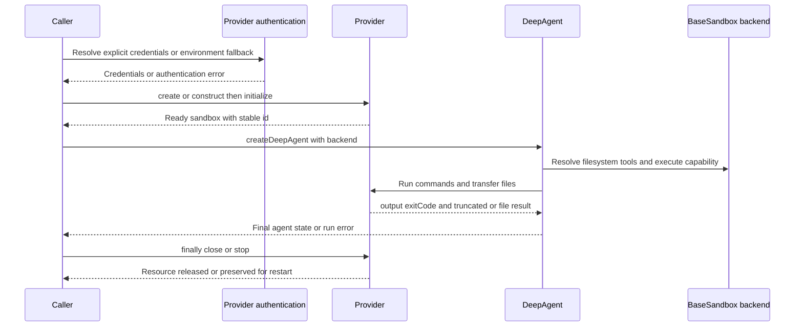
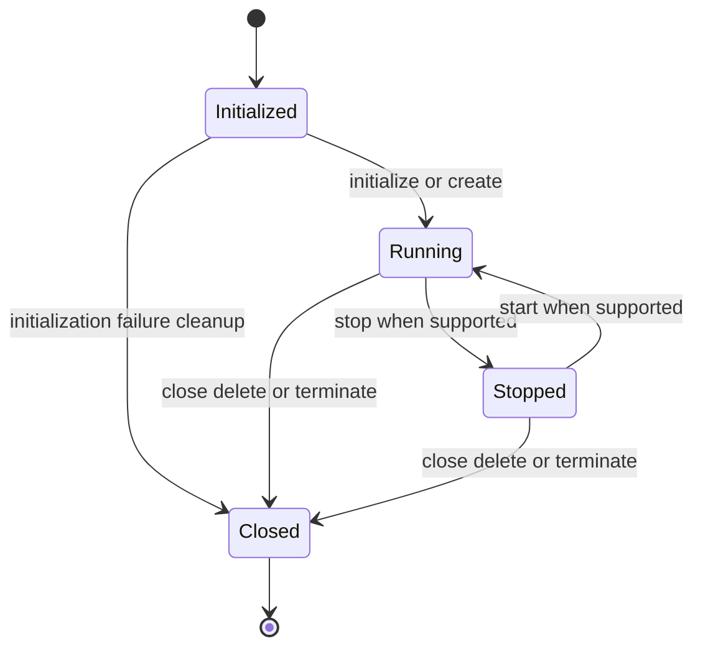

# Run an Agent in a Sandbox

A sandbox-backed agent combines two contracts:

- **DeepAgents backend contract:** the object passed as `backend` supplies filesystem operations, and an execution-capable backend additionally supplies `execute(command)` and a non-empty `id`.
- **Provider lifecycle contract:** the provider authenticates, provisions or opens a resource, makes it ready before the agent runs, and releases it after the run.

The safest ownership pattern is to create the resource before constructing or invoking the agent, then put the entire run in `try/finally`. A model failure, tool error, or thrown provisioning error must not bypass cleanup.

## End-to-end control flow



*Caption: Authentication and provisioning happen before the agent run, while cleanup is owned by the caller and must execute on every exit path.*

A backend instance may be passed directly, or a backend factory may create one for a runtime. `createDeepAgent` forwards the configured backend to filesystem, summarization, memory, skills, and subagent middleware. The `backend` option accepts either an `AnyBackendProtocol` instance or a factory receiving `{ state, store }`; a factory is useful when each invocation needs a fresh environment. The filesystem middleware exposes `execute` only when the resolved backend satisfies `isSandboxBackend`, which requires a callable `execute` and a non-empty `id`.

## 1. Select the execution boundary

Choose the backend according to what the run is allowed to affect:

| Backend | Commands | File lifetime and boundary | Typical use |
| --- | --- | --- | --- |
| `DaytonaSandbox` | Yes | Remote Daytona sandbox; `close()` deletes it, while `stop()` preserves it for `start()` | Cloud code execution and disposable workspaces |
| `DenoSandbox` | Yes | Remote Deno Deploy Linux microVM; `close()` terminates the sandbox and unsaved data is lost | Isolated Deno execution |
| `ModalSandbox` | Yes | Remote Modal container; `close()` terminates it | Isolated container execution with image and resource choices |
| `LocalShellSandbox` | Yes | A directory on the current host, with commands spawned by the host process | Development-only host-local execution |
| `VfsBackend` | No | In-memory `/workspace`; `stop()` drops the virtual filesystem | File-only workflows with no shell authority |

### Security warning: a working directory is not isolation

`LocalShellSandbox` is useful as a `BaseSandbox` example, but it is not a security sandbox. It runs `/bin/bash -c` through the host's `child_process.spawn`, sets `cwd` to a host path, and inherits the host environment. Its working directory is an organizational boundary, not a process, container, or VM boundary. An agent with `execute` can run commands that access anything available to that host user, subject to ordinary host permissions.

The cloud providers create remote execution resources, but “isolated” still means the provider's sandbox boundary, image, network policy, mounted volumes, injected secrets, and credentials must be reviewed. Do not put host credentials into prompts or broad environment inheritance merely because a command needs them. `VfsBackend` is the strongest local boundary in this set for file-only work: it stores bytes in memory and resolves paths below `/workspace`, but it intentionally cannot run commands.

Filesystem permissions do not make arbitrary shell execution safe. The filesystem middleware applies permission rules to `ls`, `read_file`, `write_file`, `edit_file`, `glob`, and `grep`; it does not scope arbitrary `execute` commands. Configuring permissions with an execution-capable backend is rejected unless `execute` is disabled or every permission path is safely scoped through a `CompositeBackend` route. Treat shell access as a separate authority.

## 2. Resolve provider-specific credentials

Credentials are resolved by the provider adapter, not by `createDeepAgent`. Prefer explicit options for dependency-injected applications and environment variables for local development or CI secret stores. Never log the resolved values.

| Provider | Explicit option | Environment fallback | Additional behavior |
| --- | --- | --- | --- |
| Daytona | `auth.apiKey` | `DAYTONA_API_KEY` | `auth.apiUrl` then `DAYTONA_API_URL` then `https://app.daytona.io/api`; `target` then `DAYTONA_TARGET` |
| Deno | top-level `token`, then deprecated `auth.token` | `DENO_DEPLOY_TOKEN` | A personal token beginning with `ddp_` also needs `org`, or `DENO_DEPLOY_ORG`; organization tokens beginning with `ddo_` do not need it |
| Modal | `auth.tokenId` and `auth.tokenSecret` | `MODAL_TOKEN_ID` and `MODAL_TOKEN_SECRET` | Both values are required; missing credentials produce an actionable error |
| LangSmith | `apiKey` in `LangSmithSandbox.create` | `LANGSMITH_API_KEY` | Creation requires exactly one of `snapshotId` or deprecated `templateName` |

For example, Daytona can be configured without embedding the key in source:

```bash
export DAYTONA_API_KEY=your_api_key_here
```

```typescript
const sandbox = await DaytonaSandbox.create({
  language: "typescript",
  timeout: 300,
  auth: {
    apiKey: process.env.DAYTONA_API_KEY,
  },
});
```

The explicit option is normally unnecessary when the process environment is already configured, but the provider still validates credentials during initialization. Authentication failures are wrapped as provider errors such as `AUTHENTICATION_FAILED`; provisioning failures are distinct `SANDBOX_CREATION_FAILED` errors. Keep those categories visible so an operator can distinguish bad credentials from quota, image, region, or provider failures.

## 3. Create and initialize before use

The provider constructors are not interchangeable with ready resources:

- `DaytonaSandbox`, `DenoSandbox`, and `ModalSandbox` constructors only create wrappers. Their `initialize()` methods authenticate and provision the underlying resource, reject double initialization, update the temporary ID to the provider ID, and upload `initialFiles` before returning. Their `create()` factories perform construction plus initialization and are the recommended one-step entrypoints.
- `LangSmithSandbox.create()` creates a sandbox from a `snapshotId` or deprecated `templateName` and returns a running wrapper. It rejects both creation sources being supplied together and rejects neither being supplied.
- `VfsBackend.create()` initializes an in-memory `VirtualFileSystem`, creates `/workspace`, populates `initialFiles`, and returns a ready file backend. It has no command execution or sandbox `id`, so it must not be used when the task requires `execute`.

Initial files are part of the readiness invariant. Providers create parent directories and upload them during initialization. If an upload fails, initialization fails rather than silently handing the agent a partial workspace. Use absolute paths where the provider requires them and make the workspace convention explicit. Deno's integration suite maps test paths under `/home/app`; Modal's maps them under `/tmp`; Daytona accepts provider paths such as `script.ts` and exposes a provider work directory.

### Lifecycle model



*Caption: Conceptual provider lifecycle. Daytona supports a restartable stopped state; Deno and Modal use terminal `close()` behavior; VFS uses `stop()` to discard its in-memory state and can be initialized again.*

The lifecycle distinctions matter operationally:

- **Daytona:** `stop()` calls the provider stop operation and preserves files; `start()` resumes it. `close()` deletes the remote sandbox and clears SDK references. Use `close()` in a `finally` block when the run owns a disposable resource.
- **Deno:** `close()` closes the remote sandbox and clears the wrapper reference; `stop()` is an alias for `close()`, so it is not a resumable pause. `kill()` is the forceful variant.
- **Modal:** `close()` terminates the container and clears the client, app, and sandbox references; `stop()` is an alias for `close()`. It can reconnect to an existing sandbox with `fromId()` or `fromName()` while that resource exists.
- **LangSmith:** `stop()` preserves the sandbox for a later `start()`, while `close()` deletes it and marks `isRunning` false. This makes `close()` the terminal operation.
- **VFS:** `stop()` clears the VFS reference, sets `isRunning` false, and loses all in-memory files. A later `initialize()` creates a new empty VFS unless new initial files are supplied.

Do not call agent tools before initialization. Provider operations use structured `NOT_INITIALIZED` errors rather than relying on a null SDK reference. Do not assume `close()` is idempotent across SDKs without checking the provider adapter; the robust pattern is to keep cleanup in `finally` and tolerate or report cleanup failure separately from the primary run error.

## 4. Attach the backend and run the agent

A minimal cloud-backed run looks like this:

```typescript
import { HumanMessage } from "@langchain/core/messages";
import { ChatAnthropic } from "@langchain/anthropic";
import { createDeepAgent } from "deepagents";
import { DaytonaSandbox } from "@langchain/daytona";

const sandbox = await DaytonaSandbox.create({
  language: "typescript",
  autoStopInterval: 15,
  labels: {
    purpose: "agent-run",
  },
});

try {
  const agent = createDeepAgent({
    model: new ChatAnthropic({
      model: "claude-haiku-4-5",
      temperature: 0,
    }),
    systemPrompt: "You are a coding assistant with access to an isolated sandbox.",
    backend: sandbox,
  });

  const result = await agent.invoke({
    messages: [
      new HumanMessage(
        "Create hello.ts, run it, and report the output and exit status.",
      ),
    ],
  });

  console.log(result.messages.at(-1));
} finally {
  await sandbox.close();
}
```

The agent's filesystem tools are adapters over the backend, not a second storage implementation. `BaseSandbox` supplies default `ls`, text and binary `read`, `readRaw`, literal `grep`, `glob`, `write`, `edit`, and recursive `delete` implementations when a provider supplies `execute`, `uploadFiles`, and `downloadFiles`. Those defaults use POSIX `awk`, `grep`, `find`, and `stat` through the sandbox command channel, so the remote image does not need Python or Node.js just to support the file tools. A provider with a native file API, such as `VfsBackend`, implements the v2 file operations directly instead.

`uploadFiles` and `downloadFiles` are bulk APIs with one response per input path and standardized per-item errors such as `file_not_found`, `permission_denied`, `is_directory`, and `invalid_path`. Providers should allow partial success rather than turning one bad path into an all-or-nothing result. `BaseSandbox` treats text as UTF-8 and paginates it by line offset and limit; binary reads return complete `Uint8Array` content. `edit` downloads and reuploads content and rejects multiple matches unless `replaceAll` is true. These operations can be expensive for large files, so use provider-native methods when they preserve better metadata or byte behavior.

### Command results and failures

`execute` returns an `ExecuteResponse` with combined output, `exitCode`, and `truncated`. A normal non-zero exit is a command result that the agent can inspect; it is not automatically a provider provisioning failure. The middleware formats the result with an explicit command status and adds `[Output was truncated due to size limits]` when `truncated` is true. The agent prompt should tell the model to inspect exit codes rather than trusting output text alone.

Provider adapters throw for different failures:

- A missing initialization, failed SDK call, provider timeout, or provisioning problem is an exception with provider-specific error codes such as `NOT_INITIALIZED`, `COMMAND_TIMEOUT`, `COMMAND_FAILED`, `AUTHENTICATION_FAILED`, or `SANDBOX_CREATION_FAILED`.
- A command that starts and exits non-zero remains an `ExecuteResponse` with its exit code. Deno and Modal combine stdout and stderr; LangSmith combines them with a newline when both are present. Local execution combines both streams while enforcing its configured timeout and 1 MiB output cap.
- Local timeout returns `exitCode: null` and appends `[Command timed out]`; a spawn failure returns exit code `1`. Remote timeout behavior is provider-specific and is surfaced as a provider error rather than being confused with a normal exit.
- A truncated search or glob is partial data, not success with an implied complete result. Preserve the `truncated` flag so the model can narrow the request.

Do not use shell quoting as a security boundary. `BaseSandbox.delete()` quotes a path before passing it to `rm -rf`, but that only protects shell parsing; it does not confine deletion to a workspace. Providers that promise path containment must enforce it in their native transfer and execution layers. `VfsBackend` resolves paths below `/workspace`, rejects traversal, and rejects writes through symlinks. A host-local shell backend needs an actual process or container isolation strategy if it will execute untrusted model-generated commands.

## 5. Cleanup that survives failures

The resource owner should clean up in `finally`, including when agent construction, initialization of later resources, model calls, tool calls, or result handling throws:

```typescript
let sandbox: DaytonaSandbox | undefined;

try {
  sandbox = await DaytonaSandbox.create({ language: "typescript" });
  const agent = createDeepAgent({ model, backend: sandbox });
  return await agent.invoke({ messages });
} finally {
  if (sandbox) {
    await sandbox.close();
  }
}
```

If several sandboxes are created, each successful creation must be registered for cleanup immediately; do not wait until all provisioning succeeds. If cleanup itself can fail, log the provider resource ID and cleanup error without hiding the original run error. For long-lived workflows, choose deliberately between `stop()` for a restartable resource and `close()` or `delete` for terminal cleanup. Providers with remote resources should also configure provider-side TTLs or auto-delete controls and use labels so interrupted processes can be swept later.

Factory ownership is equally important. `createDaytonaSandboxFactory`, `createDenoSandboxFactory`, and `createModalSandboxFactory` return asynchronous factories that create a fresh sandbox per call. Their reuse counterparts return the same pre-created instance and therefore do not transfer lifecycle ownership: the caller must close it, and concurrent runs share its files and command authority. `createVfsBackendFactory` creates a fresh in-memory backend per call, while its reuse counterpart shares state until `stop()`.

## Configuration checklist

Before running an agent, verify:

1. The provider's credential variable or explicit option is present, and secrets are supplied through a secret manager or process environment rather than a prompt.
2. The image, snapshot, language, region, memory, CPU, disk, volumes, network policy, and timeout match the task's trust and cost requirements.
3. `initialFiles` paths are in the intended workspace and are uploaded before the agent can execute commands.
4. The command-capable provider's shell root and file-transfer root are the same boundary, or the mismatch is documented and tested.
5. `execute` is enabled only when arbitrary shell access is intended; filesystem permission rules alone do not restrict it.
6. The agent checks `exitCode` and `truncated` and can recover from missing files or non-zero commands.
7. The `finally` block closes or stops every owned resource, and remote TTL or label cleanup covers interrupted processes.

## Focused tests that matter

Run local unit tests before cloud integration tests. The important coverage is behavioral:

- `libs/deepagents/src/backends/sandbox.test.ts` verifies that `BaseSandbox` routes text reads through `awk`, binary reads through downloads, preserves pagination metadata, returns structured missing-file errors, performs writes and edits through transfer methods, and reports command-backed search behavior.
- `libs/providers/deno/src/sandbox.test.ts` and `libs/providers/modal/src/sandbox.test.ts` mock their SDKs to verify option forwarding, temporary-to-provider ID changes, pre-initialization state, command stdout and stderr, file transfer mapping, and cleanup. Daytona's corresponding unit tests cover authentication, creation, partial transfer failures, start and stop behavior, reconnect, and label deletion.
- `libs/providers/daytona/src/sandbox.int.test.ts` runs `sandboxStandardTests`, labels resources, uses short auto-stop and auto-delete intervals, and sweeps labeled sandboxes in `afterAll`. This is the required safety net for interrupted remote test processes.
- `libs/providers/deno/src/sandbox.int.test.ts` skips when `DENO_DEPLOY_TOKEN` is absent or the account lacks sandbox plan access, runs sequentially to avoid concurrency limits, tests reconnect and initial files, and closes each remote resource.
- `libs/providers/modal/src/sandbox.int.test.ts` skips without both Modal credentials, runs the standard suite sequentially, and tests initial files, reconnect, Python images, and Node.js images.
- `examples/sandbox/local-sandbox.ts` is a useful local adapter example for timeout, output truncation, partial file results, and `BaseSandbox` extension, but it must not be treated as proof of host isolation.
- `examples/sandbox/vfs-backend.ts` demonstrates the no-command alternative: initialize initial files, let the agent edit the virtual workspace, and call `backend.stop()` in `finally`.

For a provider change, run the focused unit test first, then the package's typecheck and unit suite, then credentialed integration tests with deterministic cleanup. The shared sandbox suite is the boundary test for lifecycle, command execution, upload and download, file tools, search, initial files, and failure behavior; it is not a substitute for provider-specific authentication, isolation, reconnect, timeout, or cleanup tests.

## Related pages

- [Backend Protocol and File Storage Architecture](/openwiki/architecture/backend-storage.md) — protocol versions, backend ownership, and persistence boundaries.
- [Sandbox Backend Integrations](/openwiki/integrations/sandbox-providers.md) — provider comparison and package integration details.
- [Configuration, Credentials, and Security Boundaries](/openwiki/operations/configuration-security.md) — secret handling and execution security.
- [Testing Strategy and Boundary Coverage](/openwiki/testing/strategy.md) — validation order and test boundaries.
- [End-to-End Agent Run](/openwiki/workflows/agent-run.md) — the model, middleware, tool, and state loop surrounding the backend.
